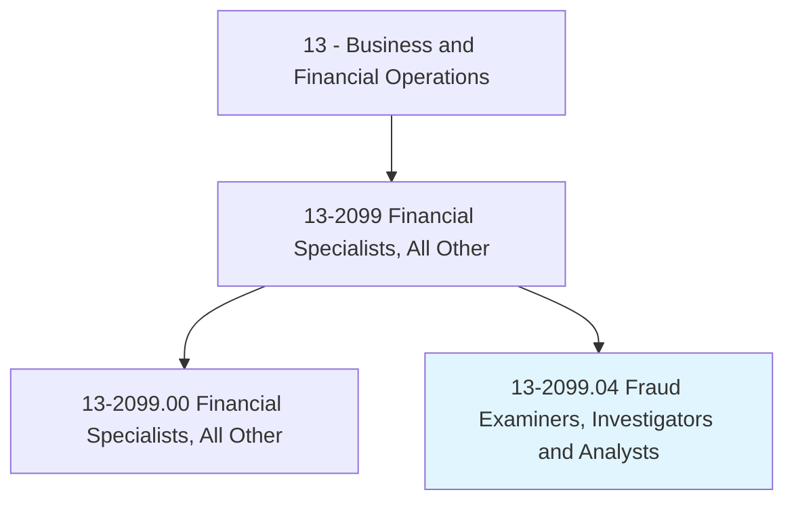
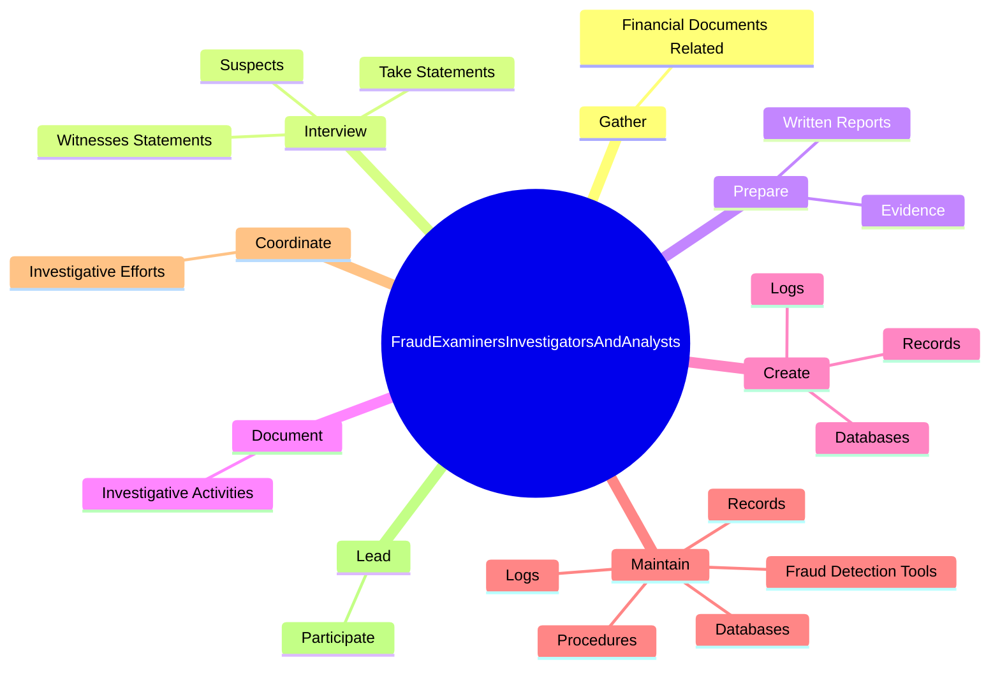
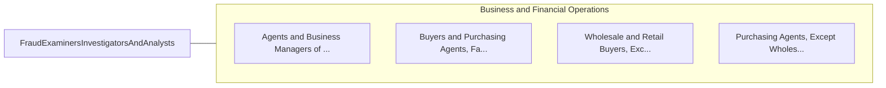

# Fraud Examiners, Investigators and Analysts

> Obtain evidence, take statements, produce reports, and testify to findings regarding resolution of fraud allegations. May coordinate fraud detection and prevention activities.

## Overview

Fraud Examiners, Investigators and Analysts is a specialized variant within the Business and Financial Operations category. Obtain evidence, take statements, produce reports, and testify to findings regarding resolution of fraud allegations. 

## Classification Hierarchy

## Key Statistics

| Metric | Value |
|--------|-------|
| SOC Code | 13-2099.04 |
| Category | [Business and Financial Operations](/occupations/Business) |
| Task Count | 40 |
| Source | O*NET |

## Core Tasks

### gather.FinancialDocumentsRelated

Fraud Examiners, Investigators and Analysts gather financial documents related as part of their core responsibilities.

**Actions:**
- `gather.FinancialDocumentsRelated.to.Investigations`

### interview.WitnessesStatements

Fraud Examiners, Investigators and Analysts interview witnesses statements as part of their core responsibilities.

**Actions:**
- `interview.WitnessesStatements`
- `interview.TakeStatements`
- `interview.Suspects`

### prepare.WrittenReports

Fraud Examiners, Investigators and Analysts prepare written reports as part of their core responsibilities.

**Actions:**
- `prepare.WrittenReports.of.InvestigationFindings`
- `prepare.Evidence.for.Presentation.in.Court`

## Skills & Competencies

### Technical Skills
- **Financial Analysis** - Advanced
- **Data Analysis** - Advanced
- **Regulatory Compliance** - Advanced

### Soft Skills
- **Communication** - Essential
- **Problem Solving** - Essential
- **Critical Thinking** - Important
- **Teamwork** - Important
- **Adaptability** - Important

## Related Occupations

## Industries

This occupation is found across multiple industries. See [Industries](/industries) for sector-specific employment data.

## Career Progression

---

*Source: O*NET 13-2099.04 - ONETOccupation*
