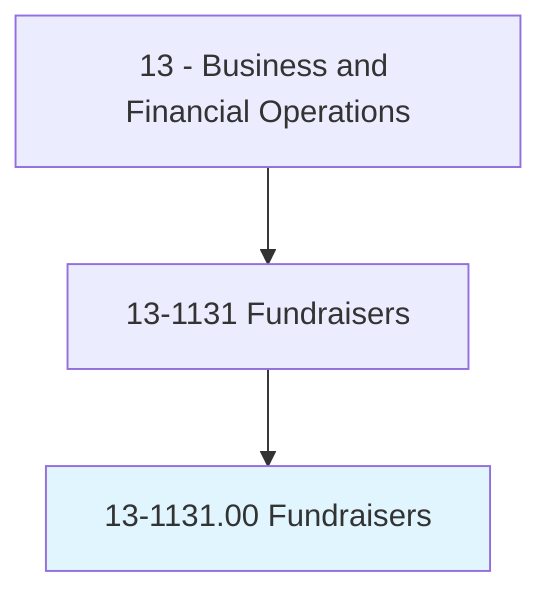
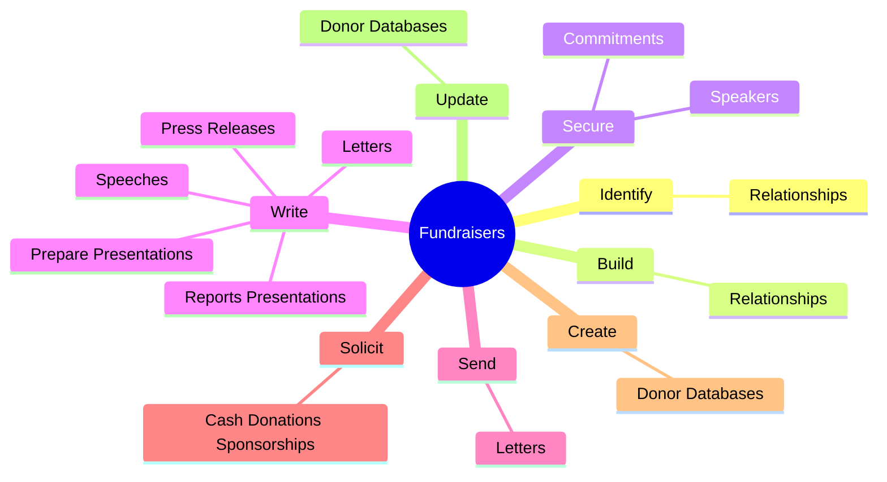
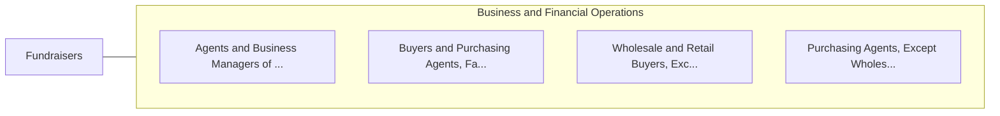

# Fundraisers

> Organize activities to raise funds or otherwise solicit and gather monetary donations or other gifts for an organization. May design and produce promotional materials. May also raise awareness of the organization's work, goals, and financial needs.

## Overview

Fundraisers is an occupation within the Business and Financial Operations category. Organize activities to raise funds or otherwise solicit and gather monetary donations or other gifts for an organization. May design and produce promotional materials.

## Classification Hierarchy

## Key Statistics

| Metric | Value |
|--------|-------|
| SOC Code | 13-1131.00 |
| Category | [Business and Financial Operations](/occupations/Business) |
| Task Count | 102 |
| Source | O*NET |

## Core Tasks

### identify.Relationships

Fundraisers identify relationships as part of their core responsibilities.

**Actions:**
- `identify.Relationships.with.PotentialDonors`

### build.Relationships

Fundraisers build relationships as part of their core responsibilities.

**Actions:**
- `build.Relationships.with.PotentialDonors`

### secure.Commitments

Fundraisers secure commitments as part of their core responsibilities.

**Actions:**
- `secure.Commitments.of.Participation.from.IndividualsCorporateDonors`
- `secure.Commitments.of.Donation.from.IndividualsCorporateDonors`
- `secure.Speakers.for.CharitableEvents`
- `secure.Speakers.for.CommunityMeetings`

## Skills & Competencies

### Technical Skills
- **Financial Analysis** - Advanced
- **Data Analysis** - Advanced
- **Regulatory Compliance** - Advanced

### Soft Skills
- **Communication** - Essential
- **Problem Solving** - Essential
- **Critical Thinking** - Important
- **Teamwork** - Important
- **Adaptability** - Important

## Related Occupations

## Industries

This occupation is found across multiple industries. See [Industries](/industries) for sector-specific employment data.

## Career Progression

---

*Source: O*NET 13-1131.00 - ONETOccupation*
