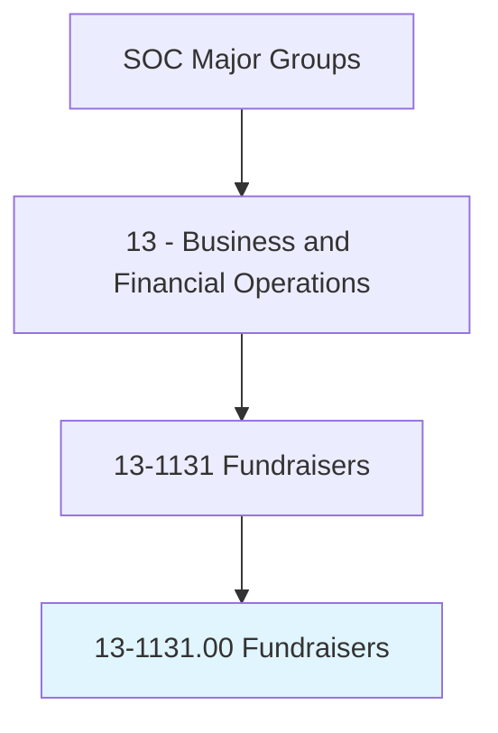
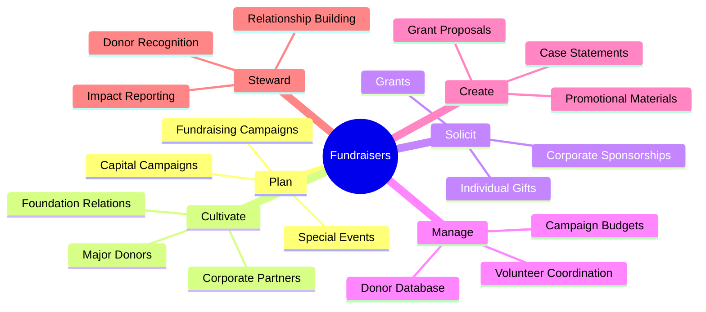
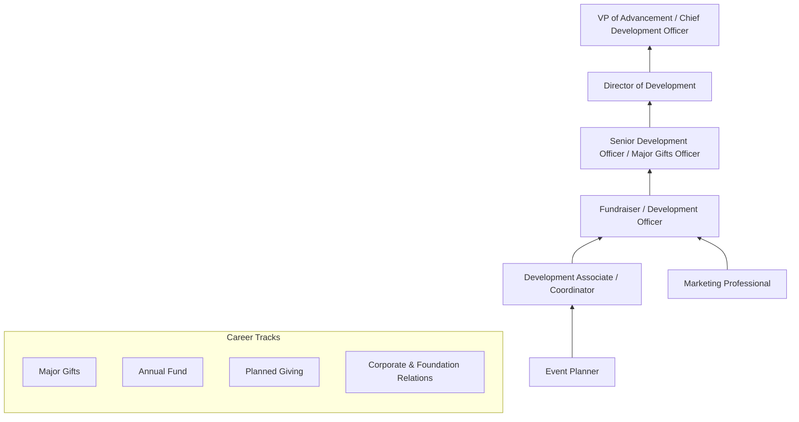
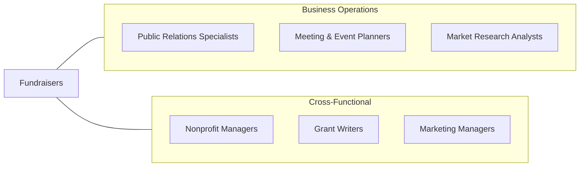

# Fundraisers

> Organize activities to raise funds or otherwise solicit and gather monetary donations or other gifts for an organization. May design and produce promotional materials. May also raise awareness of the organization's work, goals, and financial needs.

## Overview

Fundraisers plan, organize, and execute campaigns to raise money for nonprofit organizations, educational institutions, political campaigns, and other causes. They identify potential donors, cultivate relationships, solicit contributions, and steward donor relationships to encourage continued and increased giving. The role encompasses a wide range of activities from planning gala events and direct mail campaigns to writing grant proposals and managing major gift solicitations.

These professionals are essential to the financial sustainability of the nonprofit sector, which represents over $2.5 trillion in revenue in the United States. They develop fundraising strategies aligned with organizational missions, set revenue targets, manage donor databases, and track campaign performance. The most successful fundraisers combine interpersonal warmth with strategic thinking, creating compelling narratives that connect donors' values and interests with organizational impact.

The profession has evolved with digital giving platforms, social media campaigns, crowdfunding, peer-to-peer fundraising, and data-driven donor analytics. Modern fundraisers must master both traditional relationship-based major gift fundraising and digital engagement strategies that reach younger donors through online channels. The growing emphasis on diversity, equity, and inclusion in philanthropy, along with donor-advised funds and impact investing, continues to reshape the fundraising landscape.

## Classification Hierarchy

## Key Statistics

| Metric | Value |
|--------|-------|
| SOC Code | 13-1131.00 |
| Job Zone | 4 (Considerable Preparation) |
| Category | [Business and Financial Operations](/occupations/Business/index) |
| Median Salary | $61,190 |
| Employment | ~89,000 |
| Projected Growth | 10% (Much faster than average) |
| Task Count | 28 |
| Source | O*NET |

## Core Tasks

### plan.FundraisingCampaigns

Plan and execute fundraising campaigns, events, and initiatives.

**Actions:**
- `plan.FundraisingCampaigns.to.achieve.RevenueTargets` - Design campaign strategy
- `plan.SpecialEvents.to.engage.DonorsAndSponsors` - Organize fundraising events
- `plan.CapitalCampaigns.for.MajorInstitutionalNeeds` - Lead capital drives
- `develop.AnnualFundStrategies.for.SustainedGiving` - Build recurring revenue

### cultivate.DonorRelationships

Identify, cultivate, and steward relationships with individual, corporate, and foundation donors.

**Actions:**
- `cultivate.MajorDonors.through.PersonalizedEngagement` - Build high-value relationships
- `cultivate.CorporatePartners.for.SponsorshipOpportunities` - Develop business partnerships
- `write.GrantProposals.for.FoundationFunding` - Secure institutional grants
- `steward.DonorRelationships.through.ImpactReporting` - Retain donors

### solicit.Contributions

Make direct solicitations for donations and gifts.

**Actions:**
- `solicit.IndividualGifts.through.PersonalAsks` - Request major gifts
- `solicit.CorporateSponsors.for.EventSupport` - Secure event sponsorships
- `manage.DirectMailCampaigns.for.BroadOutreach` - Execute mass solicitations
- `manage.OnlineGivingCampaigns.through.DigitalPlatforms` - Drive digital donations

## Skills & Competencies

### Technical Skills
- **Fundraising Strategy & Campaign Management** - Expert
- **Grant Writing** - Advanced
- **Donor Database Management (CRM)** - Advanced
- **Event Planning** - Advanced
- **Digital Fundraising & Social Media** - Advanced
- **Financial Management & Budgeting** - Proficient
- **Marketing & Communications** - Proficient

### Soft Skills
- **Relationship Building** - Critical
- **Communication (Written/Verbal)** - Critical
- **Persuasion & Influence** - Essential
- **Empathy** - Essential
- **Strategic Thinking** - Essential
- **Resilience** - Important

## Education & Certifications

| Requirement | Details |
|-------------|---------|
| Typical Education | Bachelor's degree in Nonprofit Management, Communications, Marketing, or related field |
| Key Certifications | CFRE (Certified Fund Raising Executive) |
| Advanced Certification | ACFRE (Advanced CFRE) |
| Planned Giving | CAP (Chartered Advisor in Philanthropy) |
| Professional Orgs | AFP (Association of Fundraising Professionals), CASE |
| Work Experience | 2-5 years in fundraising, development, or related nonprofit work |

## Career Progression

## Industry Variations

| Industry | Focus | Typical Tasks |
|----------|-------|---------------|
| **Higher Education** | Alumni giving, capital campaigns | Reunion giving, endowment building, parent programs |
| **Healthcare** | Grateful patient giving | Hospital foundations, research funding, equipment campaigns |
| **Arts & Culture** | Patron development | Membership programs, naming opportunities, galas |
| **Social Services** | Community support | Annual appeals, government grants, emergency campaigns |
| **Political** | Campaign finance | Compliance, bundling, digital small-dollar fundraising |
| **Religious** | Congregational giving | Stewardship campaigns, tithing programs, capital projects |

## Technology & Tools

| Category | Tools |
|----------|-------|
| **CRM / Donor Management** | Raiser's Edge, Salesforce NPSP, Bloomerang, DonorPerfect |
| **Online Giving** | Classy, GiveLively, Network for Good, GoFundMe Charity |
| **Email Marketing** | Mailchimp, Constant Contact, Pardot |
| **Social Media** | Facebook Fundraisers, Instagram, LinkedIn |
| **Event Management** | Eventbrite, Greater Giving, OneCause |
| **Prospect Research** | WealthEngine, DonorSearch, iWave |
| **Grant Management** | Submittable, Foundant, Fluxx |

## Related Occupations

## Departments

This occupation typically works in:
- [Development / Advancement](/departments/Development)
- [Major Gifts](/departments/MajorGifts)
- [Annual Fund](/departments/AnnualFund)
- [Foundation Relations](/departments/FoundationRelations)
- [Communications](/departments/Communications)

---

*Source: O*NET 13-1131.00 - ONETOccupation*
