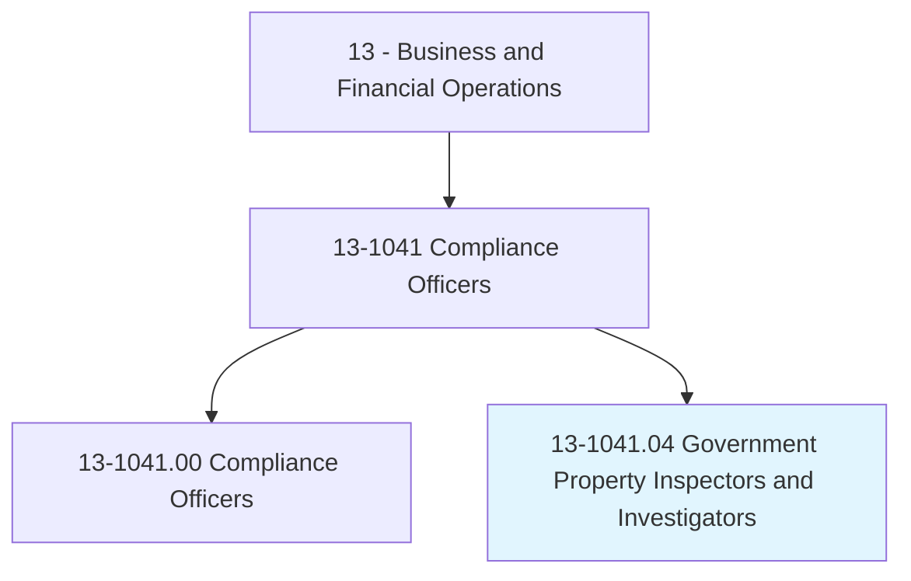
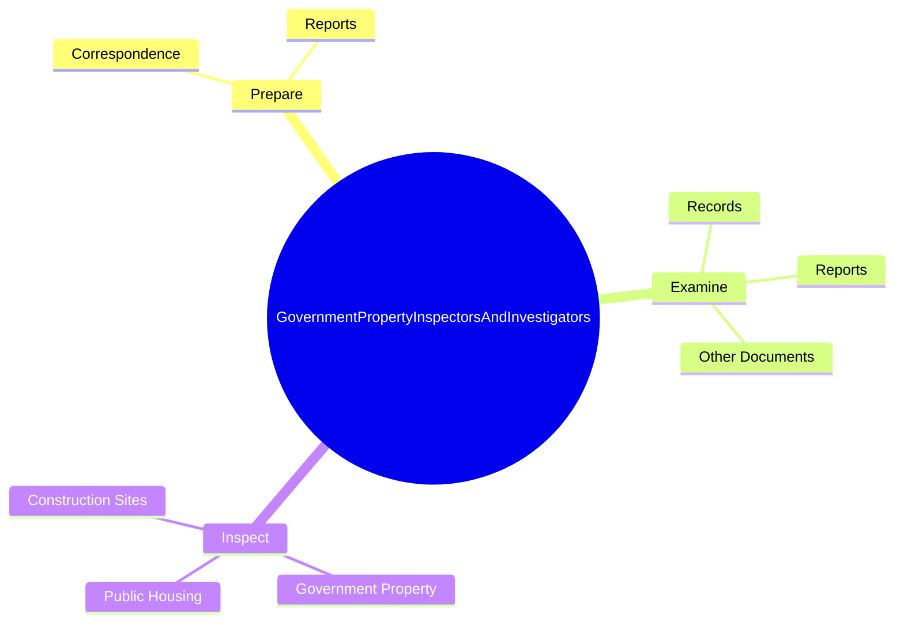
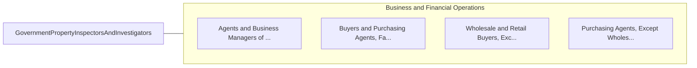

# Government Property Inspectors and Investigators

> Investigate or inspect government property to ensure compliance with contract agreements and government regulations.

## Overview

Government Property Inspectors and Investigators is classified under Business and Financial Operations (SOC 13). Investigate or inspect government property to ensure compliance with contract agreements and government regulations.

## Classification Hierarchy

## Key Statistics

| Metric | Value |
|--------|-------|
| SOC Code | 13-1041.04 |
| Category | [Business and Financial Operations](/occupations/Business/index) |
| Task Count | 39 |
| Source | O*NET |

## Core Tasks

### prepare.Correspondence

Government Property Inspectors and Investigators prepare correspondence as part of their core responsibilities.

**Actions:**
- `prepare.Correspondence.of.Inspections`
- `prepare.Correspondence.of.Investigations`
- `prepare.Correspondence.of.RecommendationsF`
- `prepare.Correspondence.of.Action`

### examine.Records

Government Property Inspectors and Investigators examine records as part of their core responsibilities.

**Actions:**
- `examine.Records.to.establish.Facts`
- `examine.Records.to.detect.Discrepancies`
- `examine.Reports.to.establish.Facts`
- `examine.Reports.to.detect.Discrepancies`

### inspect.GovernmentProperty

Government Property Inspectors and Investigators inspect government property as part of their core responsibilities.

**Actions:**
- `inspect.GovernmentProperty.to.ensure.ComplianceWithContractSpecificationsRequirements`
- `inspect.GovernmentProperty.to.LegalRequirements`
- `inspect.ConstructionSites.to.ensure.ComplianceWithContractSpecificationsRequirements`
- `inspect.ConstructionSites.to.LegalRequirements`

## Skills & Competencies

### Technical Skills
- **Financial Analysis** - Advanced
- **Data Analysis** - Advanced
- **Regulatory Compliance** - Advanced

### Soft Skills
- **Communication** - Essential
- **Problem Solving** - Essential
- **Critical Thinking** - Important
- **Teamwork** - Important
- **Adaptability** - Important

## Related Occupations

## Industries

This occupation is found across multiple industries. See [Industries](/industries) for sector-specific employment data.

## Career Progression

---

*Source: O*NET 13-1041.04 - ONETOccupation*
