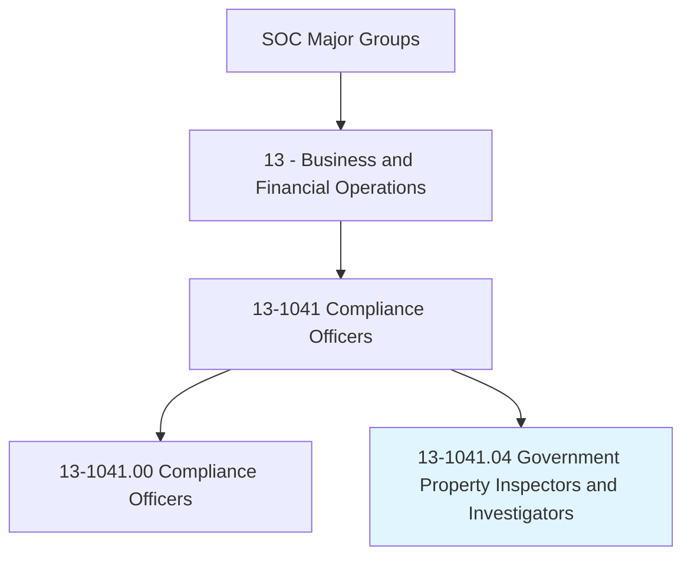
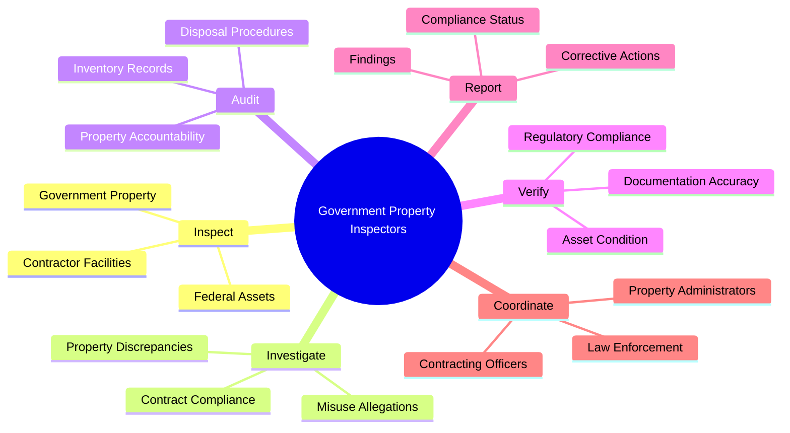
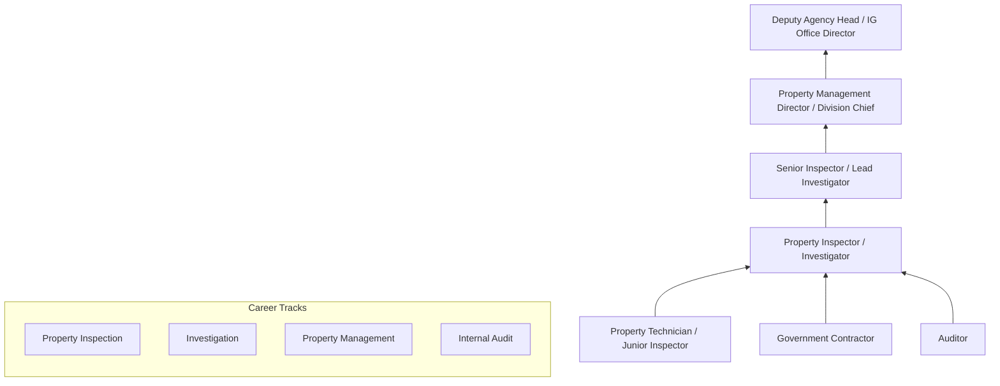
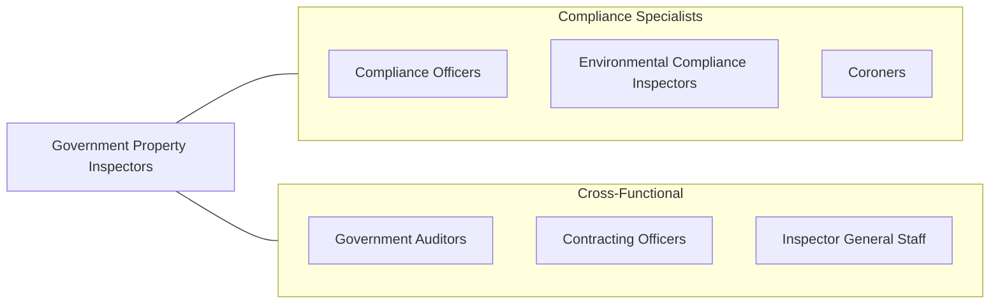

# Government Property Inspectors and Investigators

> Investigate or inspect government property to ensure compliance with contract agreements and government regulations.

## Overview

Government Property Inspectors and Investigators ensure that government-owned, leased, or contractor-managed property is handled in accordance with federal regulations, contract terms, and property management standards. They inspect government assets ranging from real estate and facilities to equipment, vehicles, and sensitive materials held by contractors and government agencies. Their work safeguards taxpayer investments and ensures accountability in the management of public resources.

These professionals conduct property audits, verify inventory records, investigate discrepancies, and ensure compliance with the Federal Acquisition Regulation (FAR), Defense Federal Acquisition Regulation Supplement (DFARS), and agency-specific property management policies. They may specialize in areas such as defense contractor property oversight, GSA real property management, or federal fleet administration.

The role requires knowledge of government procurement and property management regulations, auditing techniques, and investigation methodology. As government agencies modernize asset management through RFID tracking, IoT sensors, and enterprise resource planning systems, inspectors must adapt to technology-enabled property management while maintaining the traditional oversight skills necessary to detect waste, fraud, and abuse.

## Classification Hierarchy

## Key Statistics

| Metric | Value |
|--------|-------|
| SOC Code | 13-1041.04 |
| Job Zone | 4 (Considerable Preparation) |
| Category | [Business and Financial Operations](/occupations/Business/index) |
| Median Salary | $73,860 |
| Employment | ~15,000 |
| Projected Growth | 4% (As fast as average) |
| Task Count | 35 |
| Source | O*NET |

## Core Tasks

### inspect.GovernmentProperty

Inspect government property and contractor facilities for compliance with regulations and contract terms.

**Actions:**
- `inspect.GovernmentProperty.to.verify.Condition` - Assess asset status
- `inspect.ContractorFacilities.to.ensure.PropertyAccountability` - Check contractor compliance
- `inspect.FederalAssets.to.confirm.ProperUtilization` - Verify appropriate use
- `audit.InventoryRecords.to.reconcile.PropertyAccounts` - Validate records

### investigate.Discrepancies

Investigate property discrepancies, losses, and allegations of misuse.

**Actions:**
- `investigate.PropertyDiscrepancies.to.identify.CausesOfLoss` - Trace missing assets
- `investigate.ContractCompliance.to.enforce.PropertyClauses` - Verify contract adherence
- `investigate.MisuseAllegations.to.determine.Accountability` - Assess wrongdoing
- `coordinate.with.LawEnforcement.for.TheftOrFraud` - Escalate criminal matters

### report.Findings

Prepare inspection and investigation reports with recommendations for corrective action.

**Actions:**
- `report.InspectionFindings.to.ContractingOfficers` - Communicate results
- `report.CorrectiveActions.for.DeficientConditions` - Prescribe remediation
- `recommend.DisposalProcedures.for.ExcessProperty` - Advise on surplus assets
- `monitor.ComplianceStatus.for.FollowUpInspections` - Track progress

## Skills & Competencies

### Technical Skills
- **Federal Property Management Regulations (FMR)** - Expert
- **FAR/DFARS Property Clauses** - Expert
- **Auditing & Investigation Techniques** - Advanced
- **Asset Management Systems** - Advanced
- **Government Contracting** - Advanced
- **Report Writing** - Advanced
- **Inventory Management** - Proficient

### Soft Skills
- **Attention to Detail** - Critical
- **Analytical Thinking** - Critical
- **Integrity & Objectivity** - Essential
- **Communication** - Essential
- **Problem Solving** - Important
- **Organizational Skills** - Important

## Education & Certifications

| Requirement | Details |
|-------------|---------|
| Typical Education | Bachelor's degree in Business, Public Administration, or related field |
| Key Certifications | CPPM (Certified Professional Property Manager - NPMA) |
| Additional Certs | CGI (Certified Government Inspector), CDFM (Certified Defense Financial Manager) |
| Federal Training | DAU (Defense Acquisition University) property management courses |
| Security Clearance | Often required for defense-related positions |
| Work Experience | 2-5 years in property management, auditing, or government contracting |

## Career Progression

## Industry Variations

| Industry | Focus | Typical Tasks |
|----------|-------|---------------|
| **Department of Defense** | Military property | Contractor property oversight, GFP accountability |
| **GSA** | Federal real property | Building inspections, lease compliance, space utilization |
| **NASA** | High-value equipment | Sensitive property tracking, contractor oversight |
| **DOE** | Nuclear materials | Special nuclear material accountability |
| **State/Local Government** | Public assets | Fleet management, facility inspections, surplus disposal |
| **Inspector General Offices** | Fraud/waste investigation | Property fraud, misuse investigations |

## Technology & Tools

| Category | Tools |
|----------|-------|
| **Property Systems** | DPAS, Sunflower, Maximo, IUID Registry |
| **Inventory** | RFID scanners, barcode systems, mobile inspection apps |
| **Audit Tools** | ACL, IDEA, Excel |
| **GIS** | ArcGIS, Google Earth (facility mapping) |
| **Reporting** | Microsoft 365, agency-specific portals |
| **Communication** | Encrypted email, secure conferencing |
| **Investigation** | Case management systems, evidence tracking |

## Related Occupations

## Departments

This occupation typically works in:
- [Property Management](/departments/PropertyManagement)
- [Contract Administration](/departments/ContractAdministration)
- [Inspector General](/departments/InspectorGeneral)
- [Facilities Management](/departments/FacilitiesManagement)
- [Procurement](/departments/Procurement)

---

*Source: O*NET 13-1041.04 - ONETOccupation*
