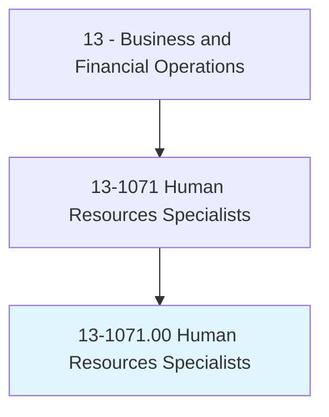
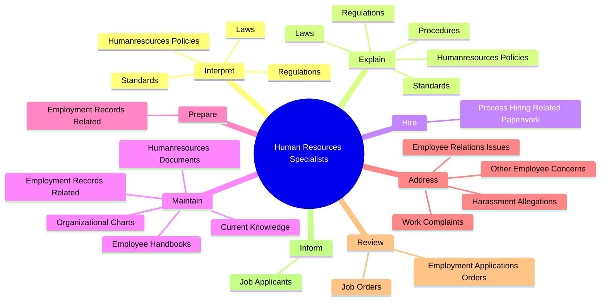

# Human Resources Specialists

> Recruit, screen, interview, or place individuals within an organization. May perform other activities in multiple human resources areas.

## Overview

Human Resources Specialists is an occupation within the Business and Financial Operations category. Recruit, screen, interview, or place individuals within an organization. 

## Classification Hierarchy

## Key Statistics

| Metric | Value |
|--------|-------|
| SOC Code | 13-1071.00 |
| Category | [Business and Financial Operations](/occupations/Business) |
| Task Count | 136 |
| Source | O*NET |

## Core Tasks

### interpret.HumanresourcesPolicies

Human Resources Specialists interpret humanresources policies as part of their core responsibilities.

**Actions:**
- `interpret.HumanresourcesPolicies`
- `interpret.Laws`
- `interpret.Standards`
- `interpret.Regulations`

### explain.HumanresourcesPolicies

Human Resources Specialists explain humanresources policies as part of their core responsibilities.

**Actions:**
- `explain.HumanresourcesPolicies`
- `explain.Procedures`
- `explain.Laws`
- `explain.Standards`

### hire.ProcessHiringRelatedPaperwork

Human Resources Specialists hire process hiring related paperwork as part of their core responsibilities.

**Actions:**
- `hire.ProcessHiringRelatedPaperwork`

## Skills & Competencies

### Technical Skills
- **Financial Analysis** - Advanced
- **Data Analysis** - Advanced
- **Regulatory Compliance** - Advanced

### Soft Skills
- **Communication** - Essential
- **Problem Solving** - Essential
- **Critical Thinking** - Important
- **Teamwork** - Important
- **Adaptability** - Important

## Related Occupations

## Industries

This occupation is found across multiple industries. See [Industries](/industries) for sector-specific employment data.

## Career Progression

---

*Source: O*NET 13-1071.00 - ONETOccupation*
