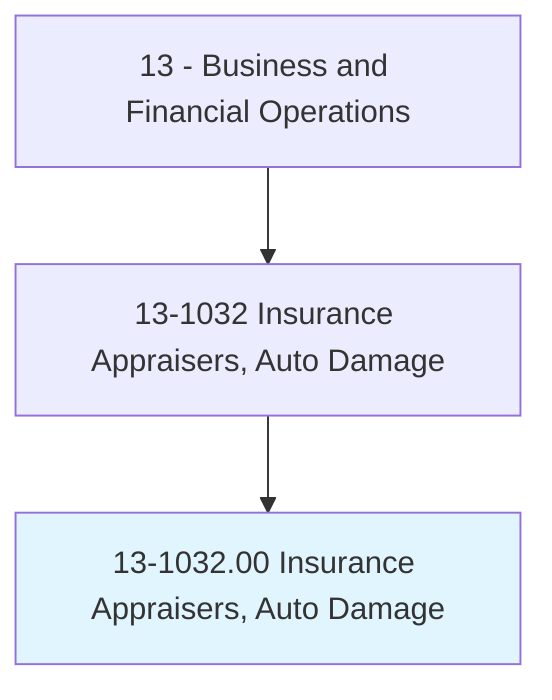
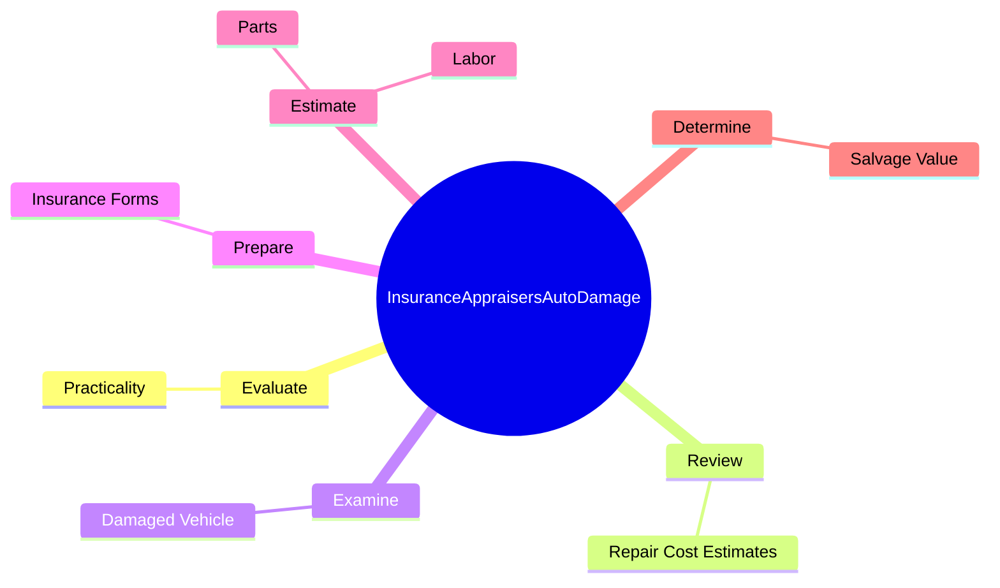
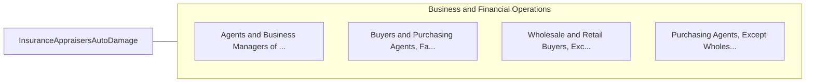

# Insurance Appraisers, Auto Damage

> Appraise automobile or other vehicle damage to determine repair costs for insurance claim settlement. Prepare insurance forms to indicate repair cost or cost estimates and recommendations. May seek agreement with automotive repair shop on repair costs.

## Overview

Insurance Appraisers, Auto Damage is an occupation within the Business and Financial Operations category. Appraise automobile or other vehicle damage to determine repair costs for insurance claim settlement. Prepare insurance forms to indicate repair cost or cost estimates and recommendations.

## Classification Hierarchy

## Key Statistics

| Metric | Value |
|--------|-------|
| SOC Code | 13-1032.00 |
| Category | [Business and Financial Operations](/occupations/Business) |
| Task Count | 18 |
| Source | O*NET |

## Core Tasks

### evaluate.Practicality

Insurance Appraisers, Auto Damage evaluate practicality as part of their core responsibilities.

**Actions:**
- `evaluate.Practicality.of.RepairAsOpposedToPaymentOfMarketValueOfVehicleBeforeAccident`

### review.RepairCostEstimates

Insurance Appraisers, Auto Damage review repair cost estimates as part of their core responsibilities.

**Actions:**
- `review.RepairCostEstimates.with.AutomobileRepairShop.to.secure.AgreementOnCostOfRepairs`

### examine.DamagedVehicle

Insurance Appraisers, Auto Damage examine damaged vehicle as part of their core responsibilities.

**Actions:**
- `examine.DamagedVehicle.to.determine.ExtentOfStructural`
- `examine.DamagedVehicle.to.Body`
- `examine.DamagedVehicle.to.Mechanical`
- `examine.DamagedVehicle.to.Electrical`

## Skills & Competencies

### Technical Skills
- **Financial Analysis** - Advanced
- **Data Analysis** - Advanced
- **Regulatory Compliance** - Advanced

### Soft Skills
- **Communication** - Essential
- **Problem Solving** - Essential
- **Critical Thinking** - Important
- **Teamwork** - Important
- **Adaptability** - Important

## Related Occupations

## Industries

This occupation is found across multiple industries. See [Industries](/industries) for sector-specific employment data.

## Career Progression

---

*Source: O*NET 13-1032.00 - ONETOccupation*
