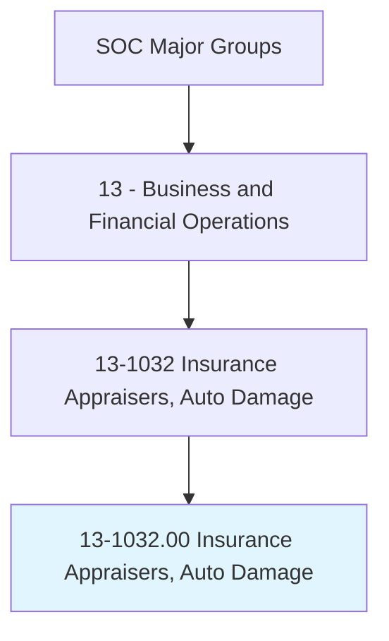
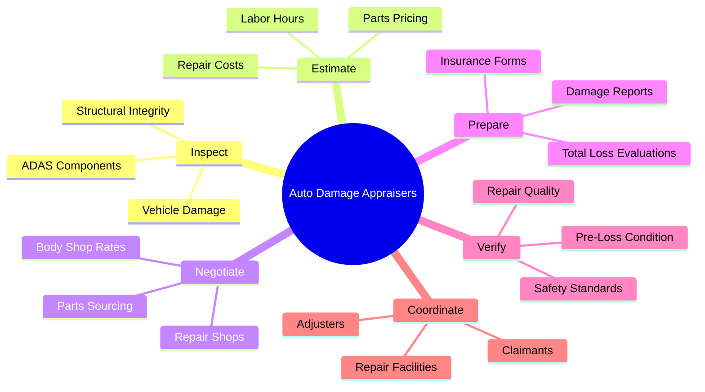
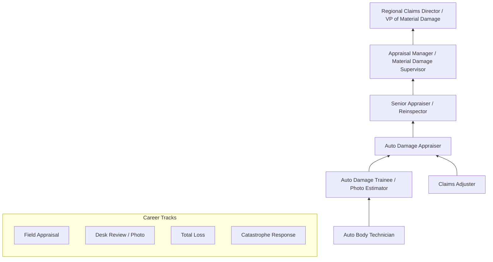
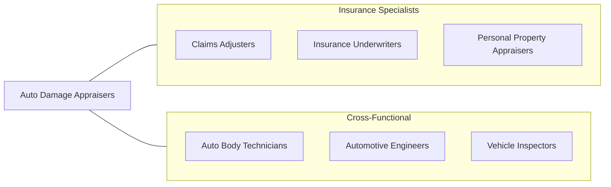

# Insurance Appraisers, Auto Damage

> Appraise automobile or other vehicle damage to determine repair costs for insurance claim settlement. Prepare insurance forms to indicate repair cost estimates and recommendations. May seek agreement with automotive repair shop on repair costs.

## Overview

Insurance Appraisers for Auto Damage assess vehicle damage resulting from accidents, weather events, vandalism, and other covered perils to determine repair costs for insurance claim settlement. They inspect damaged vehicles, prepare detailed repair estimates, negotiate with repair shops, and ensure that repairs meet quality and safety standards. Their work directly affects claim settlement costs, customer satisfaction, and the operational efficiency of insurance companies.

These professionals must possess extensive knowledge of automotive construction, repair procedures, paint and refinishing techniques, and parts pricing to create accurate estimates. They use sophisticated estimating software that integrates parts databases, labor time guides, and material cost calculators to produce detailed repair plans. The role requires balancing the insurer's interest in cost-effective repairs with the obligation to restore vehicles to their pre-loss condition.

The profession is undergoing significant transformation due to advanced driver assistance systems (ADAS), electric vehicles, composite materials, and AI-powered damage assessment tools. Modern vehicles incorporate complex sensors, cameras, and computer systems that dramatically increase repair complexity and cost. Photo-based and AI-assisted estimating platforms are changing how initial damage assessments are conducted, though skilled human appraisers remain essential for complex damage evaluation and quality assurance.

## Classification Hierarchy

## Key Statistics

| Metric | Value |
|--------|-------|
| SOC Code | 13-1032.00 |
| Job Zone | 3 (Medium Preparation) |
| Category | [Business and Financial Operations](/occupations/Business/index) |
| Median Salary | $70,020 |
| Employment | ~15,000 |
| Projected Growth | -6% (Declining) |
| Task Count | 24 |
| Source | O*NET |

## Core Tasks

### inspect.VehicleDamage

Inspect damaged vehicles to identify all areas requiring repair and assess structural integrity.

**Actions:**
- `inspect.VehicleDamage.to.assess.RepairScope` - Determine damage extent
- `inspect.StructuralIntegrity.to.evaluate.SafetyImplications` - Check frame/unibody
- `inspect.ADASComponents.to.identify.CalibrationNeeds` - Assess sensor damage
- `document.DamageFindings.with.PhotosAndMeasurements` - Create visual record

### estimate.RepairCosts

Prepare detailed repair cost estimates using estimating software and industry databases.

**Actions:**
- `estimate.RepairCosts.using.IndustryStandardSoftware` - Calculate total costs
- `estimate.LaborHours.based.on.RepairProcedures` - Apply time guides
- `estimate.PartsPricing.from.OEMAndAftermarketSources` - Price components
- `determine.TotalLoss.when.RepairCostsExceedValue` - Evaluate repair economics

### negotiate.RepairTerms

Negotiate repair costs and procedures with automotive repair facilities.

**Actions:**
- `negotiate.RepairCosts.with.BodyShops` - Agree on repair pricing
- `negotiate.PartsSourcing.for.CostEfficiency` - Optimize parts selection
- `verify.RepairQuality.to.ensure.PreLossCondition` - Inspect completed work
- `coordinate.with.Claimants.on.RepairOptions` - Communicate with policyholders

## Skills & Competencies

### Technical Skills
- **Automotive Damage Assessment** - Expert
- **Estimating Software (CCC, Mitchell, Audatex)** - Expert
- **Automotive Construction & Materials** - Advanced
- **Repair Procedures & Techniques** - Advanced
- **ADAS Technology** - Advanced
- **Parts Identification & Pricing** - Advanced
- **Total Loss Evaluation** - Proficient

### Soft Skills
- **Attention to Detail** - Critical
- **Negotiation** - Critical
- **Communication** - Essential
- **Customer Service** - Essential
- **Time Management** - Important
- **Conflict Resolution** - Important

## Education & Certifications

| Requirement | Details |
|-------------|---------|
| Typical Education | Associate's or bachelor's degree; vocational training accepted |
| Key Certifications | I-CAR training (Gold Class, Platinum, individual courses) |
| Insurance Certs | AIC (Associate in Claims) |
| Automotive | ASE certification in collision repair areas |
| State Licensing | Some states require auto appraiser licensing |
| Work Experience | 2-5 years in auto body repair or insurance appraisal |

## Career Progression

## Industry Variations

| Industry | Focus | Typical Tasks |
|----------|-------|---------------|
| **Insurance Carriers** | Staff appraiser | Direct policyholder interaction, DRP management |
| **Independent Appraisal** | Multi-carrier | High-volume field appraisals, portable equipment |
| **DRP (Direct Repair)** | Shop-based | Supplement negotiation, cycle time management |
| **Fleet / Commercial** | Commercial vehicles | Heavy truck appraisal, fleet damage management |
| **Catastrophe Teams** | Storm/disaster response | Rapid deployment, high-volume assessments |
| **Total Loss** | Vehicle valuation | Market value research, salvage disposition |

## Technology & Tools

| Category | Tools |
|----------|-------|
| **Estimating** | CCC Intelligent Solutions, Mitchell, Audatex |
| **Photo/AI Assessment** | CCC Photo Estimate, Tractable, Claim Genius |
| **Parts** | PartsTrader, Car-Part.com, OEM parts catalogs |
| **Valuation** | CCC Valuescope, J.D. Power, NADA |
| **Mobile** | Tablets, mobile estimating apps, digital cameras |
| **Communication** | Microsoft 365, claims management portals |
| **ADAS Reference** | OEM position statements, I-CAR RTS portal |

## Related Occupations

## Departments

This occupation typically works in:
- [Material Damage](/departments/MaterialDamage)
- [Claims Operations](/departments/ClaimsOperations)
- [Auto Physical Damage](/departments/AutoPhysicalDamage)
- [Total Loss](/departments/TotalLoss)
- [Quality Assurance](/departments/QualityAssurance)

---

*Source: O*NET 13-1032.00 - ONETOccupation*
