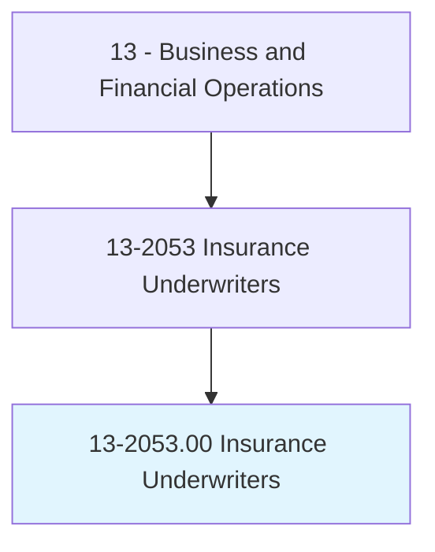
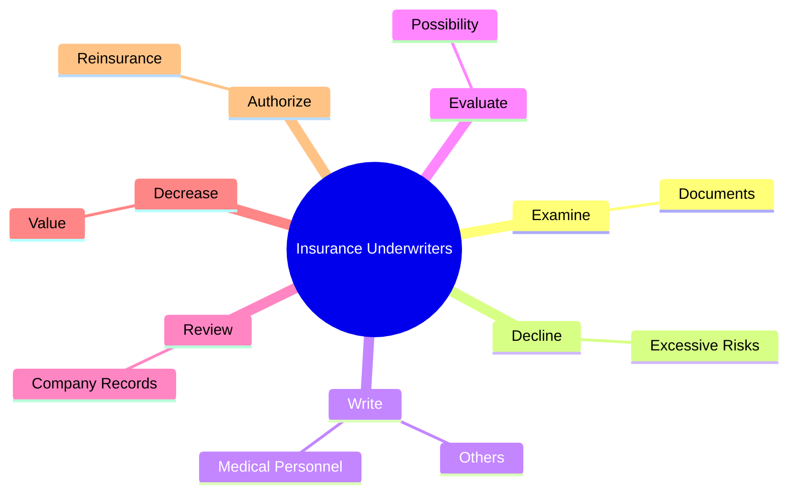
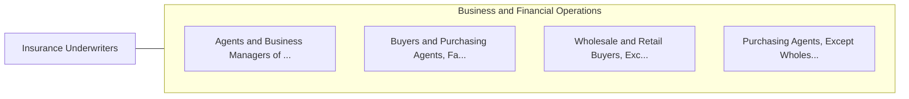

# Insurance Underwriters

> Review individual applications for insurance to evaluate degree of risk involved and determine acceptance of applications.

## Overview

Insurance Underwriters is classified under Business and Financial Operations (SOC 13). Review individual applications for insurance to evaluate degree of risk involved and determine acceptance of applications.

## Classification Hierarchy

## Key Statistics

| Metric | Value |
|--------|-------|
| SOC Code | 13-2053.00 |
| Category | [Business and Financial Operations](/occupations/Business) |
| Task Count | 22 |
| Source | O*NET |

## Core Tasks

### examine.Documents

Insurance Underwriters examine documents as part of their core responsibilities.

**Actions:**
- `examine.Documents.to.determine.DegreeOfRiskFromFactors`
- `examine.Documents.to.ApplicantHealth`
- `examine.Documents.to.FinancialStanding`
- `examine.Documents.to.value`

### decline.ExcessiveRisks

Insurance Underwriters decline excessive risks as part of their core responsibilities.

**Actions:**
- `decline.ExcessiveRisks`

### write.MedicalPersonnel

Insurance Underwriters write medical personnel as part of their core responsibilities.

**Actions:**
- `write.MedicalPersonnel.to.obtain.FurtherInformation`
- `write.MedicalPersonnel.to.quote.Rates`
- `write.MedicalPersonnel.to.explain.CompanyUnderwritingPolicies`
- `write.Others.to.obtain.FurtherInformation`

## Skills & Competencies

### Technical Skills
- **Financial Analysis** - Advanced
- **Data Analysis** - Advanced
- **Regulatory Compliance** - Advanced

### Soft Skills
- **Communication** - Essential
- **Problem Solving** - Essential
- **Critical Thinking** - Important
- **Teamwork** - Important
- **Adaptability** - Important

## Related Occupations

## Industries

This occupation is found across multiple industries. See [Industries](/industries) for sector-specific employment data.

## Career Progression

---

*Source: O*NET 13-2053.00 - ONETOccupation*
