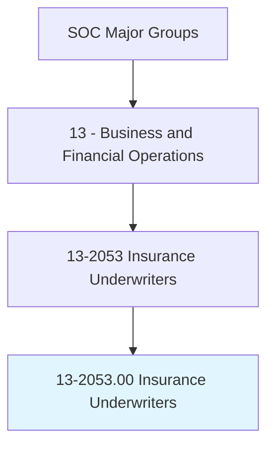
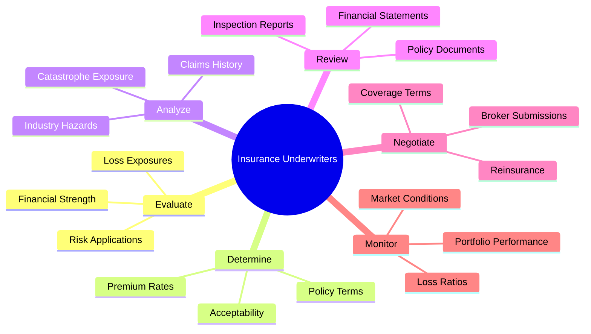
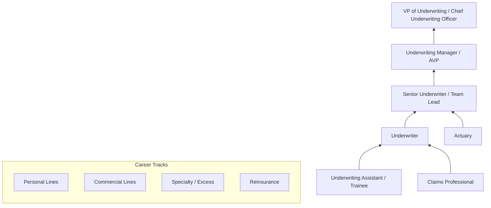
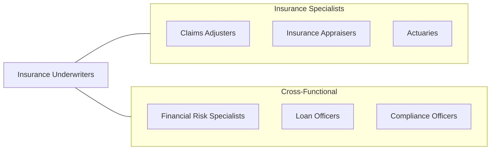

# Insurance Underwriters

> Review individual applications for insurance to evaluate degree of risk involved and determine acceptance of applications.

## Overview

Insurance Underwriters evaluate and select the risks that insurance companies agree to insure, determining policy terms, coverage limits, and premium rates. They review applications from individuals and businesses, analyze risk factors, and decide whether to accept, modify, or decline coverage. Their decisions directly impact the insurer's loss experience, profitability, and competitive position in the marketplace.

The underwriting process requires careful analysis of applicant information including financial records, medical reports, inspection findings, loss history, and industry-specific risk factors. Underwriters must balance the need to write profitable business with the competitive pressure to provide coverage at market-competitive terms. They apply actuarial guidelines, company risk appetite parameters, and their own professional judgment to make coverage decisions that collectively determine the financial health of the insurance portfolio.

The profession is being transformed by predictive analytics, artificial intelligence, and automated underwriting platforms that can process straightforward risks with minimal human intervention. Despite this automation, experienced underwriters remain essential for complex commercial risks, specialty lines, and situations requiring nuanced judgment about emerging risk factors such as cyber exposure, climate change, and pandemic-related losses.

## Classification Hierarchy

## Key Statistics

| Metric | Value |
|--------|-------|
| SOC Code | 13-2053.00 |
| Job Zone | 4 (Considerable Preparation) |
| Category | [Business and Financial Operations](/occupations/Business/index) |
| Median Salary | $77,860 |
| Employment | ~109,000 |
| Projected Growth | -4% (Declining) |
| Task Count | 22 |
| Source | O*NET |

## Core Tasks

### evaluate.RiskApplications

Review insurance applications to evaluate risk and determine insurability.

**Actions:**
- `evaluate.RiskApplications.to.determine.Acceptability` - Assess risk quality
- `evaluate.LossExposures.to.quantify.PotentialClaims` - Measure loss potential
- `evaluate.FinancialStrength.of.CommercialApplicants` - Assess business stability
- `examine.Documents.to.determine.DegreeOfRiskFromFactors` - Analyze risk factors

### determine.PolicyTerms

Set premium rates, coverage terms, and conditions for accepted risks.

**Actions:**
- `determine.PremiumRates.based.on.RiskClassification` - Price coverage
- `determine.PolicyTerms.to.reflect.RiskCharacteristics` - Structure coverage
- `determine.CoverageLimits.based.on.ExposureAnalysis` - Set maximum payouts
- `decline.ExcessiveRisks.that.exceed.CompanyAppetite` - Reject unacceptable risks

### monitor.PortfolioPerformance

Monitor underwriting portfolio performance and adjust strategies accordingly.

**Actions:**
- `monitor.LossRatios.to.assess.PortfolioProfitability` - Track financial performance
- `monitor.MarketConditions.to.adjust.PricingStrategies` - Respond to competition
- `authorize.Reinsurance.to.manage.CatastropheExposure` - Transfer excess risk
- `review.CompanyRecords.to.evaluate.UnderwritingResults` - Analyze book of business

## Skills & Competencies

### Technical Skills
- **Risk Assessment & Selection** - Expert
- **Insurance Policy Forms & Coverage** - Expert
- **Actuarial Guidelines & Rating** - Advanced
- **Financial Statement Analysis** - Advanced
- **Loss Control & Risk Engineering** - Proficient
- **Reinsurance** - Proficient
- **Predictive Analytics** - Proficient
- **Regulatory Compliance** - Proficient

### Soft Skills
- **Analytical Thinking** - Critical
- **Judgment & Decision Making** - Critical
- **Attention to Detail** - Essential
- **Communication** - Essential
- **Negotiation** - Important
- **Time Management** - Important

## Education & Certifications

| Requirement | Details |
|-------------|---------|
| Typical Education | Bachelor's degree in Business, Finance, Risk Management, or related field |
| Key Certifications | CPCU (Chartered Property Casualty Underwriter) |
| Additional Certs | AU (Associate in Commercial Underwriting), ARe (Associate in Reinsurance) |
| Entry-Level | AINS (Associate in General Insurance) |
| Specialty | RPLU (Registered Professional Liability Underwriter) |
| Work Experience | 2-5 years progressive underwriting experience |

## Career Progression

## Industry Variations

| Industry | Focus | Typical Tasks |
|----------|-------|---------------|
| **Personal Lines** | Home, auto, umbrella | Automated scoring, exception handling, territory analysis |
| **Commercial Lines** | Business insurance | Financial analysis, loss control review, risk engineering |
| **Specialty Lines** | D&O, E&O, cyber | Complex risk assessment, manuscript policy drafting |
| **Excess & Surplus** | Non-standard risks | Creative coverage solutions, high-hazard risks |
| **Reinsurance** | Treaty and facultative | Portfolio analysis, cat modeling, capacity management |
| **Life & Health** | Individual/group | Medical underwriting, mortality assessment, group rating |

## Technology & Tools

| Category | Tools |
|----------|-------|
| **Underwriting Platforms** | Guidewire PolicyCenter, Duck Creek, Majesco |
| **Rating Engines** | Earnix, Milliman Arius, proprietary systems |
| **Analytics** | SAS, Python, Tableau, Power BI |
| **Data Sources** | LexisNexis, ISO, NCCI, A.M. Best |
| **Cat Modeling** | RMS, AIR, CoreLogic |
| **Document Management** | ImageRight, OnBase, SharePoint |
| **Communication** | Microsoft 365, broker portals |

## Related Occupations

## Departments

This occupation typically works in:
- [Underwriting](/departments/Underwriting)
- [Risk Selection](/departments/RiskSelection)
- [Product Management](/departments/ProductManagement)
- [Actuarial](/departments/Actuarial)
- [Reinsurance](/departments/Reinsurance)

---

*Source: O*NET 13-2053.00 - ONETOccupation*
