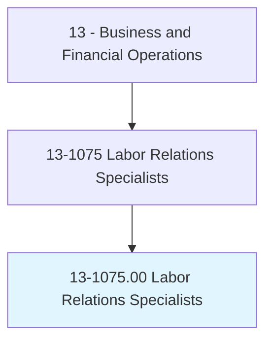
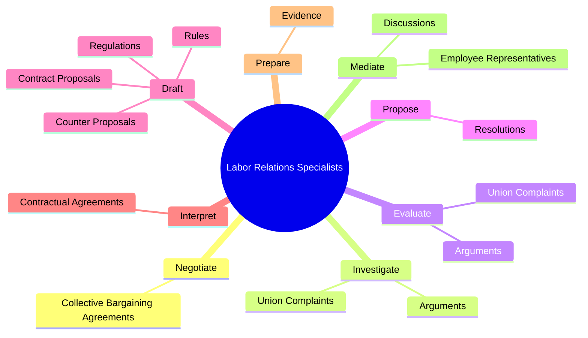
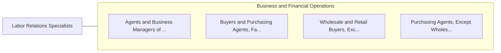

# Labor Relations Specialists

> Resolve disputes between workers and managers, negotiate collective bargaining agreements, or coordinate grievance procedures to handle employee complaints.

## Overview

Labor Relations Specialists is classified under Business and Financial Operations (SOC 13). Resolve disputes between workers and managers, negotiate collective bargaining agreements, or coordinate grievance procedures to handle employee complaints.

## Classification Hierarchy

## Key Statistics

| Metric | Value |
|--------|-------|
| SOC Code | 13-1075.00 |
| Category | [Business and Financial Operations](/occupations/Business/index) |
| Task Count | 126 |
| Source | O*NET |

## Core Tasks

### negotiate.CollectiveBargainingAgreements

Labor Relations Specialists negotiate collective bargaining agreements as part of their core responsibilities.

**Actions:**
- `negotiate.CollectiveBargainingAgreements`

### investigate.UnionComplaints

Labor Relations Specialists investigate union complaints as part of their core responsibilities.

**Actions:**
- `investigate.UnionComplaints.to.determine.Viability`
- `investigate.Arguments.to.determine.Viability`

### evaluate.UnionComplaints

Labor Relations Specialists evaluate union complaints as part of their core responsibilities.

**Actions:**
- `evaluate.UnionComplaints.to.determine.Viability`
- `evaluate.Arguments.to.determine.Viability`

## Skills & Competencies

### Technical Skills
- **Financial Analysis** - Advanced
- **Data Analysis** - Advanced
- **Regulatory Compliance** - Advanced

### Soft Skills
- **Communication** - Essential
- **Problem Solving** - Essential
- **Critical Thinking** - Important
- **Teamwork** - Important
- **Adaptability** - Important

## Related Occupations

## Industries

This occupation is found across multiple industries. See [Industries](/industries) for sector-specific employment data.

## Career Progression

---

*Source: O*NET 13-1075.00 - ONETOccupation*
