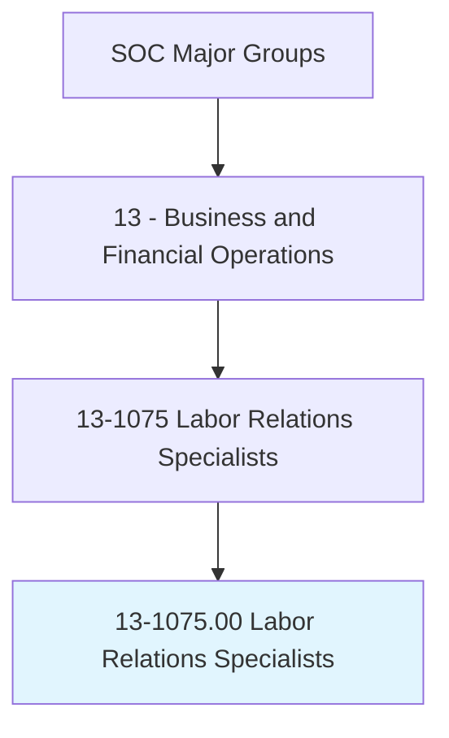
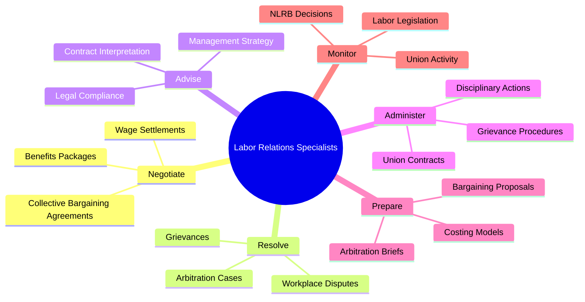
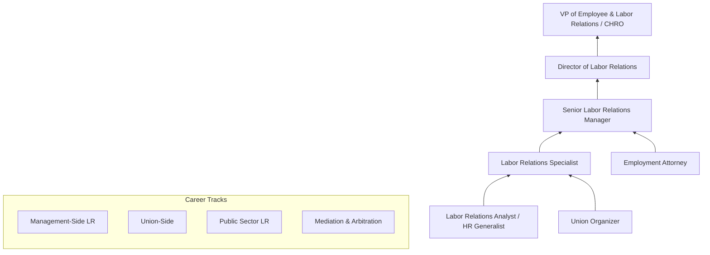
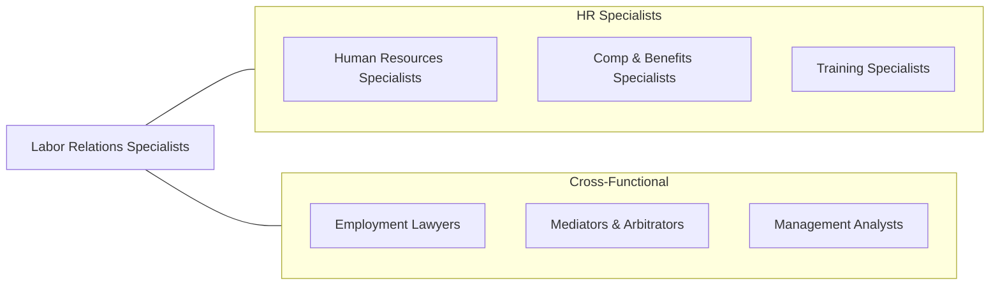

# Labor Relations Specialists

> Resolve disputes between workers and managers, negotiate collective bargaining agreements, or coordinate grievance procedures to handle employee complaints.

## Overview

Labor Relations Specialists manage the relationship between organizations and labor unions, negotiating collective bargaining agreements, resolving workplace disputes, administering grievance procedures, and ensuring compliance with labor laws. They serve as the primary point of contact between management and union representatives, requiring deep knowledge of labor law, contract administration, and dispute resolution techniques.

These professionals play a critical role in organizations with unionized workforces, drafting contract proposals, conducting negotiations over wages, benefits, working conditions, and work rules, and interpreting contract language to resolve day-to-day disputes. They advise management on labor relations strategy, prepare for arbitration hearings, and monitor legislative and regulatory developments that affect the collective bargaining relationship.

The profession operates within a dynamic regulatory environment shaped by the National Labor Relations Act, Railway Labor Act, and various state labor laws. Recent trends including the resurgence of union organizing, remote work implications for bargaining units, gig economy classification disputes, and evolving NLRB interpretations have made the field more complex and strategically important for employers across all sectors.

## Classification Hierarchy

## Key Statistics

| Metric | Value |
|--------|-------|
| SOC Code | 13-1075.00 |
| Job Zone | 4 (Considerable Preparation) |
| Category | [Business and Financial Operations](/occupations/Business/index) |
| Median Salary | $82,010 |
| Employment | ~86,000 |
| Projected Growth | -1% (Declining) |
| Task Count | 32 |
| Source | O*NET |

## Core Tasks

### negotiate.CollectiveBargainingAgreements

Lead or support collective bargaining negotiations with labor unions.

**Actions:**
- `negotiate.CollectiveBargainingAgreements.with.UnionRepresentatives` - Conduct CBA negotiations
- `negotiate.WageSettlements.within.BudgetaryConstraints` - Structure compensation
- `negotiate.BenefitsPackages.to.balance.CostAndCompetitiveness` - Design benefits
- `prepare.BargainingProposals.based.on.EconomicAnalysis` - Develop management positions

### resolve.Grievances

Process and resolve grievances and workplace disputes under collective bargaining agreements.

**Actions:**
- `resolve.Grievances.through.ContractInterpretation` - Apply CBA language
- `resolve.WorkplaceDisputes.through.Mediation` - Facilitate resolution
- `prepare.ArbitrationBriefs.for.UnresolvedGrievances` - Build arbitration cases
- `administer.DisciplinaryActions.in.accordance.with.ContractTerms` - Apply just cause

### advise.Management

Advise management on labor relations strategy, contract compliance, and labor law.

**Actions:**
- `advise.Management.on.LaborRelationsStrategy` - Guide strategic decisions
- `advise.Supervisors.on.ContractInterpretation` - Clarify CBA provisions
- `monitor.LaborLegislation.for.ComplianceImplications` - Track regulatory changes
- `monitor.UnionActivity.to.assess.OrganizingRisks` - Evaluate labor climate

## Skills & Competencies

### Technical Skills
- **Labor Law (NLRA, Railway Labor Act)** - Expert
- **Collective Bargaining** - Expert
- **Contract Administration & Interpretation** - Expert
- **Grievance & Arbitration** - Advanced
- **Economic & Wage Analysis** - Advanced
- **Mediation & ADR** - Advanced
- **HRIS & Labor Analytics** - Proficient

### Soft Skills
- **Negotiation** - Critical
- **Communication (Written/Verbal)** - Critical
- **Analytical Thinking** - Essential
- **Conflict Resolution** - Essential
- **Patience & Diplomacy** - Essential
- **Strategic Thinking** - Important

## Education & Certifications

| Requirement | Details |
|-------------|---------|
| Typical Education | Bachelor's degree in Labor Relations, HR, Political Science, or Law |
| Advanced Degree | Master's in Labor Relations (MILR) or JD preferred |
| Key Certifications | SPHR/SHRM-SCP, CLRP (Certified Labor Relations Professional) |
| Professional Orgs | LERA (Labor and Employment Relations Association) |
| Federal Sector | FLRA familiarity for federal labor relations |
| Work Experience | 3-7 years in labor relations, HR, or union-side advocacy |

## Career Progression

## Industry Variations

| Industry | Focus | Typical Tasks |
|----------|-------|---------------|
| **Manufacturing** | Industrial unions | Shift scheduling, safety rules, work rules |
| **Healthcare** | Nursing/service unions | Staffing ratios, patient safety, mandatory overtime |
| **Education** | Teachers unions | Academic freedom, class size, evaluation |
| **Government** | Public sector unions | Civil service rules, FLRA compliance |
| **Transportation** | Railway/airline unions | Railway Labor Act, seniority systems |
| **Entertainment** | SAG-AFTRA, IATSE | Residuals, working conditions, AI/digital use |

## Technology & Tools

| Category | Tools |
|----------|-------|
| **Contract Management** | ContractPodAi, Ironclad, SharePoint |
| **Grievance Tracking** | LaborSoft, CaseIQ, custom databases |
| **Analytics** | Excel, Tableau, compensation benchmarking tools |
| **Legal Research** | Westlaw, LexisNexis, NLRB case databases |
| **HRIS** | Workday, SAP SuccessFactors, ADP |
| **Communication** | Microsoft 365, secure bargaining portals |
| **Costing** | Excel models, actuarial tools for benefits costing |

## Related Occupations

## Departments

This occupation typically works in:
- Labor Relations
- Employee Relations
- Human Resources
- [Legal](/departments/Legal)
- [Operations](/departments/Operations)

---

*Source: O*NET 13-1075.00 - ONETOccupation*
