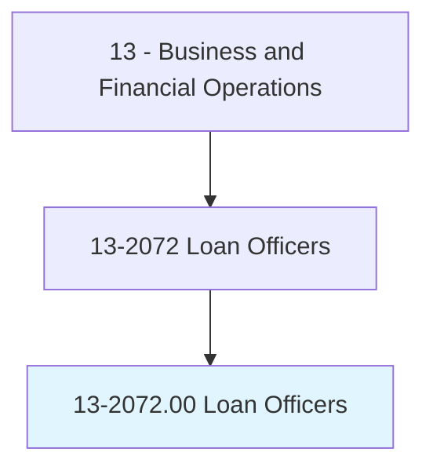
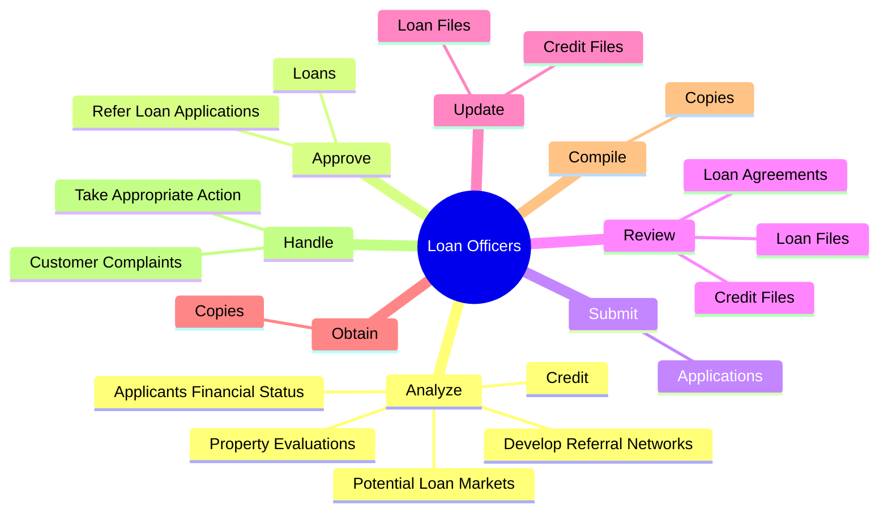

# Loan Officers

> Evaluate, authorize, or recommend approval of commercial, real estate, or credit loans. Advise borrowers on financial status and payment methods. Includes mortgage loan officers and agents, collection analysts, loan servicing officers, loan underwriters, and payday loan officers.

## Overview

Loan Officers is an occupation within the Business and Financial Operations category. Evaluate, authorize, or recommend approval of commercial, real estate, or credit loans. Advise borrowers on financial status and payment methods.

## Classification Hierarchy

## Key Statistics

| Metric | Value |
|--------|-------|
| SOC Code | 13-2072.00 |
| Category | [Business and Financial Operations](/occupations/Business) |
| Task Count | 67 |
| Source | O*NET |

## Core Tasks

### analyze.ApplicantsFinancialStatus

Loan Officers analyze applicants financial status as part of their core responsibilities.

**Actions:**
- `analyze.ApplicantsFinancialStatus.to.determine.FeasibilityOfGrantingLoans`
- `analyze.Credit.to.determine.FeasibilityOfGrantingLoans`
- `analyze.PropertyEvaluations.to.determine.FeasibilityOfGrantingLoans`
- `analyze.PotentialLoanMarkets.to.locate.ProspectsForLoans`

### approve.Loans

Loan Officers approve loans as part of their core responsibilities.

**Actions:**
- `approve.Loans.within.SpecifiedLimitsToManagementForApproval`
- `approve.ReferLoanApplications.outside.LimitsToManagementForApproval`

### submit.Applications

Loan Officers submit applications as part of their core responsibilities.

**Actions:**
- `submit.Applications.to.CreditAnalystsForVerification`
- `submit.Applications.to.Recommendation`

## Skills & Competencies

### Technical Skills
- **Financial Analysis** - Advanced
- **Data Analysis** - Advanced
- **Regulatory Compliance** - Advanced

### Soft Skills
- **Communication** - Essential
- **Problem Solving** - Essential
- **Critical Thinking** - Important
- **Teamwork** - Important
- **Adaptability** - Important

## Related Occupations

## Industries

This occupation is found across multiple industries. See [Industries](/industries) for sector-specific employment data.

## Career Progression

---

*Source: O*NET 13-2072.00 - ONETOccupation*
