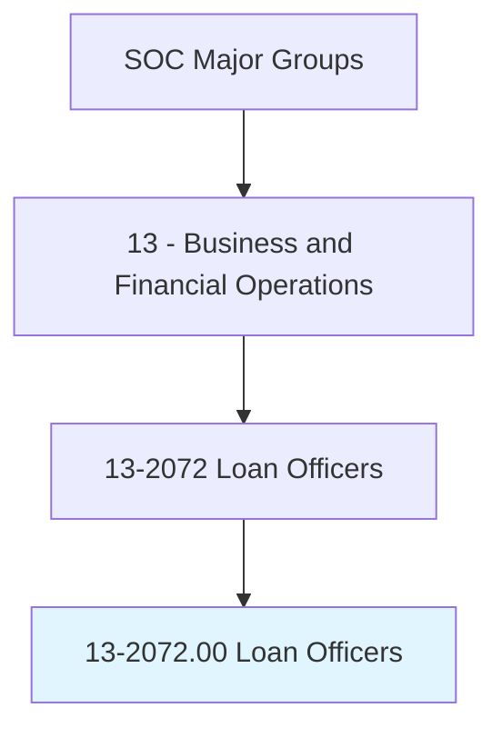
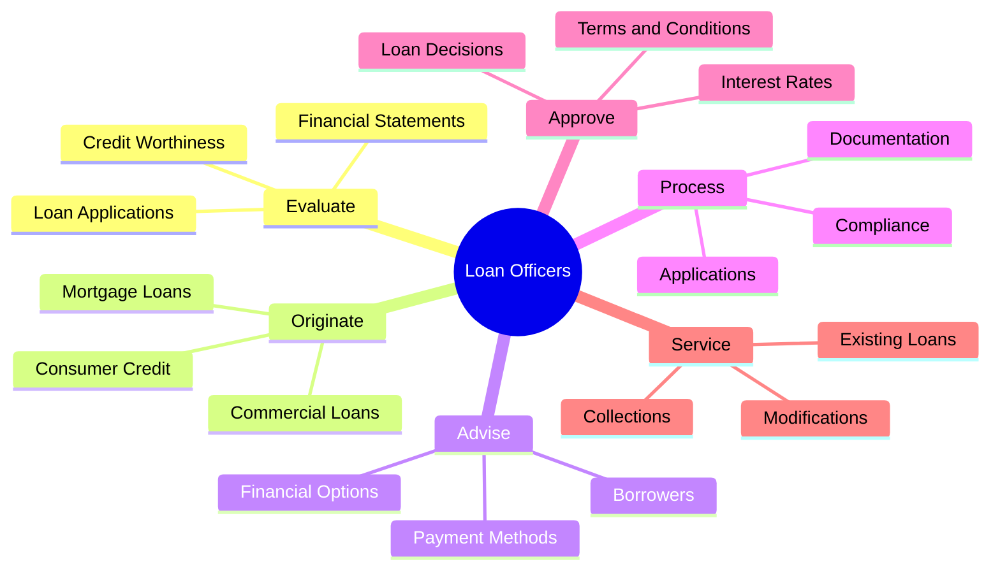
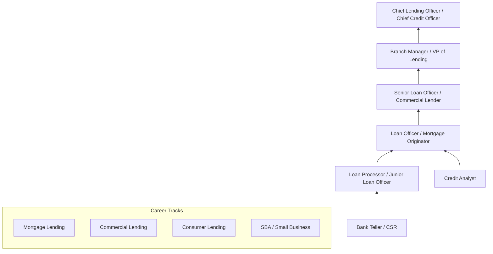
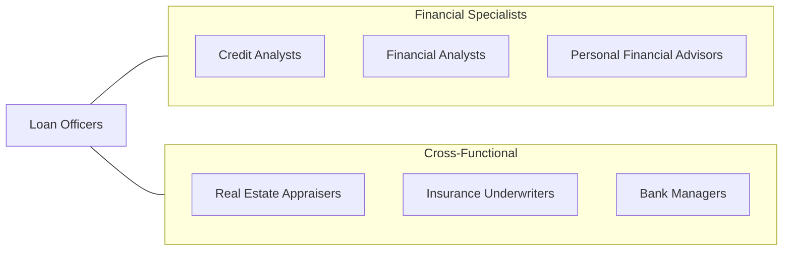

# Loan Officers

> Evaluate, authorize, or recommend approval of commercial, real estate, or credit loans. Advise borrowers on financial status and payment methods. Includes mortgage loan officers and agents, collection analysts, loan servicing officers, and loan underwriters.

## Overview

Loan Officers evaluate and authorize loans for individuals and businesses, serving as the critical decision-makers in the lending process. They review loan applications, assess borrowers' creditworthiness, determine appropriate loan terms, and ensure compliance with lending regulations. Whether originating residential mortgages, commercial real estate loans, consumer credit, or business financing, these professionals balance the need to grow loan portfolios with prudent risk management.

The role encompasses the full lending lifecycle, from initial borrower consultation through application processing, credit analysis, approval, and closing. Loan officers must understand financial statements, credit scoring models, collateral valuation, and regulatory requirements including TILA, RESPA, ECOA, HMDA, and the Dodd-Frank Act. They serve as advisors to borrowers, helping them understand available products and select financing solutions appropriate for their needs.

The profession has been reshaped by technology, including automated underwriting systems, digital application platforms, electronic closings, and data-driven risk assessment tools. Despite automation of routine decisions, experienced loan officers remain essential for complex transactions, relationship management, and borrowers who fall outside standard parameters. The ongoing evolution of interest rate environments, housing markets, and regulatory requirements ensures that loan origination remains a dynamic and challenging profession.

## Classification Hierarchy

## Key Statistics

| Metric | Value |
|--------|-------|
| SOC Code | 13-2072.00 |
| Job Zone | 4 (Considerable Preparation) |
| Category | [Business and Financial Operations](/occupations/Business/index) |
| Median Salary | $65,740 |
| Employment | ~326,000 |
| Projected Growth | 3% (Slower than average) |
| Task Count | 30 |
| Source | O*NET |

## Core Tasks

### evaluate.LoanApplications

Review loan applications and assess borrower creditworthiness.

**Actions:**
- `evaluate.LoanApplications.to.determine.Eligibility` - Screen applicants
- `evaluate.CreditWorthiness.using.CreditReports` - Assess credit risk
- `evaluate.FinancialStatements.to.verify.Income` - Confirm ability to repay
- `evaluate.Collateral.to.assess.LoanSecurity` - Value pledged assets

### originate.Loans

Originate mortgage, commercial, and consumer loans.

**Actions:**
- `originate.MortgageLoans.for.HomePurchases` - Facilitate homeownership
- `originate.CommercialLoans.for.BusinessExpansion` - Fund business growth
- `advise.Borrowers.on.FinancialOptions` - Recommend appropriate products
- `process.LoanDocumentation.for.Closing` - Complete loan packages

### ensure.Compliance

Ensure lending activities comply with federal, state, and company regulations.

**Actions:**
- `ensure.Compliance.with.TILA.and.RESPA` - Meet disclosure requirements
- `ensure.FairLending.under.ECOA.and.HMDA` - Prevent discriminatory lending
- `approve.LoanDecisions.within.DelegatedAuthority` - Exercise lending authority
- `maintain.NMLS.Registration.for.MortgageLending` - Uphold licensing standards

## Skills & Competencies

### Technical Skills
- **Credit Analysis** - Expert
- **Lending Regulations (TILA, RESPA, ECOA)** - Expert
- **Financial Statement Analysis** - Advanced
- **Mortgage Products & Programs** - Advanced
- **Automated Underwriting (DU, LP)** - Advanced
- **Real Estate Valuation** - Proficient
- **Commercial Lending** - Proficient

### Soft Skills
- **Relationship Building** - Critical
- **Communication** - Critical
- **Sales & Business Development** - Essential
- **Attention to Detail** - Essential
- **Problem Solving** - Important
- **Time Management** - Important

## Education & Certifications

| Requirement | Details |
|-------------|---------|
| Typical Education | Bachelor's degree in Finance, Business, or Economics |
| Federal Licensing | NMLS registration required for mortgage loan originators |
| Key Certifications | CMB (Certified Mortgage Banker), CML (Commercial Mortgage Lender) |
| Additional Certs | CRA (Certified Residential Appraiser) optional |
| SAFE Act | 20 hours pre-licensing education, national exam |
| Work Experience | 1-3 years in banking, lending, or financial services |

## Career Progression

## Industry Variations

| Industry | Focus | Typical Tasks |
|----------|-------|---------------|
| **Retail Banking** | Consumer & mortgage | Personal loans, home mortgages, HELOCs |
| **Commercial Banking** | Business lending | C&I loans, CRE, lines of credit, treasury management |
| **Mortgage Companies** | Residential origination | Purchase, refinance, government loans (FHA, VA) |
| **Credit Unions** | Member lending | Auto loans, personal loans, member-focused products |
| **SBA Lending** | Small business | SBA 7(a), 504 loans, microloans |
| **Fintech** | Digital lending | Online applications, instant decisions, marketplace lending |

## Technology & Tools

| Category | Tools |
|----------|-------|
| **Loan Origination** | Encompass (ICE), MeridianLink, Blend |
| **Underwriting** | DU (Desktop Underwriter), LP (Loan Prospector) |
| **CRM** | Salesforce, Total Expert, Velocify |
| **Compliance** | ComplianceEase, Wolters Kluwer, MISMO |
| **Credit Reports** | Equifax, Experian, TransUnion |
| **Document** | DocuSign, Notarize, eClose platforms |
| **Analytics** | Excel, Power BI, custom dashboards |

## Related Occupations

## Departments

This occupation typically works in:
- [Lending / Origination](/departments/Lending)
- [Mortgage Operations](/departments/MortgageOperations)
- [Commercial Banking](/departments/CommercialBanking)
- [Credit Administration](/departments/CreditAdministration)
- [Branch Banking](/departments/BranchBanking)

---

*Source: O*NET 13-2072.00 - ONETOccupation*
