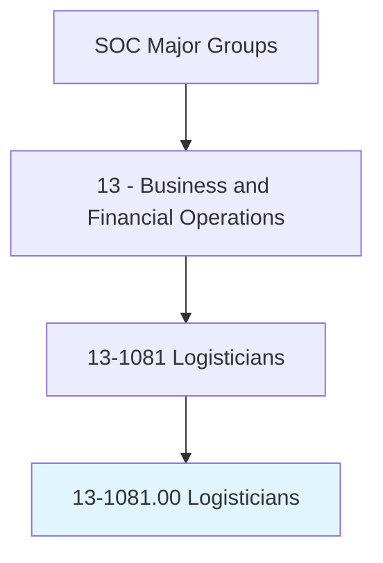
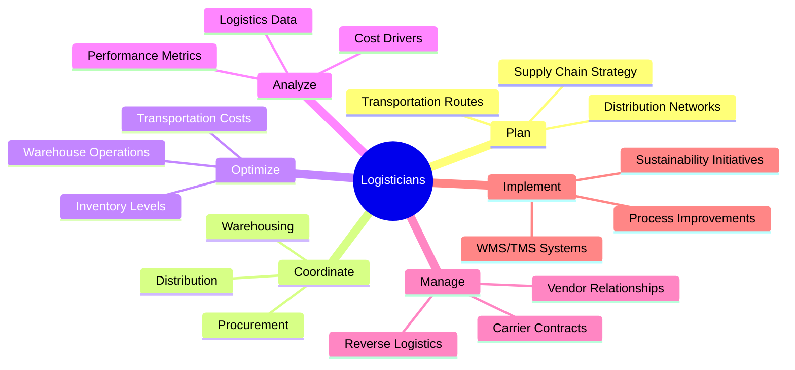
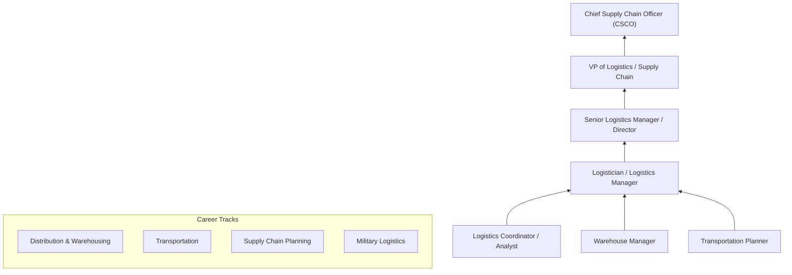
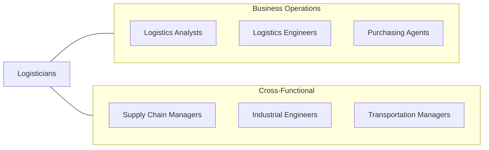

# Logisticians

> Analyze and coordinate the logistical functions of a firm or organization. Responsible for the entire life cycle of a product, including acquisition, distribution, internal allocation, delivery, and final disposal of resources.

## Overview

Logisticians analyze, coordinate, and optimize the logistical functions that move goods and materials through supply chains from origin to final destination. They manage the complete product lifecycle, including procurement, warehousing, inventory management, transportation, distribution, and reverse logistics. Their work ensures that organizations receive the right products, in the right quantities, at the right time, and at the lowest possible cost.

These professionals operate at the strategic and tactical levels of supply chain management, designing logistics networks, selecting transportation modes, optimizing warehouse operations, and implementing inventory control systems. They analyze data on shipping volumes, carrier performance, facility utilization, and cost drivers to identify improvement opportunities. The role requires systems thinking, as logistics decisions affect manufacturing schedules, customer service levels, working capital, and environmental impact.

The profession has been transformed by e-commerce growth, globalization, supply chain disruptions, and sustainability mandates. Modern logisticians leverage advanced technologies including warehouse management systems, transportation management systems, IoT tracking, predictive analytics, and autonomous vehicles to manage increasingly complex and fast-paced supply chains. The COVID-19 pandemic and subsequent supply chain disruptions elevated the strategic importance of logistics and supply chain resilience.

## Classification Hierarchy

## Key Statistics

| Metric | Value |
|--------|-------|
| SOC Code | 13-1081.00 |
| Job Zone | 4 (Considerable Preparation) |
| Category | [Business and Financial Operations](/occupations/Business/index) |
| Median Salary | $77,520 |
| Employment | ~193,000 |
| Projected Growth | 18% (Much faster than average) |
| Task Count | 42 |
| Source | O*NET |

## Core Tasks

### plan.SupplyChainStrategy

Design and implement logistics strategies for efficient supply chain operations.

**Actions:**
- `plan.SupplyChainStrategy.to.optimize.CostAndService` - Design logistics networks
- `plan.DistributionNetworks.to.minimize.DeliveryTime` - Structure distribution
- `plan.TransportationRoutes.to.reduce.FreightCosts` - Optimize routing
- `plan.InventoryStrategies.to.balance.ServiceAndCost` - Set stocking policies

### coordinate.LogisticsOperations

Coordinate procurement, warehousing, and distribution activities.

**Actions:**
- `coordinate.Procurement.with.Suppliers` - Manage inbound logistics
- `coordinate.Warehousing.for.EfficientStorageAndRetrieval` - Oversee facility operations
- `coordinate.Distribution.to.meet.CustomerRequirements` - Manage outbound logistics
- `manage.ReverseLogistics.for.ReturnsAndRecycling` - Handle returns flow

### analyze.LogisticsPerformance

Analyze logistics data and performance metrics to drive continuous improvement.

**Actions:**
- `analyze.LogisticsData.to.identify.Inefficiencies` - Find improvement opportunities
- `analyze.PerformanceMetrics.to.benchmark.Operations` - Track KPIs
- `analyze.CostDrivers.to.reduce.TotalLogisticsCost` - Identify savings
- `implement.ProcessImprovements.based.on.DataAnalysis` - Execute changes

## Skills & Competencies

### Technical Skills
- **Supply Chain Management** - Expert
- **Logistics Planning & Optimization** - Expert
- **Inventory Management** - Advanced
- **Transportation Management** - Advanced
- **Warehouse Operations** - Advanced
- **ERP / WMS / TMS Systems** - Advanced
- **Data Analysis** - Advanced
- **Lean / Six Sigma** - Proficient

### Soft Skills
- **Analytical Thinking** - Critical
- **Problem Solving** - Critical
- **Communication** - Essential
- **Coordination** - Essential
- **Adaptability** - Important
- **Leadership** - Important

## Education & Certifications

| Requirement | Details |
|-------------|---------|
| Typical Education | Bachelor's degree in Supply Chain, Logistics, Business, or Engineering |
| Key Certifications | CSCP (Certified Supply Chain Professional - APICS) |
| Additional Certs | CPIM (Production & Inventory Management), CLTD (Logistics, Transportation & Distribution) |
| Lean/Six Sigma | Green Belt or Black Belt certification |
| Transportation | PLS (Professional Logistician designation) |
| Work Experience | 2-5 years in logistics, supply chain, or operations |

## Career Progression

## Industry Variations

| Industry | Focus | Typical Tasks |
|----------|-------|---------------|
| **E-commerce / Retail** | Fulfillment speed | Last-mile optimization, returns processing, omnichannel |
| **Manufacturing** | Production logistics | JIT delivery, kanban, supplier integration |
| **Military / Defense** | Operational readiness | Theater logistics, equipment sustainment, rapid deployment |
| **Healthcare** | Supply reliability | Cold chain, regulatory compliance, hospital supply |
| **Food & Beverage** | Perishable handling | Temperature control, shelf-life management, food safety |
| **3PL / Freight** | Multi-client service | Network optimization, carrier management, technology |

## Technology & Tools

| Category | Tools |
|----------|-------|
| **WMS** | Manhattan Associates, Blue Yonder, SAP EWM |
| **TMS** | Oracle TMS, MercuryGate, Descartes |
| **ERP** | SAP, Oracle, Microsoft Dynamics |
| **Analytics** | Tableau, Power BI, Python, Excel |
| **Visibility** | FourKites, project44, Descartes MacroPoint |
| **Planning** | Kinaxis, o9 Solutions, Blue Yonder |
| **IoT/Tracking** | RFID, GPS, temperature sensors |

## Related Occupations

## Departments

This occupation typically works in:
- [Logistics](/departments/SupplyChain)
- [Supply Chain Management](/departments/SupplyChain)
- Distribution
- Transportation
- [Operations](/departments/Operations)

---

*Source: O*NET 13-1081.00 - ONETOccupation*
