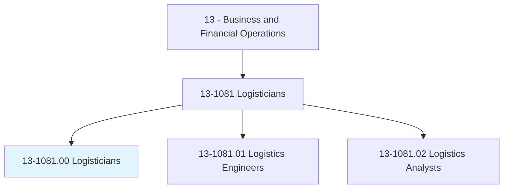
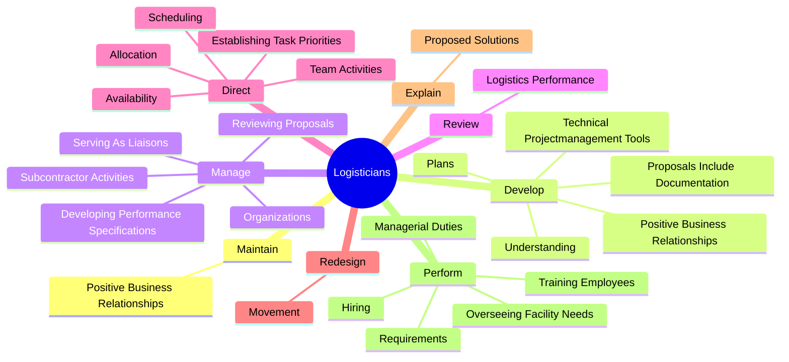
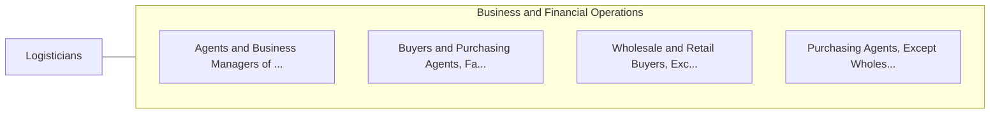

# Logisticians

> Analyze and coordinate the ongoing logistical functions of a firm or organization. Responsible for the entire life cycle of a product, including acquisition, distribution, internal allocation, delivery, and final disposal of resources.

## Overview

Logisticians is an occupation within the Business and Financial Operations category. Analyze and coordinate the ongoing logistical functions of a firm or organization. 

## Classification Hierarchy

## Key Statistics

| Metric | Value |
|--------|-------|
| SOC Code | 13-1081.00 |
| Category | [Business and Financial Operations](/occupations/Business) |
| Task Count | 86 |
| Source | O*NET |

## Core Tasks

### maintain.PositiveBusinessRelationships

Logisticians maintain positive business relationships as part of their core responsibilities.

**Actions:**
- `maintain.PositiveBusinessRelationships.with.CustomersKeyPersonnelInvolvedIn`
- `maintain.PositiveBusinessRelationships.with.DirectlyRelevantTo`
- `maintain.PositiveBusinessRelationships.with.LogisticsActivity`

### develop.PositiveBusinessRelationships

Logisticians develop positive business relationships as part of their core responsibilities.

**Actions:**
- `develop.PositiveBusinessRelationships.with.CustomersKeyPersonnelInvolvedIn`
- `develop.PositiveBusinessRelationships.with.DirectlyRelevantTo`
- `develop.PositiveBusinessRelationships.with.LogisticsActivity`
- `develop.Understanding.of.CustomersNeeds`

### manage.SubcontractorActivities

Logisticians manage subcontractor activities as part of their core responsibilities.

**Actions:**
- `manage.SubcontractorActivities`
- `manage.ReviewingProposals`
- `manage.DevelopingPerformanceSpecifications`
- `manage.ServingAsLiaisons.between.Subcontractors`

## Skills & Competencies

### Technical Skills
- **Financial Analysis** - Advanced
- **Data Analysis** - Advanced
- **Regulatory Compliance** - Advanced

### Soft Skills
- **Communication** - Essential
- **Problem Solving** - Essential
- **Critical Thinking** - Important
- **Teamwork** - Important
- **Adaptability** - Important

## Related Occupations

## Industries

This occupation is found across multiple industries. See [Industries](/industries) for sector-specific employment data.

## Career Progression

---

*Source: O*NET 13-1081.00 - ONETOccupation*
