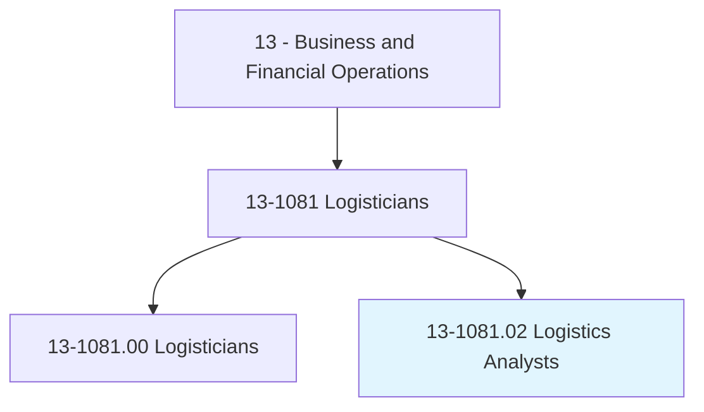
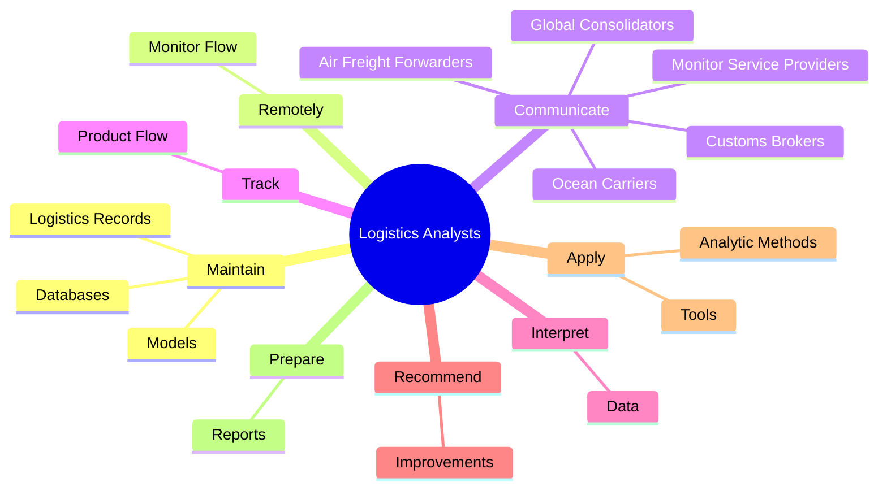
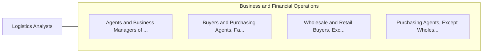

# Logistics Analysts

> Analyze product delivery or supply chain processes to identify or recommend changes. May manage route activity including invoicing, electronic bills, and shipment tracing.

## Overview

Logistics Analysts is a specialized variant within the Business and Financial Operations category. Analyze product delivery or supply chain processes to identify or recommend changes. 

## Classification Hierarchy

## Key Statistics

| Metric | Value |
|--------|-------|
| SOC Code | 13-1081.02 |
| Category | [Business and Financial Operations](/occupations/Business) |
| Task Count | 102 |
| Source | O*NET |

## Core Tasks

### maintain.Databases

Logistics Analysts maintain databases as part of their core responsibilities.

**Actions:**
- `maintain.Databases.of.LogisticsInformation`
- `maintain.LogisticsRecords.in.Accordance.with.CorporatePolicies`
- `maintain.Models.for.LogisticsUses`
- `maintain.Models.for.CostEstimating`

### remotely.MonitorFlow

Logistics Analysts remotely monitor flow as part of their core responsibilities.

**Actions:**
- `remotely.MonitorFlow.of.Vehicles`
- `remotely.MonitorFlow.of.Inventory`
- `remotely.MonitorFlow.of.UsingWebBasedLogisticsInformationSystems.to.track.Vehicles`
- `remotely.MonitorFlow.of.Containers`

### communicate.MonitorServiceProviders

Logistics Analysts communicate monitor service providers as part of their core responsibilities.

**Actions:**
- `communicate.MonitorServiceProviders`
- `communicate.OceanCarriers`
- `communicate.AirFreightForwarders`
- `communicate.GlobalConsolidators`

## Skills & Competencies

### Technical Skills
- **Financial Analysis** - Advanced
- **Data Analysis** - Advanced
- **Regulatory Compliance** - Advanced

### Soft Skills
- **Communication** - Essential
- **Problem Solving** - Essential
- **Critical Thinking** - Important
- **Teamwork** - Important
- **Adaptability** - Important

## Related Occupations

## Industries

This occupation is found across multiple industries. See [Industries](/industries) for sector-specific employment data.

## Career Progression

---

*Source: O*NET 13-1081.02 - ONETOccupation*
