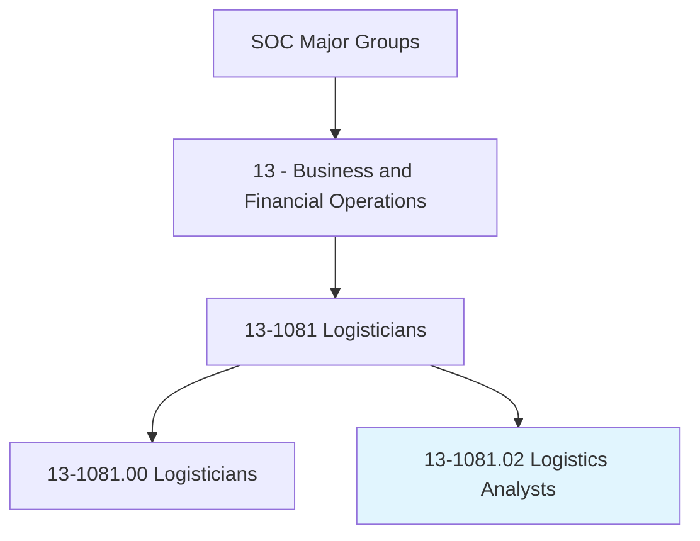
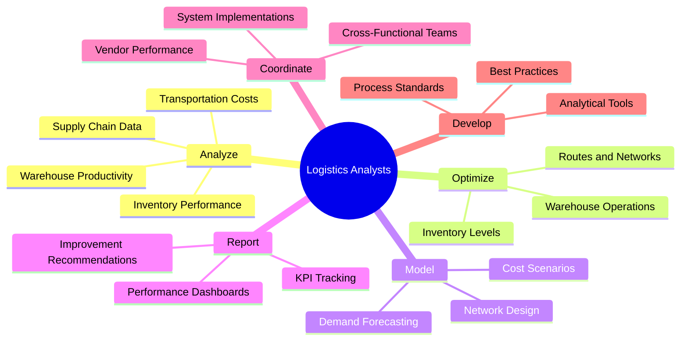
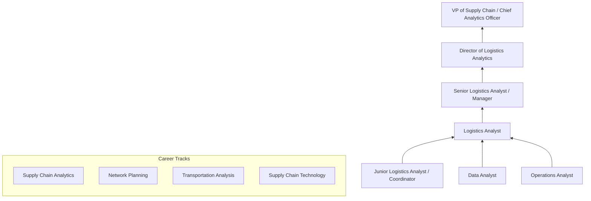
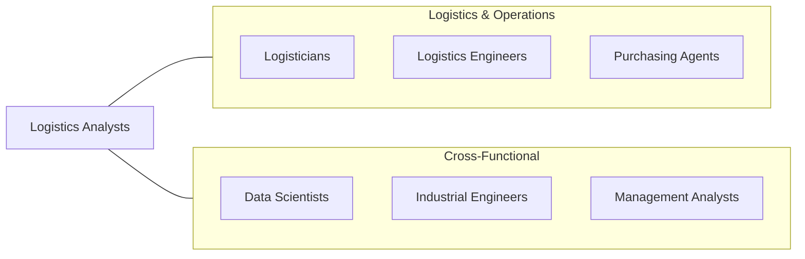

# Logistics Analysts

> Analyze logistics processes and coordinate activities to ensure efficient operations. Monitor and improve the supply chain by optimizing inventory levels, reducing costs, and enhancing delivery performance.

## Overview

Logistics Analysts use data analysis, modeling, and process optimization techniques to improve the efficiency and effectiveness of logistics operations. They analyze transportation costs, warehouse productivity, inventory turns, order fulfillment metrics, and supply chain performance to identify bottlenecks, reduce waste, and enhance service levels. The role is more analytically focused than general logistician positions, emphasizing quantitative methods and data-driven decision-making.

These professionals build models to optimize transportation routes, warehouse layouts, inventory policies, and network configurations. They develop dashboards and reports that provide visibility into logistics performance, enabling management to make informed decisions about capacity planning, carrier selection, and process improvement initiatives. The role bridges the gap between operational logistics execution and strategic supply chain planning.

As supply chains generate increasingly large volumes of data from IoT sensors, warehouse management systems, transportation management systems, and enterprise resource planning platforms, logistics analysts are becoming more important in extracting actionable insights from this data. Advanced analytics, machine learning, and digital twin technology are expanding the analytical toolkit available to these professionals.

## Classification Hierarchy

## Key Statistics

| Metric | Value |
|--------|-------|
| SOC Code | 13-1081.02 |
| Job Zone | 4 (Considerable Preparation) |
| Category | [Business and Financial Operations](/occupations/Business/index) |
| Median Salary | $77,520 |
| Employment | ~50,000 |
| Projected Growth | 18% (Much faster than average) |
| Task Count | 38 |
| Source | O*NET |

## Core Tasks

### analyze.LogisticsData

Analyze logistics data to identify trends, inefficiencies, and improvement opportunities.

**Actions:**
- `analyze.TransportationCosts.to.identify.SavingsOpportunities` - Optimize freight spend
- `analyze.WarehouseProductivity.to.improve.Throughput` - Enhance facility efficiency
- `analyze.InventoryPerformance.to.optimize.StockLevels` - Balance service and cost
- `analyze.SupplyChainData.to.identify.Bottlenecks` - Find constraints

### optimize.LogisticsProcesses

Build models and implement solutions to optimize logistics operations.

**Actions:**
- `optimize.TransportationRoutes.to.reduce.Cost` - Improve routing efficiency
- `optimize.InventoryLevels.to.minimize.CarryingCosts` - Right-size inventory
- `model.NetworkDesign.to.evaluate.FacilityLocations` - Optimize distribution network
- `model.DemandForecasting.to.improve.PlanningAccuracy` - Predict requirements

### report.PerformanceMetrics

Develop dashboards and reports tracking logistics KPIs.

**Actions:**
- `report.PerformanceDashboards.to.provideOperationalVisibility` - Build reporting
- `report.KPITracking.to.measure.ContinuousImprovement` - Monitor progress
- `develop.AnalyticalTools.for.OngoingMonitoring` - Create self-service analytics
- `recommend.ProcessImprovements.based.on.Analysis` - Drive changes

## Skills & Competencies

### Technical Skills
- **Data Analysis & Statistics** - Expert
- **Supply Chain Analytics** - Expert
- **Excel / SQL / Python** - Advanced
- **Transportation & Warehouse Optimization** - Advanced
- **Demand Forecasting** - Advanced
- **BI Tools (Tableau, Power BI)** - Advanced
- **ERP/WMS/TMS Systems** - Proficient
- **Lean / Six Sigma** - Proficient

### Soft Skills
- **Analytical Thinking** - Critical
- **Problem Solving** - Critical
- **Communication** - Essential
- **Attention to Detail** - Essential
- **Collaboration** - Important
- **Presentation Skills** - Important

## Education & Certifications

| Requirement | Details |
|-------------|---------|
| Typical Education | Bachelor's degree in Supply Chain, Industrial Engineering, Analytics, or Business |
| Key Certifications | CSCP (Certified Supply Chain Professional), CLTD (Logistics, Transportation & Distribution) |
| Analytics | Six Sigma Green/Black Belt |
| Additional | CPIM (Certified in Planning and Inventory Management) |
| Work Experience | 2-4 years in logistics, supply chain, or analytics |
| Technical Skills | SQL, Python/R, Tableau/Power BI strongly preferred |

## Career Progression

## Industry Variations

| Industry | Focus | Typical Tasks |
|----------|-------|---------------|
| **E-commerce** | Fulfillment optimization | Last-mile analysis, returns modeling, peak planning |
| **Manufacturing** | Production logistics | Inbound optimization, supplier analytics, JIT analysis |
| **3PL** | Multi-client analytics | Client profitability, network optimization, carrier analysis |
| **Retail** | Store replenishment | Demand forecasting, allocation optimization, DC analysis |
| **Healthcare** | Supply assurance | Critical item tracking, expiration management |
| **Defense** | Readiness analytics | Sustainment modeling, deployment planning |

## Technology & Tools

| Category | Tools |
|----------|-------|
| **Analytics** | Python, R, SQL, Excel (advanced) |
| **BI / Visualization** | Tableau, Power BI, Looker |
| **Optimization** | AIMMS, CPLEX, Gurobi, OR-Tools |
| **ERP/WMS/TMS** | SAP, Oracle, Manhattan, Blue Yonder |
| **Planning** | Kinaxis, o9, Llamasoft (Coupa) |
| **Data** | Snowflake, Databricks, AWS |
| **Collaboration** | Microsoft 365, Slack, Jira |

## Related Occupations

## Departments

This occupation typically works in:
- [Logistics Analytics](/departments/LogisticsAnalytics)
- [Supply Chain Planning](/departments/SupplyChainPlanning)
- [Transportation](/departments/Transportation)
- [Distribution](/departments/Distribution)
- [Operations Excellence](/departments/OpsExcellence)

---

*Source: O*NET 13-1081.02 - ONETOccupation*
