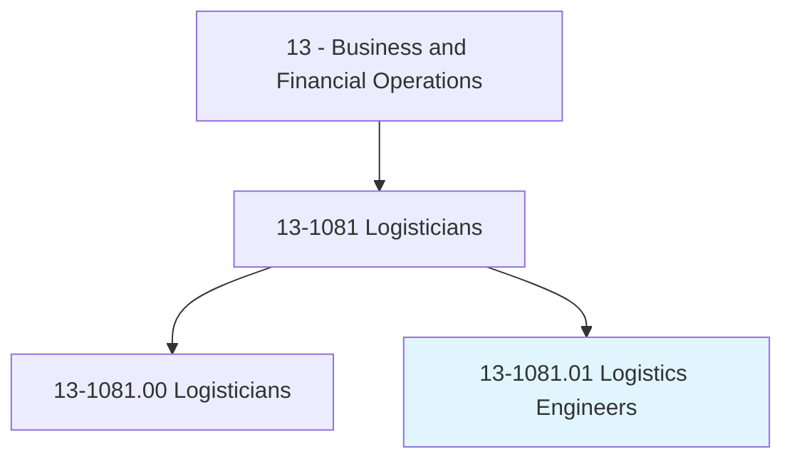
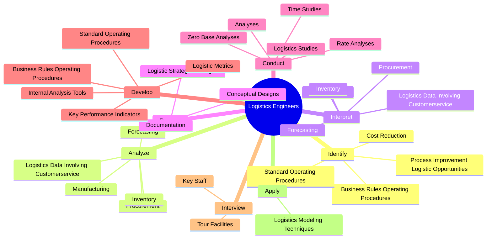
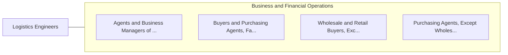

# Logistics Engineers

> Design or analyze operational solutions for projects such as transportation optimization, network modeling, process and methods analysis, cost containment, capacity enhancement, routing and shipment optimization, or information management.

## Overview

Logistics Engineers is classified under Business and Financial Operations (SOC 13). Design or analyze operational solutions for projects such as transportation optimization, network modeling, process and methods analysis, cost containment, capacity enhancement, routing and shipment optimization, or information management.

## Classification Hierarchy

## Key Statistics

| Metric | Value |
|--------|-------|
| SOC Code | 13-1081.01 |
| Category | [Business and Financial Operations](/occupations/Business) |
| Task Count | 144 |
| Source | O*NET |

## Core Tasks

### identify.CostReduction

Logistics Engineers identify cost reduction as part of their core responsibilities.

**Actions:**
- `identify.CostReduction`
- `identify.ProcessImprovementLogisticOpportunities`
- `identify.BusinessRulesOperatingProcedures.to.streamline.OperatingProcesses`
- `identify.StandardOperatingProcedures.to.streamline.OperatingProcesses`

### analyze.LogisticsDataInvolvingCustomerservice

Logistics Engineers analyze logistics data involving customerservice as part of their core responsibilities.

**Actions:**
- `analyze.LogisticsDataInvolvingCustomerservice`
- `analyze.Forecasting`
- `analyze.Procurement`
- `analyze.Manufacturing`

### interpret.LogisticsDataInvolvingCustomerservice

Logistics Engineers interpret logistics data involving customerservice as part of their core responsibilities.

**Actions:**
- `interpret.LogisticsDataInvolvingCustomerservice`
- `interpret.Forecasting`
- `interpret.Procurement`
- `interpret.Manufacturing`

## Skills & Competencies

### Technical Skills
- **Financial Analysis** - Advanced
- **Data Analysis** - Advanced
- **Regulatory Compliance** - Advanced

### Soft Skills
- **Communication** - Essential
- **Problem Solving** - Essential
- **Critical Thinking** - Important
- **Teamwork** - Important
- **Adaptability** - Important

## Related Occupations

## Industries

This occupation is found across multiple industries. See [Industries](/industries) for sector-specific employment data.

## Career Progression

---

*Source: O*NET 13-1081.01 - ONETOccupation*
