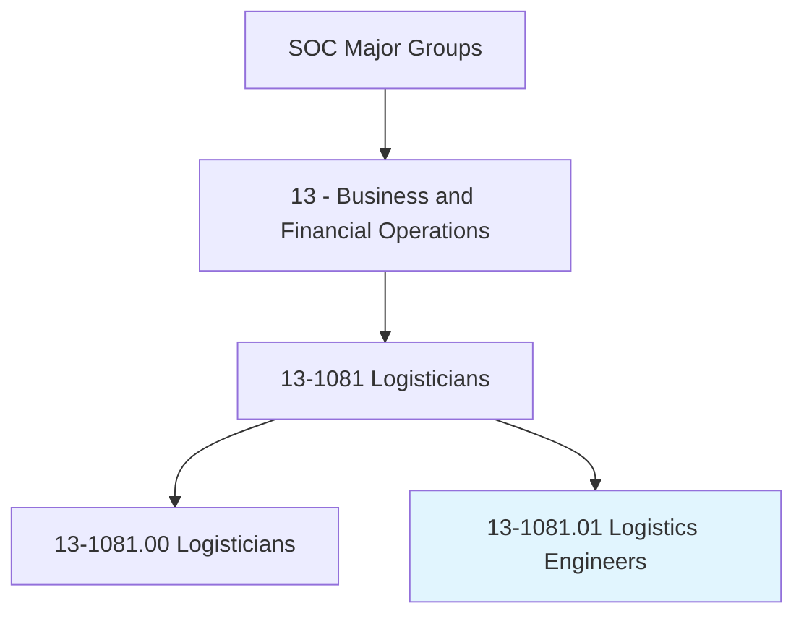
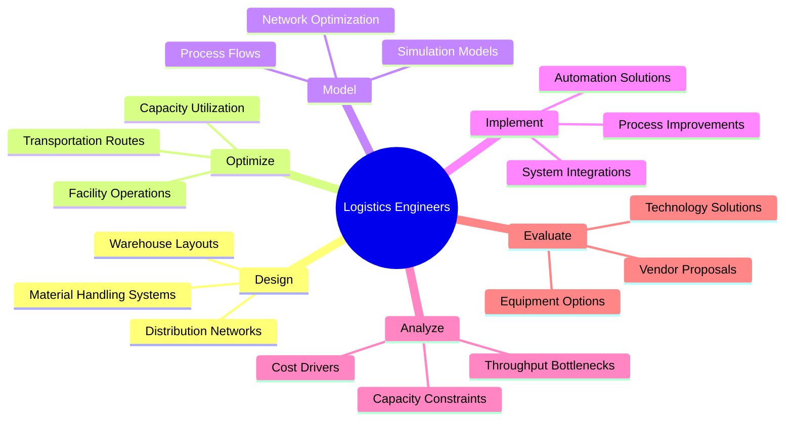
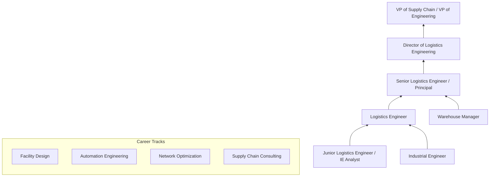
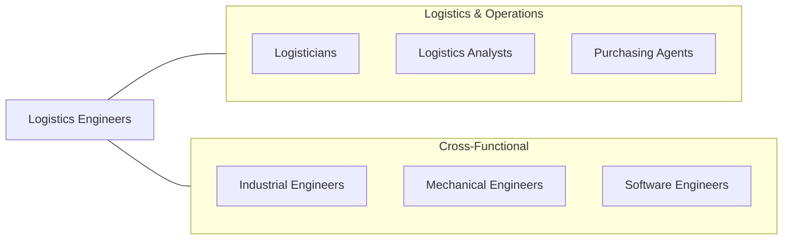

# Logistics Engineers

> Design or analyze operational solutions for projects such as transportation optimization, network modeling, process and methods analysis, cost containment, capacity enhancement, routing and shipment optimization, and information management.

## Overview

Logistics Engineers apply engineering principles and quantitative methods to design, optimize, and improve logistics systems and processes. They work on transportation network design, warehouse layout and automation, material handling systems, capacity planning, and process engineering to create efficient and cost-effective supply chain operations. The role combines traditional industrial engineering with supply chain management expertise.

These professionals design facility layouts, model transportation networks, specify material handling equipment, and develop process flows that optimize throughput, minimize costs, and improve service levels. They use simulation modeling, optimization algorithms, and engineering analysis to evaluate alternatives and recommend solutions for complex logistics challenges. The role is more engineering-focused than logistics analysts, emphasizing physical system design and process engineering.

The profession is evolving rapidly with warehouse automation, autonomous vehicles, drone delivery, robotics, and digital twin technology. Logistics engineers are at the forefront of designing next-generation fulfillment centers, automated sorting facilities, and intelligent transportation systems that leverage AI, robotics, and IoT to achieve unprecedented levels of efficiency and speed.

## Classification Hierarchy

## Key Statistics

| Metric | Value |
|--------|-------|
| SOC Code | 13-1081.01 |
| Job Zone | 4 (Considerable Preparation) |
| Category | [Business and Financial Operations](/occupations/Business/index) |
| Median Salary | $82,640 |
| Employment | ~35,000 |
| Projected Growth | 18% (Much faster than average) |
| Task Count | 45 |
| Source | O*NET |

## Core Tasks

### design.LogisticsSystems

Design warehouse layouts, distribution networks, and material handling systems.

**Actions:**
- `design.WarehouseLayouts.to.optimize.SpaceUtilization` - Plan facility configurations
- `design.DistributionNetworks.to.minimize.TransportCosts` - Structure logistics networks
- `design.MaterialHandlingSystems.for.EfficientThroughput` - Specify equipment and flows
- `design.AutomationSolutions.for.WarehouseOperations` - Integrate robotics and conveyors

### optimize.Operations

Apply engineering methods to optimize logistics operations and processes.

**Actions:**
- `optimize.TransportationRoutes.using.NetworkModeling` - Improve routing
- `optimize.FacilityOperations.through.ProcessEngineering` - Streamline workflows
- `optimize.CapacityUtilization.to.reduce.Bottlenecks` - Maximize throughput
- `model.SimulationScenarios.to.evaluate.Alternatives` - Test design options

### implement.Solutions

Implement engineered solutions for logistics improvement projects.

**Actions:**
- `implement.AutomationSolutions.for.OperationalEfficiency` - Deploy technology
- `implement.ProcessImprovements.based.on.EngineeringAnalysis` - Execute redesigns
- `evaluate.EquipmentOptions.for.CapitalProjects` - Select technology
- `manage.ProjectImplementation.through.Completion` - Oversee installations

## Skills & Competencies

### Technical Skills
- **Industrial / Logistics Engineering** - Expert
- **Warehouse Design & Automation** - Expert
- **Simulation Modeling (Arena, FlexSim, AnyLogic)** - Advanced
- **Optimization & Operations Research** - Advanced
- **CAD / Layout Design** - Advanced
- **Process Engineering** - Advanced
- **Project Management** - Proficient
- **Lean / Six Sigma** - Proficient

### Soft Skills
- **Analytical Thinking** - Critical
- **Problem Solving** - Critical
- **Communication** - Essential
- **Project Management** - Essential
- **Collaboration** - Important
- **Creativity** - Important

## Education & Certifications

| Requirement | Details |
|-------------|---------|
| Typical Education | Bachelor's degree in Industrial Engineering, Logistics Engineering, or Supply Chain |
| Advanced Degree | Master's in Industrial Engineering or Supply Chain preferred |
| Key Certifications | CSCP, PE (Professional Engineer) |
| Additional | Six Sigma Black Belt, CPIM |
| Technical Skills | CAD, simulation software, programming (Python) |
| Work Experience | 3-5 years in logistics engineering or industrial engineering |

## Career Progression

## Industry Variations

| Industry | Focus | Typical Tasks |
|----------|-------|---------------|
| **E-commerce** | Fulfillment center design | Robotics integration, pick-pack-ship optimization |
| **Manufacturing** | Production logistics | Lean manufacturing, material flow, AGV systems |
| **3PL** | Multi-client facilities | Flexible layouts, shared resources, SLA optimization |
| **Retail** | Distribution centers | Store replenishment, cross-docking, sortation |
| **Defense** | Military logistics | Sustainment engineering, deployment planning |
| **Consulting** | Multi-industry | Facility design, network studies, technology selection |

## Technology & Tools

| Category | Tools |
|----------|-------|
| **Simulation** | Arena, FlexSim, AnyLogic, Simul8 |
| **CAD / Design** | AutoCAD, SketchUp, Revit |
| **Optimization** | AIMMS, CPLEX, Gurobi, Python/OR-Tools |
| **WMS / WCS** | Manhattan, Blue Yonder, Dematic |
| **Automation** | Locus Robotics, 6 River, KUKA, Daifuku |
| **Analytics** | Python, SQL, Tableau, Power BI |
| **Project Management** | Microsoft Project, Primavera, Jira |

## Related Occupations

## Departments

This occupation typically works in:
- [Logistics Engineering](/departments/LogisticsEngineering)
- [Supply Chain Design](/departments/SupplyChainDesign)
- [Warehouse Operations](/departments/WarehouseOperations)
- [Automation Engineering](/departments/AutomationEngineering)
- [Operations Excellence](/departments/OpsExcellence)

---

*Source: O*NET 13-1081.01 - ONETOccupation*
