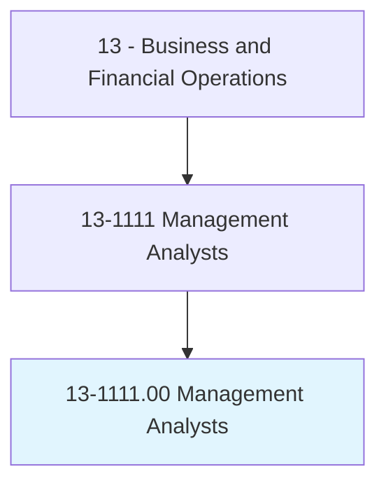
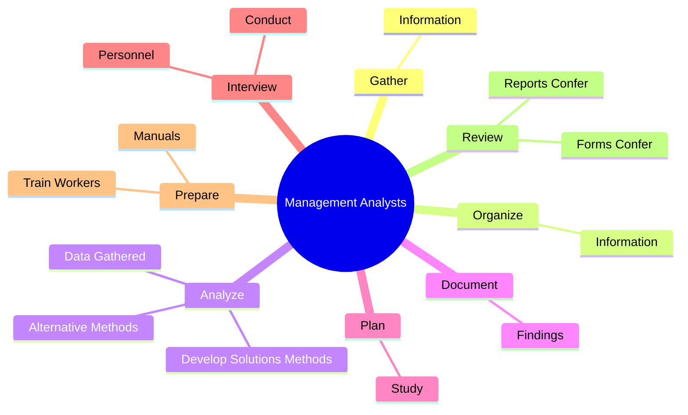
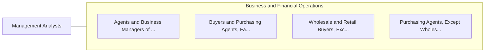

# Management Analysts

> Conduct organizational studies and evaluations, design systems and procedures, conduct work simplification and measurement studies, and prepare operations and procedures manuals to assist management in operating more efficiently and effectively. Includes program analysts and management consultants.

## Overview

Management Analysts is an occupation within the Business and Financial Operations category. Conduct organizational studies and evaluations, design systems and procedures, conduct work simplification and measurement studies, and prepare operations and procedures manuals to assist management in operating more efficiently and effectively. 

## Classification Hierarchy

## Key Statistics

| Metric | Value |
|--------|-------|
| SOC Code | 13-1111.00 |
| Category | [Business and Financial Operations](/occupations/Business/index) |
| Task Count | 62 |
| Source | O*NET |

## Core Tasks

### gather.Information

Management Analysts gather information as part of their core responsibilities.

**Actions:**
- `gather.Information.on.Problems`
- `gather.Information.on.Procedures`

### organize.Information

Management Analysts organize information as part of their core responsibilities.

**Actions:**
- `organize.Information.on.Problems`
- `organize.Information.on.Procedures`

### analyze.DataGathered

Management Analysts analyze data gathered as part of their core responsibilities.

**Actions:**
- `analyze.DataGathered.of.Proceeding`
- `analyze.DevelopSolutionsMethods.of.Proceeding`
- `analyze.AlternativeMethods.of.Proceeding`

## Skills & Competencies

### Technical Skills
- **Financial Analysis** - Advanced
- **Data Analysis** - Advanced
- **Regulatory Compliance** - Advanced

### Soft Skills
- **Communication** - Essential
- **Problem Solving** - Essential
- **Critical Thinking** - Important
- **Teamwork** - Important
- **Adaptability** - Important

## Related Occupations

## Industries

This occupation is found across multiple industries. See [Industries](/industries) for sector-specific employment data.

## Career Progression

---

*Source: O*NET 13-1111.00 - ONETOccupation*
