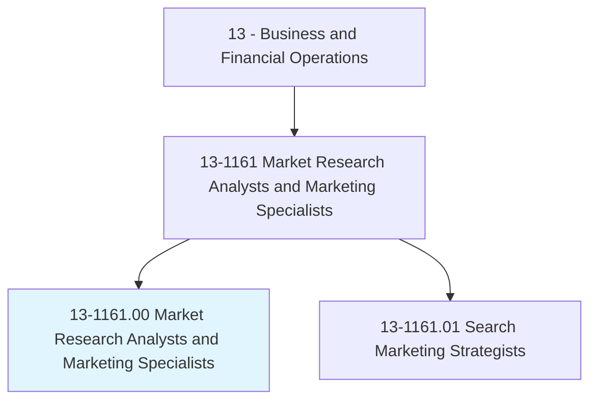
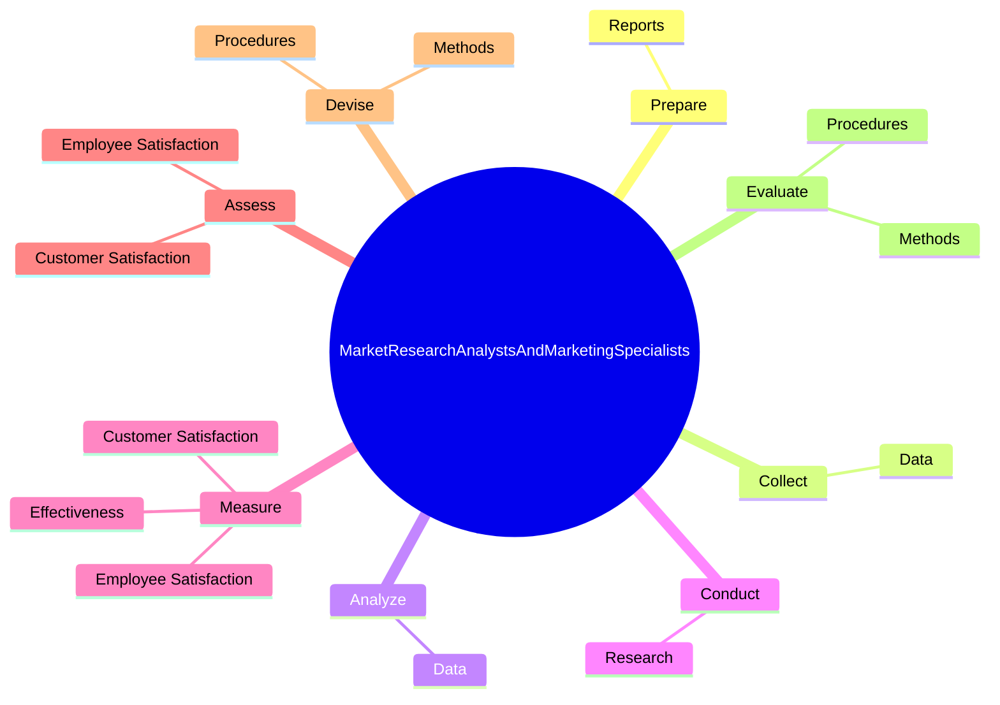

# Market Research Analysts and Marketing Specialists

> Research conditions in local, regional, national, or online markets. Gather information to determine potential sales of a product or service, or plan a marketing or advertising campaign. May gather information on competitors, prices, sales, and methods of marketing and distribution. May employ search marketing tactics, analyze web metrics, and develop recommendations to increase search engine ranking and visibility to target markets.

## Overview

Market Research Analysts and Marketing Specialists is an occupation within the Business and Financial Operations category. Research conditions in local, regional, national, or online markets. Gather information to determine potential sales of a product or service, or plan a marketing or advertising campaign.

## Classification Hierarchy

## Key Statistics

| Metric | Value |
|--------|-------|
| SOC Code | 13-1161.00 |
| Category | [Business and Financial Operations](/occupations/Business/index) |
| Task Count | 52 |
| Source | O*NET |

## Core Tasks

### prepare.Reports

Market Research Analysts and Marketing Specialists prepare reports as part of their core responsibilities.

**Actions:**
- `prepare.Reports.of.Findings`
- `prepare.Reports.of.IllustratingDataGraphically`
- `prepare.Reports.of.TranslatingComplexFindingsIntoWrittenText`

### collect.Data

Market Research Analysts and Marketing Specialists collect data as part of their core responsibilities.

**Actions:**
- `collect.Data.on.CustomerDemographics`
- `collect.Data.on.Preferences`
- `collect.Data.on.Needs`
- `collect.Data.on.BuyingHabits.to.identify.PotentialMarketsAffectingProductDemand`

### analyze.Data

Market Research Analysts and Marketing Specialists analyze data as part of their core responsibilities.

**Actions:**
- `analyze.Data.on.CustomerDemographics`
- `analyze.Data.on.Preferences`
- `analyze.Data.on.Needs`
- `analyze.Data.on.BuyingHabits.to.identify.PotentialMarketsAffectingProductDemand`

## Skills & Competencies

### Technical Skills
- **Financial Analysis** - Advanced
- **Data Analysis** - Advanced
- **Regulatory Compliance** - Advanced

### Soft Skills
- **Communication** - Essential
- **Problem Solving** - Essential
- **Critical Thinking** - Important
- **Teamwork** - Important
- **Adaptability** - Important

## Related Occupations

## Industries

This occupation is found across multiple industries. See [Industries](/industries) for sector-specific employment data.

## Career Progression

---

*Source: O*NET 13-1161.00 - ONETOccupation*
