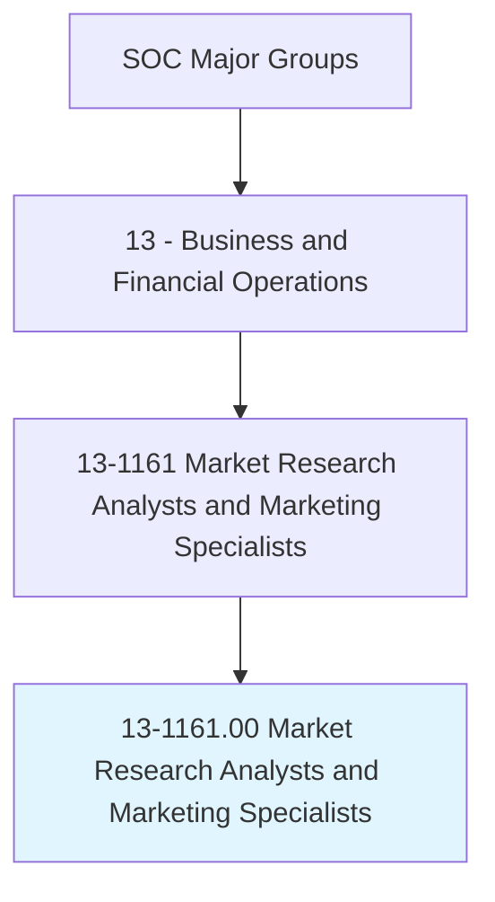
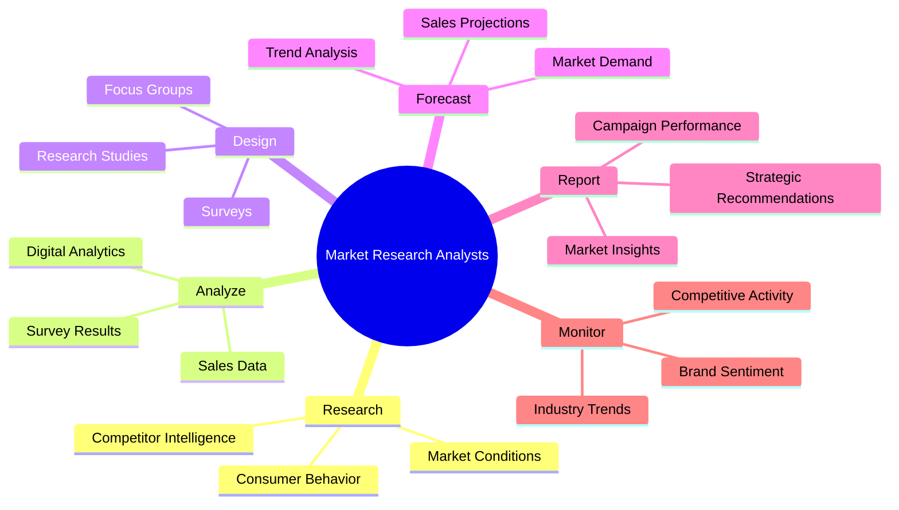
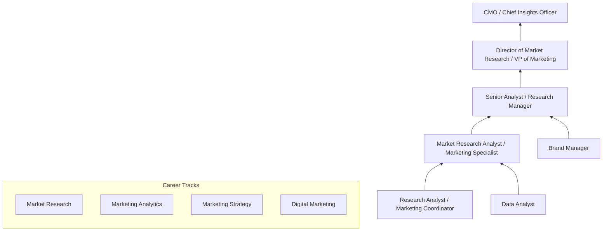
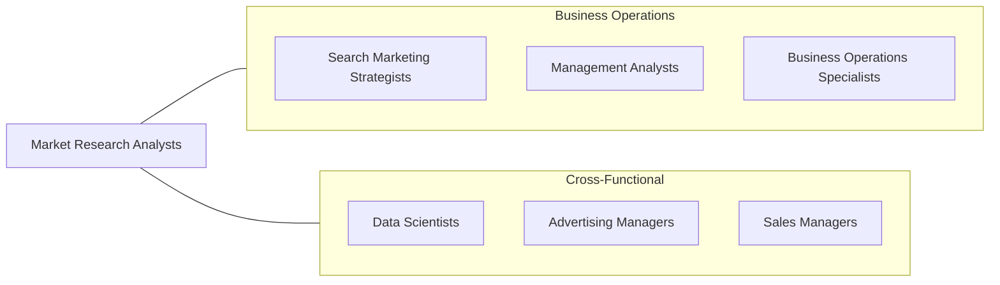

# Market Research Analysts and Marketing Specialists

> Research conditions in local, regional, national, or online markets. Gather information to determine potential sales of a product or service, or plan a marketing or advertising campaign. May gather information on competitors, prices, sales, and methods of marketing and distribution.

## Overview

Market Research Analysts and Marketing Specialists gather, analyze, and interpret data about markets, consumers, competitors, and business conditions to help organizations make informed strategic decisions. They design surveys, conduct focus groups, analyze sales data, track social media trends, and produce reports that guide product development, pricing strategies, advertising campaigns, and market entry decisions. This is one of the fastest-growing business occupations, driven by the explosion of consumer data and the increasing sophistication of marketing analytics.

These professionals work across the entire marketing intelligence lifecycle, from research design and data collection through statistical analysis and strategic recommendations. They translate complex data into actionable insights that help organizations understand customer needs, identify market opportunities, measure campaign effectiveness, and forecast demand. The role demands both quantitative skills for data analysis and creative thinking to develop research methodologies and interpret findings.

The profession has been transformed by digital marketing analytics, big data, social media listening, AI-powered consumer insights, and real-time market monitoring. Modern market researchers must master tools ranging from traditional survey platforms to advanced analytics platforms, marketing automation systems, and customer data platforms. The convergence of marketing and data science continues to reshape the field.

## Classification Hierarchy

## Key Statistics

| Metric | Value |
|--------|-------|
| SOC Code | 13-1161.00 |
| Job Zone | 4 (Considerable Preparation) |
| Category | [Business and Financial Operations](/occupations/Business/index) |
| Median Salary | $68,230 |
| Employment | ~792,000 |
| Projected Growth | 13% (Much faster than average) |
| Task Count | 44 |
| Source | O*NET |

## Core Tasks

### research.MarketConditions

Conduct primary and secondary research on market conditions, consumer behavior, and competitive dynamics.

**Actions:**
- `research.MarketConditions.to.assess.SalesPotential` - Evaluate market size
- `research.ConsumerBehavior.to.understand.PurchaseDecisions` - Profile customers
- `research.CompetitorIntelligence.to.identify.MarketPosition` - Benchmark competitors
- `design.Surveys.to.collect.PrimaryData` - Create research instruments

### analyze.MarketData

Analyze quantitative and qualitative data to derive actionable market insights.

**Actions:**
- `analyze.SalesData.to.identify.GrowthOpportunities` - Find revenue potential
- `analyze.SurveyResults.to.extract.ConsumerInsights` - Interpret research data
- `analyze.DigitalAnalytics.to.measure.CampaignEffectiveness` - Evaluate marketing ROI
- `forecast.MarketDemand.to.inform.ProductPlanning` - Predict future trends

### report.StrategicInsights

Produce reports and presentations that communicate market findings and strategic recommendations.

**Actions:**
- `report.MarketInsights.to.SeniorManagement` - Present findings
- `report.CampaignPerformance.to.measure.MarketingROI` - Evaluate effectiveness
- `recommend.MarketingStrategies.based.on.ResearchFindings` - Advise on approach
- `monitor.IndustryTrends.to.identify.EmergingOpportunities` - Track market shifts

## Skills & Competencies

### Technical Skills
- **Market Research Methodology** - Expert
- **Statistical Analysis (SPSS, R, Python)** - Advanced
- **Digital Marketing Analytics** - Advanced
- **Survey Design & Analysis** - Advanced
- **Data Visualization** - Advanced
- **CRM & Marketing Automation** - Proficient
- **SEO/SEM Analytics** - Proficient
- **Social Media Analytics** - Proficient

### Soft Skills
- **Analytical Thinking** - Critical
- **Communication (Written/Verbal)** - Critical
- **Presentation Skills** - Essential
- **Curiosity & Creativity** - Essential
- **Strategic Thinking** - Important
- **Collaboration** - Important

## Education & Certifications

| Requirement | Details |
|-------------|---------|
| Typical Education | Bachelor's degree in Marketing, Business, Statistics, or related field |
| Advanced Degree | Master's in Marketing Research, MBA, or Data Science preferred |
| Key Certifications | PRC (Professional Researcher Certification - Insights Association) |
| Digital Marketing | Google Analytics, Google Ads, HubSpot, Meta Blueprint |
| Marketing | PCM (Professional Certified Marketer - AMA) |
| Work Experience | 1-3 years in market research, marketing analytics, or related field |

## Career Progression

## Industry Variations

| Industry | Focus | Typical Tasks |
|----------|-------|---------------|
| **Consumer Products** | Brand & product research | Concept testing, brand tracking, shopper insights |
| **Technology** | Product-market fit | User research, competitive analysis, TAM analysis |
| **Healthcare / Pharma** | Clinical & market access | Physician surveys, patient journey, market access |
| **Financial Services** | Customer segmentation | Wallet share analysis, NPS tracking, product research |
| **Consulting** | Multi-industry advisory | Syndicated research, custom studies, strategic planning |
| **E-commerce** | Digital behavior | A/B testing, conversion analysis, customer analytics |

## Technology & Tools

| Category | Tools |
|----------|-------|
| **Survey** | Qualtrics, SurveyMonkey, Typeform |
| **Analytics** | Google Analytics, Adobe Analytics, Mixpanel |
| **Statistical** | SPSS, R, Python, SAS |
| **Visualization** | Tableau, Power BI, Google Data Studio |
| **Social Listening** | Brandwatch, Sprinklr, Talkwalker |
| **CRM / Automation** | Salesforce, HubSpot, Marketo |
| **Competitive Intelligence** | SEMrush, SimilarWeb, Crayon |

## Related Occupations

## Departments

This occupation typically works in:
- [Market Research](/departments/MarketResearch)
- [Marketing](/departments/Marketing)
- [Consumer Insights](/departments/ConsumerInsights)
- [Product Management](/departments/ProductManagement)
- [Business Intelligence](/departments/BusinessIntelligence)

---

*Source: O*NET 13-1161.00 - ONETOccupation*
