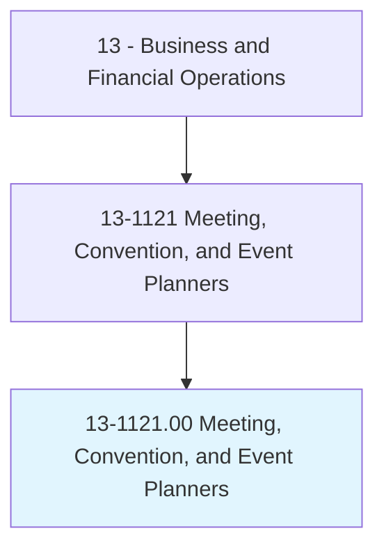
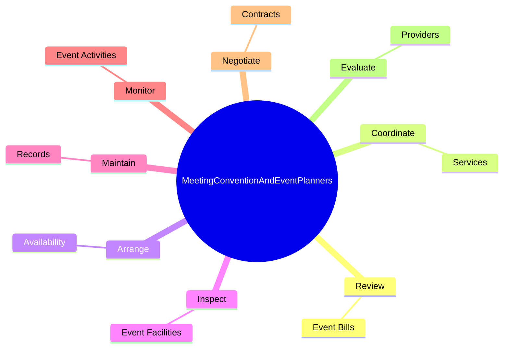

# Meeting, Convention, and Event Planners

> Coordinate activities of staff, convention personnel, or clients to make arrangements for group meetings, events, or conventions.

## Overview

Meeting, Convention, and Event Planners is classified under Business and Financial Operations (SOC 13). Coordinate activities of staff, convention personnel, or clients to make arrangements for group meetings, events, or conventions.

## Classification Hierarchy

## Key Statistics

| Metric | Value |
|--------|-------|
| SOC Code | 13-1121.00 |
| Category | [Business and Financial Operations](/occupations/Business) |
| Task Count | 86 |
| Source | O*NET |

## Core Tasks

### review.EventBills

Meeting, Convention, and Event Planners review event bills as part of their core responsibilities.

**Actions:**
- `review.EventBills.for.Accuracy`
- `review.EventBills.for.ApprovePayment`

### coordinate.Services

Meeting, Convention, and Event Planners coordinate services as part of their core responsibilities.

**Actions:**
- `coordinate.Services.for.Events`
- `coordinate.Services.for.Accommodation`
- `coordinate.Services.for.Transportation.for.Participants`
- `coordinate.Services.for.Facilities`

### arrange.Availability

Meeting, Convention, and Event Planners arrange availability as part of their core responsibilities.

**Actions:**
- `arrange.Availability.of.AudioVisualEquipment`
- `arrange.Availability.of.Transportation`
- `arrange.Availability.of.Displays`
- `arrange.Availability.of.OtherEventNeeds`

## Skills & Competencies

### Technical Skills
- **Financial Analysis** - Advanced
- **Data Analysis** - Advanced
- **Regulatory Compliance** - Advanced

### Soft Skills
- **Communication** - Essential
- **Problem Solving** - Essential
- **Critical Thinking** - Important
- **Teamwork** - Important
- **Adaptability** - Important

## Related Occupations

## Industries

This occupation is found across multiple industries. See [Industries](/industries) for sector-specific employment data.

## Career Progression

---

*Source: O*NET 13-1121.00 - ONETOccupation*
