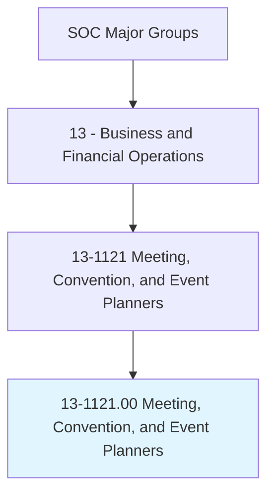
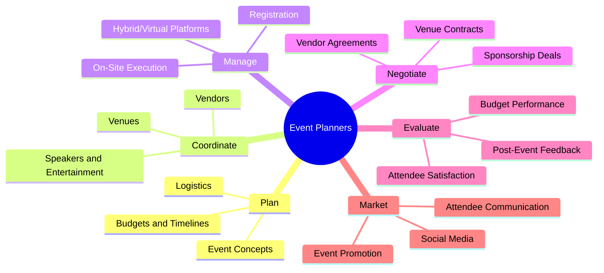
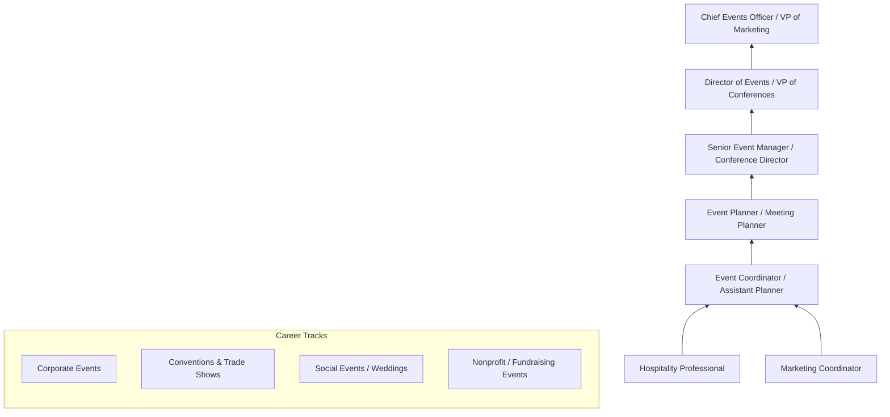
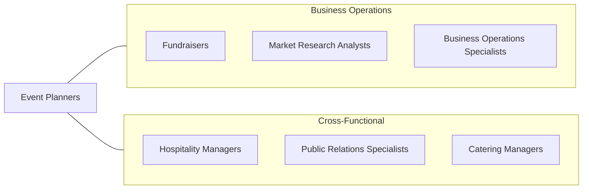

# Meeting, Convention, and Event Planners

> Coordinate activities of staff, convention personnel, or clients to make arrangements for group meetings, events, or conventions.

## Overview

Meeting, Convention, and Event Planners coordinate every detail of professional gatherings, from small corporate meetings to large-scale conventions and international conferences. They select venues, arrange catering, coordinate logistics, manage budgets, negotiate vendor contracts, and ensure that events achieve their objectives. The profession demands exceptional organizational skills, creative problem-solving, and the ability to manage multiple complex projects simultaneously.

These professionals work across the complete event lifecycle: conceptualizing event themes and formats, developing budgets and timelines, sourcing and contracting venues and vendors, managing registration and attendee communications, overseeing on-site execution, and conducting post-event evaluations. They must anticipate and mitigate risks ranging from weather disruptions and speaker cancellations to technical failures and security concerns.

The profession was fundamentally disrupted by the COVID-19 pandemic, which accelerated the adoption of virtual and hybrid event formats. Today's event planners must be proficient in both in-person and digital event platforms, creating engaging experiences that serve audiences regardless of their physical location. Sustainability practices, accessibility requirements, and data-driven attendee engagement have become increasingly important aspects of modern event planning.

## Classification Hierarchy

## Key Statistics

| Metric | Value |
|--------|-------|
| SOC Code | 13-1121.00 |
| Job Zone | 4 (Considerable Preparation) |
| Category | [Business and Financial Operations](/occupations/Business/index) |
| Median Salary | $54,470 |
| Employment | ~140,000 |
| Projected Growth | 8% (Faster than average) |
| Task Count | 36 |
| Source | O*NET |

## Core Tasks

### plan.Events

Conceptualize, plan, and budget events from initial concept through execution.

**Actions:**
- `plan.EventConcepts.to.achieve.OrganizationalObjectives` - Design event strategy
- `plan.Budgets.to.manage.EventExpenses` - Develop financial plans
- `plan.Logistics.to.coordinate.AllEventElements` - Organize details
- `plan.HybridFormats.to.engage.RemoteAttendees` - Design digital integration

### coordinate.VenuesAndVendors

Select and coordinate venues, vendors, and service providers.

**Actions:**
- `coordinate.Venues.to.match.EventRequirements` - Select appropriate spaces
- `coordinate.Catering.to.meet.DietaryAndBudgetNeeds` - Arrange food service
- `coordinate.AudioVisual.for.PresentationsAndEntertainment` - Manage AV production
- `negotiate.VendorContracts.to.optimize.CostAndQuality` - Secure favorable terms

### manage.EventExecution

Oversee on-site execution and post-event evaluation.

**Actions:**
- `manage.OnSiteExecution.to.ensure.SmoothOperations` - Direct event day
- `manage.Registration.for.AttendeeProcessing` - Handle check-in
- `evaluate.PostEventFeedback.to.measure.Success` - Assess outcomes
- `evaluate.BudgetPerformance.against.Projections` - Review financials

## Skills & Competencies

### Technical Skills
- **Event Planning & Logistics** - Expert
- **Budget Management** - Advanced
- **Contract Negotiation** - Advanced
- **Virtual/Hybrid Event Platforms** - Advanced
- **Registration & Event Technology** - Advanced
- **Marketing & Communications** - Proficient
- **Risk Management** - Proficient

### Soft Skills
- **Organization & Multitasking** - Critical
- **Communication** - Critical
- **Problem Solving (Under Pressure)** - Essential
- **Creativity** - Essential
- **Negotiation** - Essential
- **Attention to Detail** - Important

## Education & Certifications

| Requirement | Details |
|-------------|---------|
| Typical Education | Bachelor's degree in Hospitality, Event Management, Marketing, or Business |
| Key Certifications | CMP (Certified Meeting Professional), CMM (Certificate in Meeting Management) |
| Event-Specific | CSEP (Certified Special Events Professional), DES (Digital Event Strategist) |
| Professional Orgs | MPI, PCMA, ISES |
| Work Experience | 2-5 years in event coordination or hospitality |
| Digital Events | Proficiency in virtual event platforms increasingly required |

## Career Progression

## Industry Variations

| Industry | Focus | Typical Tasks |
|----------|-------|---------------|
| **Corporate** | Business meetings | Sales kickoffs, board meetings, training events |
| **Association** | Conventions & conferences | Annual meetings, educational programs, trade shows |
| **Hospitality** | Venue-based events | Hotel conferences, resort events, banquet coordination |
| **Technology** | Product launches & conferences | Developer conferences, product launches, hackathons |
| **Nonprofit** | Fundraising events | Galas, auctions, awareness campaigns |
| **Government** | Public events | Hearings, summits, community meetings |

## Technology & Tools

| Category | Tools |
|----------|-------|
| **Event Management** | Cvent, Eventbrite, Bizzabo, Whova |
| **Virtual/Hybrid** | Zoom Events, Hopin, ON24, vFairs |
| **Registration** | RegFox, Splash, Aventri |
| **Project Management** | Asana, Monday.com, Trello |
| **Diagramming** | Social Tables, AllSeated, EventDraw |
| **Communication** | Mailchimp, Constant Contact, Slack |
| **Budgeting** | Excel, QuickBooks, event budget templates |

## Related Occupations

## Departments

This occupation typically works in:
- [Events & Conferences](/departments/Events)
- [Marketing](/departments/Marketing)
- [Corporate Communications](/departments/CorporateCommunications)
- [Sales Support](/departments/SalesSupport)
- [Hospitality Operations](/departments/HospitalityOperations)

---

*Source: O*NET 13-1121.00 - ONETOccupation*
