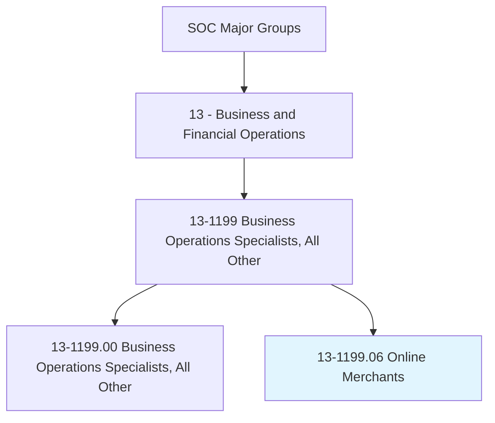
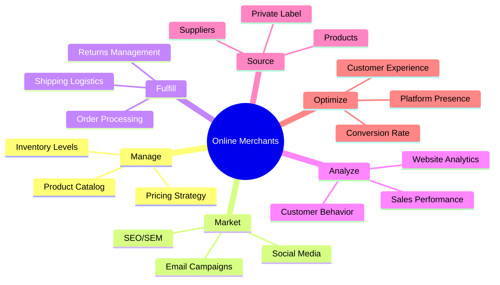
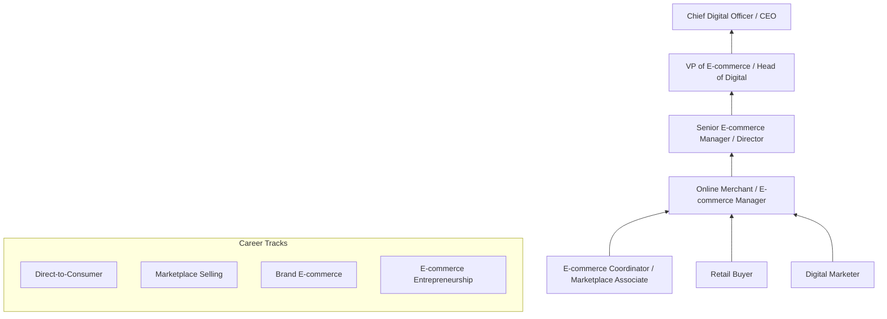
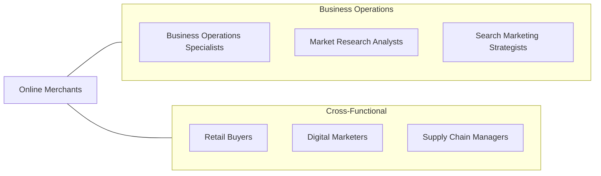

# Online Merchants

> Conduct retail activities of businesses operating exclusively online. May perform duties such as preparing business strategies, buying merchandise, managing inventory, implementing marketing activities, fulfilling and shipping online orders, and balancing financial records.

## Overview

Online Merchants manage all aspects of e-commerce retail businesses, from product sourcing and inventory management to website operations, digital marketing, order fulfillment, and customer service. They operate in an intensely competitive digital marketplace where success depends on understanding consumer behavior, optimizing the online shopping experience, managing complex supply chains, and executing data-driven marketing strategies.

These professionals must be versatile business operators with skills spanning merchandising, digital marketing, web analytics, supply chain management, and financial management. They source products, negotiate with suppliers, set pricing strategies, manage product listings, optimize search visibility, run advertising campaigns, process orders, and handle customer relationships. Many online merchants operate on marketplace platforms such as Amazon, Shopify, Etsy, and eBay in addition to or instead of standalone websites.

The e-commerce landscape continues to evolve rapidly with social commerce, live streaming sales, AI-powered personalization, voice commerce, and cross-border selling creating new opportunities and challenges. Successful online merchants must continuously adapt their strategies to platform algorithm changes, shifting consumer preferences, new advertising formats, and evolving fulfillment expectations including same-day and next-day delivery.

## Classification Hierarchy

## Key Statistics

| Metric | Value |
|--------|-------|
| SOC Code | 13-1199.06 |
| Job Zone | 4 (Considerable Preparation) |
| Category | [Business and Financial Operations](/occupations/Business/index) |
| Median Salary | $65,420 |
| Employment | ~45,000 |
| Projected Growth | 12% (Much faster than average) |
| Task Count | 38 |
| Source | O*NET |

## Core Tasks

### manage.EcommerceOperations

Manage product catalog, inventory, pricing, and daily e-commerce operations.

**Actions:**
- `manage.ProductCatalog.to.optimize.Listings` - Maintain product content
- `manage.InventoryLevels.to.prevent.Stockouts` - Balance supply and demand
- `manage.PricingStrategy.to.maximize.Margins` - Optimize pricing
- `manage.MarketplacePresence.across.MultipleChannels` - Operate omnichannel

### market.OnlineProducts

Execute digital marketing strategies to drive traffic and sales.

**Actions:**
- `market.Products.through.SEOOptimization` - Improve organic visibility
- `market.Products.through.PaidAdvertising` - Run SEM/PPC campaigns
- `market.Products.through.SocialMedia` - Engage social audiences
- `market.Products.through.EmailCampaigns` - Drive repeat purchases

### fulfill.CustomerOrders

Process, ship, and manage customer orders and returns.

**Actions:**
- `fulfill.Orders.through.EfficientProcessing` - Execute order management
- `fulfill.Shipping.to.meet.CustomerExpectations` - Manage delivery
- `manage.Returns.to.maintain.CustomerSatisfaction` - Handle reverse logistics
- `analyze.CustomerBehavior.to.improve.Experience` - Optimize journey

## Skills & Competencies

### Technical Skills
- **E-commerce Platform Management** - Expert
- **Digital Marketing (SEO, SEM, Social)** - Expert
- **Product Merchandising** - Advanced
- **Web Analytics** - Advanced
- **Supply Chain & Fulfillment** - Advanced
- **Financial Management & P&L** - Proficient
- **Web Design / UX Basics** - Proficient
- **Data Analysis** - Proficient

### Soft Skills
- **Entrepreneurial Thinking** - Critical
- **Adaptability** - Critical
- **Analytical Thinking** - Essential
- **Customer Focus** - Essential
- **Decision Making** - Important
- **Communication** - Important

## Education & Certifications

| Requirement | Details |
|-------------|---------|
| Typical Education | Bachelor's degree in Business, Marketing, or related field |
| Key Certifications | Google Ads, Google Analytics, Meta Blueprint |
| Platform | Shopify Partner, Amazon Seller certification |
| Additional | Digital marketing certifications (HubSpot, SEMrush) |
| Technical | Basic HTML/CSS, photography, graphic design beneficial |
| Work Experience | 2-5 years in e-commerce, retail, or digital marketing |

## Career Progression

## Industry Variations

| Industry | Focus | Typical Tasks |
|----------|-------|---------------|
| **DTC Brands** | Brand building | Content creation, community building, subscription models |
| **Amazon Sellers** | Marketplace optimization | Listing optimization, PPC management, FBA logistics |
| **Fashion / Apparel** | Visual merchandising | Photography, sizing guides, returns management |
| **Electronics** | Technical products | Specification management, warranty handling |
| **Food & Beverage** | Perishable logistics | Cold chain, subscription boxes, freshness management |
| **B2B E-commerce** | Business purchasing | Catalog management, bulk pricing, account management |

## Technology & Tools

| Category | Tools |
|----------|-------|
| **E-commerce Platforms** | Shopify, WooCommerce, BigCommerce, Magento |
| **Marketplaces** | Amazon Seller Central, eBay, Etsy, Walmart |
| **Marketing** | Google Ads, Meta Ads, Klaviyo, Mailchimp |
| **Analytics** | Google Analytics, Hotjar, Triple Whale |
| **Fulfillment** | ShipStation, ShipBob, Amazon FBA |
| **Inventory** | TradeGecko, Cin7, Skubana |
| **Design** | Canva, Adobe Creative Suite, photography equipment |

## Related Occupations

## Departments

This occupation typically works in:
- E-commerce
- Digital Marketing
- Merchandising
- Fulfillment Operations
- Customer Experience

---

*Source: O*NET 13-1199.06 - ONETOccupation*
