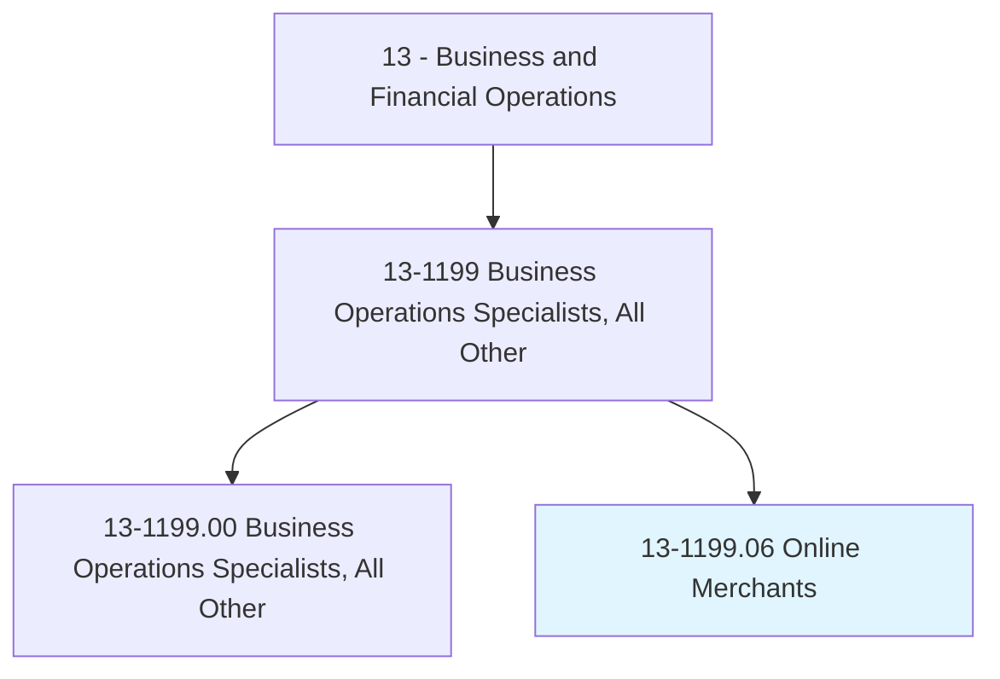
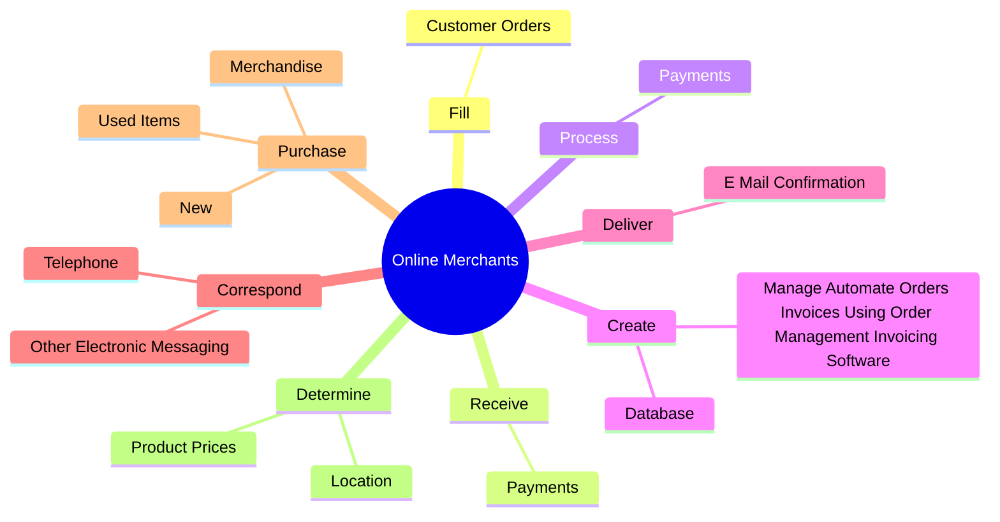

# Online Merchants

> Conduct retail activities of businesses operating exclusively online. May perform duties such as preparing business strategies, buying merchandise, managing inventory, implementing marketing activities, fulfilling and shipping online orders, and balancing financial records.

## Overview

Online Merchants is a specialized variant within the Business and Financial Operations category. Conduct retail activities of businesses operating exclusively online. 

## Classification Hierarchy

## Key Statistics

| Metric | Value |
|--------|-------|
| SOC Code | 13-1199.06 |
| Category | [Business and Financial Operations](/occupations/Business) |
| Task Count | 177 |
| Source | O*NET |

## Core Tasks

### fill.CustomerOrders

Online Merchants fill customer orders as part of their core responsibilities.

**Actions:**
- `fill.CustomerOrders.by.PackagingSoldItemsForDirectShippingByTransferringOrdersToManufacturersThirdPartyDistributors`
- `fill.CustomerOrders.by.DocumentationForDirectShippingByTransferringOrdersToManufacturersThirdPartyDistributors`

### receive.Payments

Online Merchants receive payments as part of their core responsibilities.

**Actions:**
- `receive.Payments.from.Customers`
- `receive.Payments.from.UsingElectronicTransactionServices`

### process.Payments

Online Merchants process payments as part of their core responsibilities.

**Actions:**
- `process.Payments.from.Customers`
- `process.Payments.from.UsingElectronicTransactionServices`

## Skills & Competencies

### Technical Skills
- **Financial Analysis** - Advanced
- **Data Analysis** - Advanced
- **Regulatory Compliance** - Advanced

### Soft Skills
- **Communication** - Essential
- **Problem Solving** - Essential
- **Critical Thinking** - Important
- **Teamwork** - Important
- **Adaptability** - Important

## Related Occupations

## Industries

This occupation is found across multiple industries. See [Industries](/industries) for sector-specific employment data.

## Career Progression

---

*Source: O*NET 13-1199.06 - ONETOccupation*
