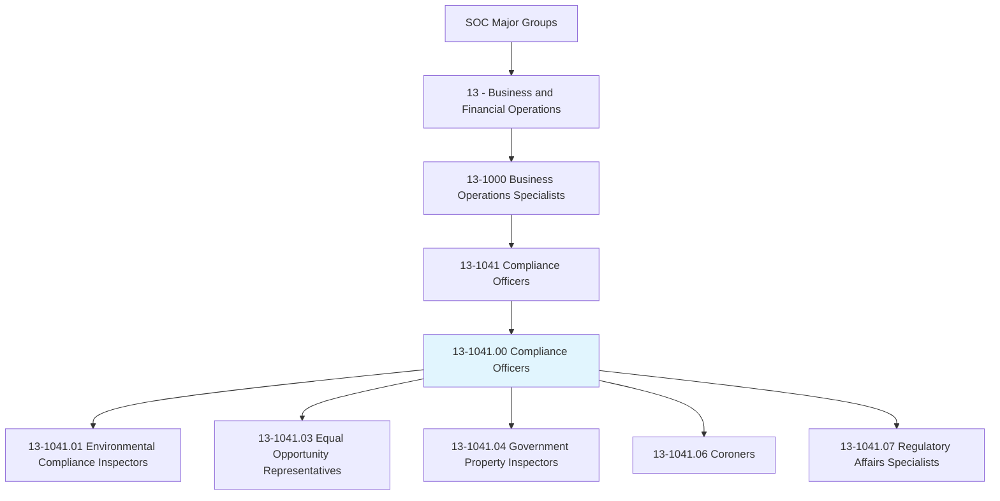
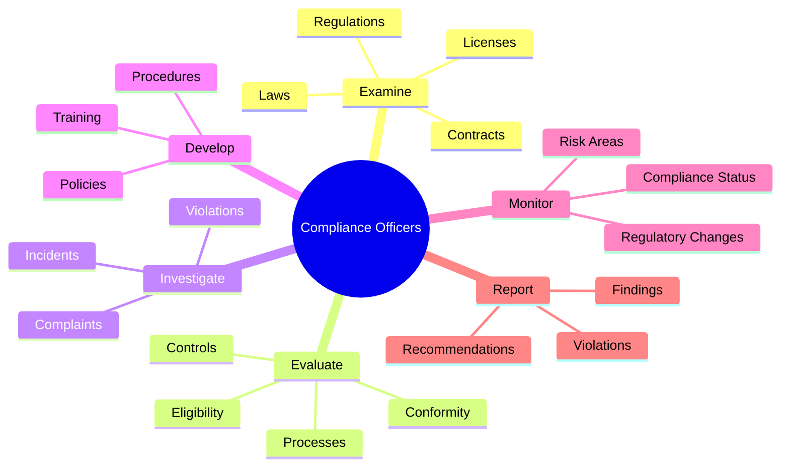
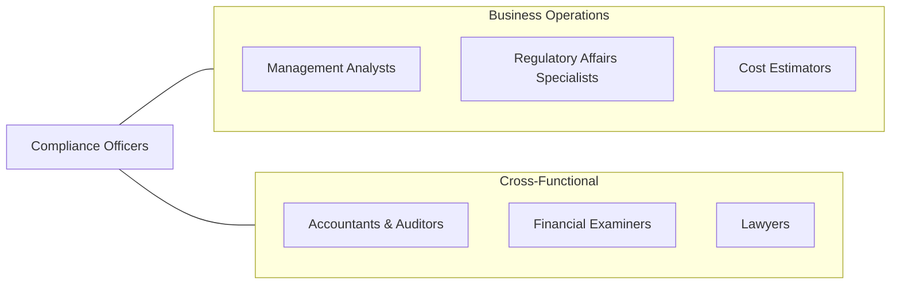
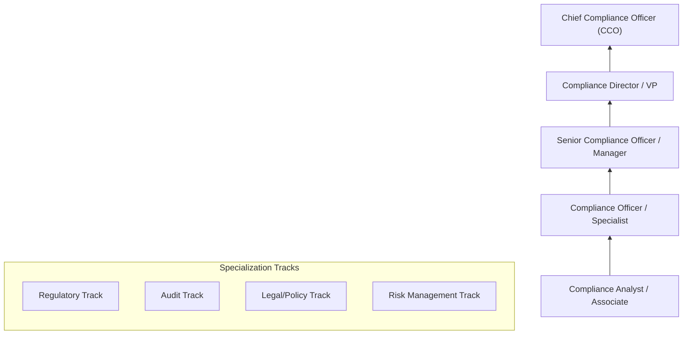

# Compliance Officers

> Examine, evaluate, and investigate eligibility for or conformity with laws and regulations governing contract compliance of licenses and permits, and perform other compliance and enforcement inspection and analysis activities not classified elsewhere.

## Overview

Compliance Officers are the guardians of regulatory adherence, ensuring organizations operate within legal and ethical boundaries. They develop compliance programs, conduct audits, investigate violations, and train staff on regulatory requirements. The role has grown significantly with increasing regulatory complexity in areas like financial services, healthcare, data privacy, and environmental protection. Compliance Officers must balance risk management with business objectives, serving as both enforcers and advisors to help organizations navigate the regulatory landscape.

## Classification Hierarchy

## Key Statistics

| Metric | Value |
|--------|-------|
| SOC Code | 13-1041.00 |
| Job Zone | 4 (Considerable Preparation) |
| Category | [Business and Financial Operations](/occupations/Business) |
| Subcategory | Business Operations Specialists |
| Core Tasks | 15+ |
| Variants | 5 specialized occupations |
| Source | O*NET |

## Core Tasks

### examine.Regulations

Examine, evaluate, and investigate eligibility for or conformity with laws and regulations.

**Actions:**
- `examine.Laws.governing.ContractCompliance` - Review legal requirements
- `examine.Regulations.for.LicensesAndPermits` - Verify regulatory standing
- `evaluate.Eligibility.for.Compliance` - Assess compliance status
- `investigate.Conformity.with.Requirements` - Check adherence

### evaluate.Controls

Evaluate internal controls and processes for compliance effectiveness.

**Actions:**
- `evaluate.Controls.to.ensure.Compliance` - Assess control design
- `evaluate.Processes.for.Effectiveness` - Test process execution
- `assess.Risks.associated.with.NonCompliance` - Identify risk areas
- `review.Documentation.for.Completeness` - Check record keeping

### investigate.Violations

Investigate alleged violations and compliance incidents.

**Actions:**
- `investigate.Violations.of.Laws` - Probe legal breaches
- `investigate.Violations.of.Regulations` - Examine regulatory failures
- `investigate.Complaints.from.Stakeholders` - Address reported concerns
- `document.Findings.of.Investigations` - Record investigation results

### develop.Policies

Develop and implement compliance policies and procedures.

**Actions:**
- `develop.Policies.to.ensure.Compliance` - Create compliance framework
- `develop.Procedures.for.RegulatoryAdherence` - Establish protocols
- `develop.TrainingPrograms.for.Staff` - Educate employees
- `implement.CorrectiveActions.to.address.Findings` - Fix identified issues

## Specialized Variants

| Variant | Code | Focus Area |
|---------|------|------------|
| [Environmental Compliance Inspectors](./EnvironmentalComplianceInspectors.mdx) | 13-1041.01 | Environmental regulations |
| [Equal Opportunity Representatives](./EqualOpportunityRepresentatives.mdx) | 13-1041.03 | EEO/civil rights |
| [Government Property Inspectors](./GovernmentPropertyInspectors.mdx) | 13-1041.04 | Government contracts |
| [Coroners](./Coroners.mdx) | 13-1041.06 | Death investigations |
| [Regulatory Affairs Specialists](./RegulatoryAffairsSpecialists.mdx) | 13-1041.07 | Product regulations |

## Professional Certifications

| Certification | Full Name | Focus Area | Requirements |
|--------------|-----------|------------|--------------|
| **CCEP** | Certified Compliance and Ethics Professional | General compliance | Experience + exam |
| **CFE** | Certified Fraud Examiner | Fraud detection | Experience + exam |
| **CRCM** | Certified Regulatory Compliance Manager | Banking compliance | Experience + exam |
| **CAMS** | Certified Anti-Money Laundering Specialist | AML compliance | Experience + exam |
| **CHC** | Certified in Healthcare Compliance | Healthcare | Experience + exam |
| **CIPP** | Certified Information Privacy Professional | Data privacy | Exam-based |

## Skills & Competencies

### Technical Skills
- **Regulatory Knowledge** - Expert
- **Risk Assessment** - Expert
- **Audit Methodologies** - Advanced
- **Legal Research** - Advanced
- **Policy Development** - Advanced
- **Data Analysis** - Proficient
- **Compliance Management Systems** - Advanced

### Soft Skills
- **Integrity** - Critical
- **Attention to Detail** - Critical
- **Communication** - Essential
- **Judgment** - Essential
- **Diplomacy** - Important
- **Persistence** - Important

## Related Occupations

## Industries

- [Financial Services](/industries/FinancialServices) - High Employment
- [Healthcare](/industries/Healthcare) - High Employment
- [Pharmaceuticals](/industries/Pharmaceuticals) - High Employment
- [Energy](/industries/Energy) - Moderate Employment
- [Government](/industries/Government) - Moderate Employment
- [Manufacturing](/industries/Manufacturing) - Moderate Employment

## Industry Variations

| Industry | Focus | Key Regulations |
|----------|-------|-----------------|
| **Banking** | Financial regulations | Dodd-Frank, BSA/AML, CFPB |
| **Healthcare** | Patient safety, billing | HIPAA, HITECH, Stark Law |
| **Pharmaceuticals** | Product safety | FDA regulations, GxP |
| **Energy** | Environmental | EPA, FERC, state regulations |
| **Technology** | Data privacy | GDPR, CCPA, SOC 2 |
| **Defense** | Government contracts | FAR, DFAR, ITAR |

## Career Progression

## Education & Training

| Requirement | Details |
|-------------|---------|
| Typical Education | Bachelor's degree in Business, Law, Finance, or related field |
| Advanced Education | J.D. or MBA valued for senior roles |
| Work Experience | 3-5 years for officer-level positions |
| On-the-Job Training | Extensive - industry and regulation-specific |

## Departments

This occupation typically works in:
- [Compliance](/departments/Compliance)
- [Legal](/departments/Legal)
- [Risk Management](/departments/RiskManagement)
- [Internal Audit](/departments/InternalAudit)
- [Regulatory Affairs](/departments/RegulatoryAffairs)

## Technology & Tools

| Category | Tools |
|----------|-------|
| **GRC Platforms** | RSA Archer, MetricStream, ServiceNow |
| **Compliance Management** | NAVEX Global, SAI Global |
| **Document Management** | SharePoint, iManage |
| **Training** | SAI Global, NAVEX EthicsPoint |
| **Monitoring** | Relativity, Nuix, Exterro |
| **Case Management** | EthicsPoint, NAVEX |

---

*Source: O*NET 13-1041.00 - ONETOccupation*
