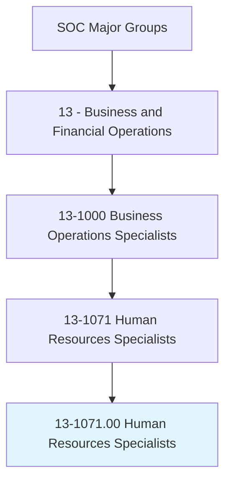
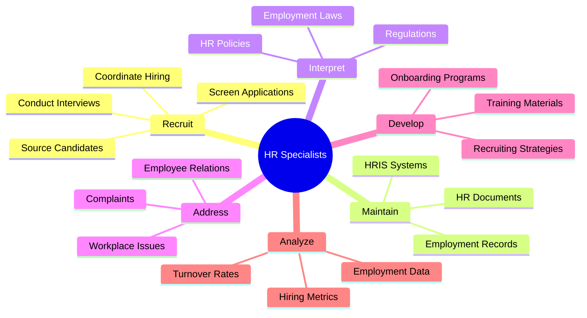
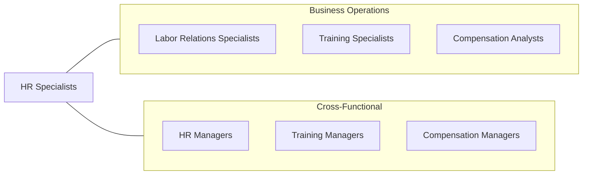
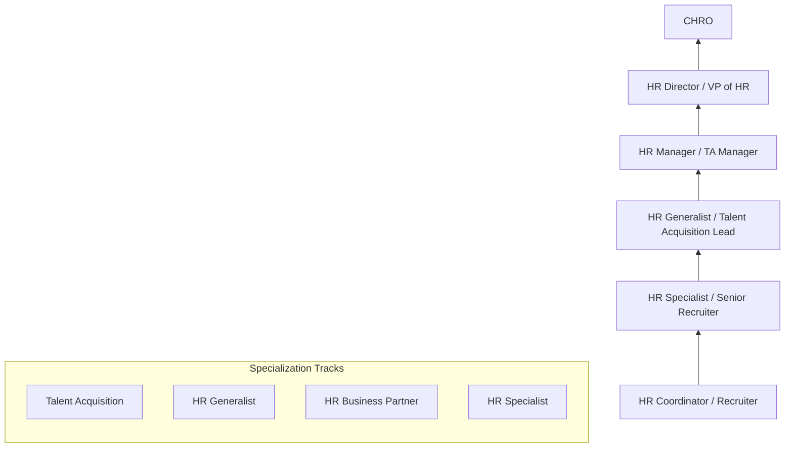

# Human Resources Specialists

> Recruit, screen, interview, or place individuals within an organization. May perform other activities in multiple human resources areas.

## Overview

Human Resources Specialists are the talent acquisition and employee relations experts who shape an organization's workforce. They handle the full recruitment lifecycle, from sourcing candidates to onboarding new hires, while also managing employee relations, compliance, and HR administration. This role has evolved from transactional personnel management to strategic talent management, with increasing emphasis on employer branding, candidate experience, and data-driven recruiting.

## Classification Hierarchy

## Key Statistics

| Metric | Value |
|--------|-------|
| SOC Code | 13-1071.00 |
| Job Zone | 4 (Considerable Preparation) |
| Category | [Business and Financial Operations](/occupations/Business/index) |
| Subcategory | Business Operations Specialists |
| Core Tasks | 20+ |
| Source | O*NET |

## Core Tasks

### interpret.HumanResourcesPolicies

Interpret and explain human resources policies, procedures, laws, standards, or regulations.

**Actions:**
- `interpret.HumanResourcesPolicies.for.Employees` - Clarify policy questions
- `interpret.Laws.regarding.Employment` - Explain legal requirements
- `explain.Procedures.to.Management` - Guide managers on HR processes
- `explain.Regulations.concerning.EEO` - Communicate compliance requirements

### hire.Employees

Hire employees and process hiring-related paperwork.

**Actions:**
- `hire.Employees.following.Procedures` - Execute hiring process
- `process.HiringRelatedPaperwork.for.NewHires` - Complete onboarding documentation
- `schedule.NewEmployeeOrientations.for.Onboarding` - Arrange orientation sessions
- `conduct.NewEmployeeOrientations.to.welcome.NewHires` - Deliver orientation programs

### maintain.EmploymentRecords

Prepare or maintain employment records related to hiring, termination, leaves, transfers, or promotions.

**Actions:**
- `maintain.EmploymentRecords.related.to.Hiring` - Track hiring documentation
- `maintain.EmploymentRecords.related.to.Termination` - Process separation records
- `maintain.EmploymentRecords.related.to.Transfers` - Document internal moves
- `maintain.EmploymentRecords.related.to.Promotions` - Record advancement actions

### address.EmployeeRelationsIssues

Address employee relations issues including harassment allegations and workplace complaints.

**Actions:**
- `address.EmployeeRelationsIssues.with.Employees` - Handle workplace concerns
- `address.HarassmentAllegations.following.Procedures` - Investigate complaints
- `address.WorkComplaints.to.resolve.Issues` - Mediate workplace conflicts
- `address.OtherEmployeeConcerns.with.Sensitivity` - Support employee needs

### review.EmploymentApplications

Review employment applications and job orders to match applicants with job requirements.

**Actions:**
- `review.EmploymentApplications.to.match.ApplicantsWithJobRequirements` - Screen candidates
- `review.JobOrders.to.identify.Requirements` - Understand position needs
- `select.QualifiedJobApplicants.for.Interviews` - Shortlist candidates
- `interview.JobApplicants.to.assess.Qualifications` - Evaluate candidates

### develop.RecruitingStrategies

Develop or implement recruiting strategies to meet current or anticipated staffing needs.

**Actions:**
- `develop.RecruitingStrategies.to.meet.StaffingNeeds` - Plan talent acquisition
- `implement.RecruitingStrategies.for.TalentAcquisition` - Execute recruitment plans
- `perform.Searches.for.QualifiedJobCandidates` - Source talent
- `advise.Management.on.RecruitingPrograms` - Guide hiring managers

## Professional Certifications

| Certification | Full Name | Focus Area | Requirements |
|--------------|-----------|------------|--------------|
| **PHR** | Professional in Human Resources | HR operations | Exam + experience |
| **SPHR** | Senior Professional in Human Resources | Strategic HR | Exam + senior experience |
| **SHRM-CP** | SHRM Certified Professional | HR competencies | Exam + experience |
| **SHRM-SCP** | SHRM Senior Certified Professional | Strategic HR leadership | Exam + senior experience |
| **GPHR** | Global Professional in Human Resources | International HR | Exam + global HR experience |
| **APTD** | Associate Professional in Talent Development | Learning & development | Exam + experience |

## Skills & Competencies

### Technical Skills
- **Applicant Tracking Systems (ATS)** - Expert
- **HRIS/HCM Systems** - Advanced
- **Employment Law/Compliance** - Advanced
- **Interviewing Techniques** - Expert
- **Background Check Systems** - Proficient
- **Microsoft Office Suite** - Advanced
- **Social Media Recruiting** - Advanced

### Soft Skills
- **Communication** - Critical
- **Interpersonal Skills** - Critical
- **Judgment and Decision Making** - Essential
- **Confidentiality** - Essential
- **Conflict Resolution** - Important
- **Empathy** - Important

## Related Occupations

## Industries

- [Professional Services](/industries/Scientific) - High Employment
- [Healthcare](/industries/Healthcare/index) - High Employment
- [Finance and Insurance](/industries/Finance) - Moderate Employment
- [Manufacturing](/industries/Manufacturing/index) - Moderate Employment
- [Technology](/industries/Technology) - High Employment
- [Government](/industries/PublicAdministration) - Moderate Employment

## Industry Variations

| Industry | Focus | Specializations |
|----------|-------|-----------------|
| **Technology** | Technical recruiting | Engineering talent, diversity hiring |
| **Healthcare** | Credential verification | Clinical recruiting, compliance |
| **Manufacturing** | Volume hiring | Shift scheduling, union relations |
| **Finance** | Background screening | Compliance, regulatory hiring |
| **Retail** | Seasonal hiring | High-volume recruiting, retention |
| **Government** | Civil service | Classification, veteran preference |

## Career Progression

## Education & Training

| Requirement | Details |
|-------------|---------|
| Typical Education | Bachelor's degree in HR, Business, Psychology, or related field |
| Work Experience | 1-2 years for certification |
| On-the-Job Training | Moderate - company-specific systems and policies |
| Continuing Education | Varies by certification (60 PDCs over 3 years for SHRM) |

## Departments

This occupation typically works in:
- [Human Resources](/departments/HR/index)
- Talent Acquisition
- Employee Relations
- HR Operations
- People Operations

## Technology & Tools

| Category | Tools |
|----------|-------|
| **ATS** | Workday, Greenhouse, Lever, iCIMS, Taleo |
| **HRIS/HCM** | Workday, SAP SuccessFactors, ADP, BambooHR |
| **Sourcing** | LinkedIn Recruiter, Indeed, ZipRecruiter |
| **Background Checks** | HireRight, Sterling, Checkr |
| **Assessment** | Criteria, Predictive Index, Wonderlic |
| **Onboarding** | DocuSign, BambooHR, Rippling |

---

*Source: O*NET 13-1071.00 - ONETOccupation*
