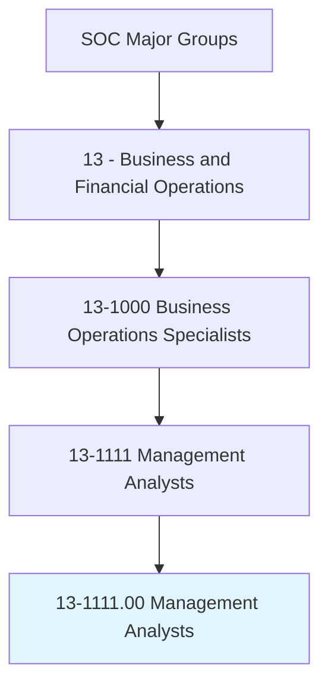
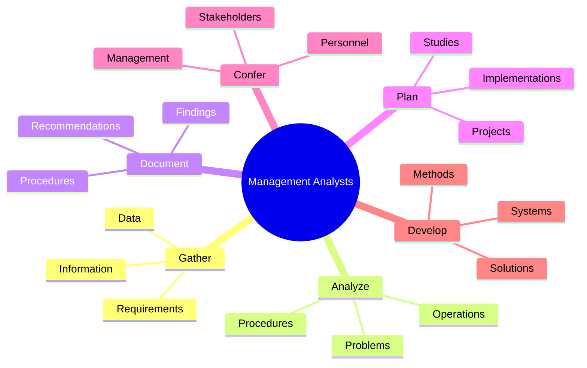
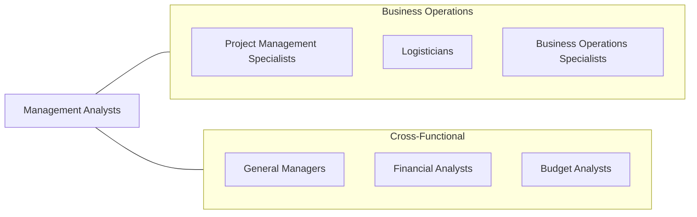
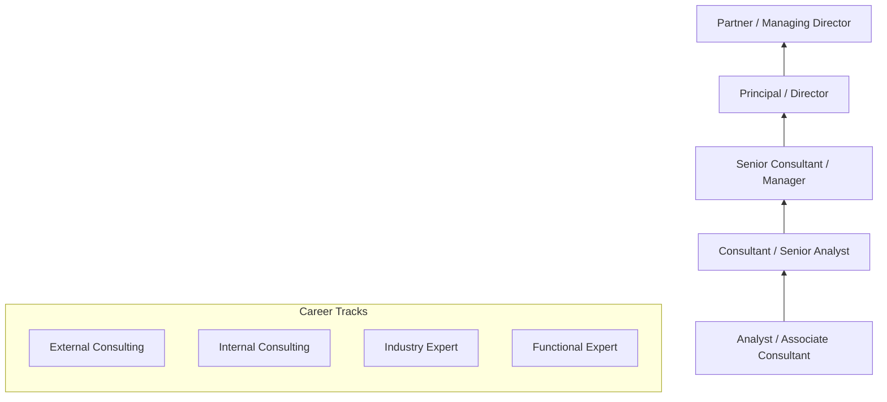

# Management Analysts

> Conduct organizational studies and evaluations, design systems and procedures, conduct work simplification and measurement studies, and prepare operations and procedures manuals to assist management in operating more efficiently and effectively. Includes program analysts and management consultants.

## Overview

Management Analysts, commonly known as Management Consultants, are problem-solvers who help organizations improve performance and efficiency. They analyze business problems, develop solutions, and help implement changes across strategy, operations, technology, and organization design. This profession spans internal consulting roles within corporations to external consulting with firms like McKinsey, BCG, Bain, Deloitte, and specialized boutiques. The work is intellectually demanding, requiring analytical rigor combined with strong communication and change management skills.

## Classification Hierarchy

## Key Statistics

| Metric | Value |
|--------|-------|
| SOC Code | 13-1111.00 |
| Job Zone | 4 (Considerable Preparation) |
| Category | [Business and Financial Operations](/occupations/Business) |
| Subcategory | Business Operations Specialists |
| Core Tasks | 15+ |
| Source | O*NET |

## Core Tasks

### gather.Information

Gather and organize information on problems or procedures.

**Actions:**
- `gather.Information.on.Problems` - Collect problem data
- `gather.Information.on.Procedures` - Document current processes
- `organize.Information.on.Problems` - Structure problem analysis
- `organize.Information.on.Procedures` - Catalog existing workflows

### analyze.Data

Analyze data gathered and develop solutions or alternative methods of proceeding.

**Actions:**
- `analyze.DataGathered.to.develop.Solutions` - Derive insights from data
- `analyze.DataGathered.to.develop.AlternativeMethods` - Identify options
- `develop.Solutions.based.on.Analysis` - Create recommendations
- `develop.AlternativeMethods.of.Proceeding` - Design alternatives

### document.Findings

Document findings of study and prepare recommendations for implementation.

**Actions:**
- `document.Findings.of.Study` - Record analytical results
- `prepare.Recommendations.for.ImplementationOfNewSystems` - Propose system changes
- `prepare.Recommendations.for.Procedures` - Suggest process improvements
- `prepare.Recommendations.for.OrganizationalChanges` - Recommend restructuring

### plan.Study

Plan study of work problems and procedures.

**Actions:**
- `plan.Study.of.WorkProblems` - Design problem investigation
- `plan.Study.of.Procedures` - Structure process analysis
- `plan.Study.of.OrganizationalChange` - Scope transformation projects
- `plan.Study.of.CostAnalysis` - Design cost studies

### confer.Personnel

Confer with personnel concerned to ensure successful functioning of newly implemented systems or procedures.

**Actions:**
- `confer.Personnel.to.ensure.SuccessfulFunctioning` - Support implementation
- `confer.Management.concerning.StudyResults` - Present findings
- `interview.Personnel.to.collect.Data` - Gather stakeholder input
- `review.FormsRecords.to.obtain.Information` - Analyze documentation

## Professional Certifications

| Certification | Full Name | Focus Area | Requirements |
|--------------|-----------|------------|--------------|
| **CMC** | Certified Management Consultant | Consulting practice | Experience + ethics + exam |
| **PMP** | Project Management Professional | Project management | 35 hours education + experience + exam |
| **Six Sigma** | Lean Six Sigma (Green/Black Belt) | Process improvement | Training + project + exam |
| **CBAP** | Certified Business Analysis Professional | Business analysis | 7500 hours experience + exam |
| **Prosci** | Change Management Certification | Change management | Training program |
| **TOGAF** | The Open Group Architecture Framework | Enterprise architecture | Exam-based certification |

## Skills & Competencies

### Technical Skills
- **Data Analysis** - Expert
- **Process Mapping/Modeling** - Expert
- **Financial Analysis** - Advanced
- **Microsoft Office (Excel, PowerPoint)** - Expert
- **Project Management** - Advanced
- **Statistical Analysis** - Proficient
- **Business Intelligence Tools** - Proficient

### Soft Skills
- **Analytical Thinking** - Critical
- **Communication (Written/Verbal)** - Critical
- **Presentation Skills** - Essential
- **Problem Solving** - Essential
- **Stakeholder Management** - Essential
- **Influence/Persuasion** - Important

## Related Occupations

## Industries

- [Management Consulting](/industries/ManagementConsulting) - High Employment
- [Finance and Insurance](/industries/FinanceInsurance) - High Employment
- [Technology](/industries/Technology) - High Employment
- [Government](/industries/Government) - Moderate Employment
- [Healthcare](/industries/Healthcare) - Moderate Employment
- [Manufacturing](/industries/Manufacturing) - Moderate Employment

## Industry Variations

| Industry | Focus | Typical Engagements |
|----------|-------|---------------------|
| **Strategy Consulting** | Corporate strategy | Growth strategy, M&A, market entry |
| **Operations Consulting** | Process excellence | Supply chain, lean operations |
| **Technology Consulting** | Digital transformation | IT strategy, system implementation |
| **Financial Services** | Risk and regulation | Compliance, risk management |
| **Healthcare** | Cost optimization | Revenue cycle, clinical operations |
| **Public Sector** | Policy implementation | Program evaluation, modernization |

## Career Progression

## Education & Training

| Requirement | Details |
|-------------|---------|
| Typical Education | Bachelor's degree (Business, Economics, Engineering common) |
| Advanced Degree | MBA strongly preferred for advancement |
| Work Experience | 2-5 years for senior roles |
| On-the-Job Training | Extensive - case methodology, firm-specific tools |

## Departments

This occupation typically works in:
- [Strategy](/departments/Strategy)
- [Operations](/departments/Operations)
- [Corporate Development](/departments/CorporateDevelopment)
- [Business Transformation](/departments/BusinessTransformation)
- [Process Excellence](/departments/ProcessExcellence)

## Technology & Tools

| Category | Tools |
|----------|-------|
| **Analysis** | Excel, Alteryx, SQL |
| **Visualization** | PowerPoint, Tableau, Power BI |
| **Collaboration** | Miro, Mural, Microsoft Teams |
| **Project Management** | Smartsheet, MS Project, Jira |
| **Process Mapping** | Visio, Lucidchart, ARIS |
| **Survey/Research** | Qualtrics, SurveyMonkey |

---

*Source: O*NET 13-1111.00 - ONETOccupation*
