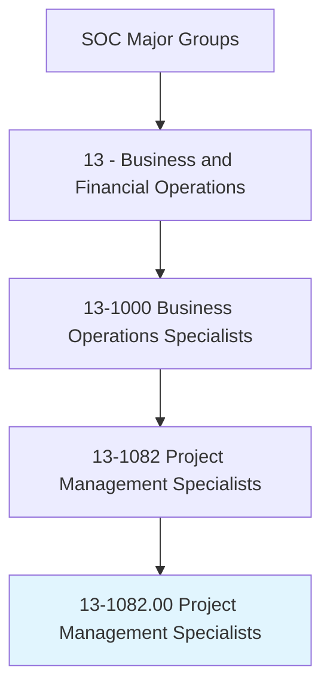
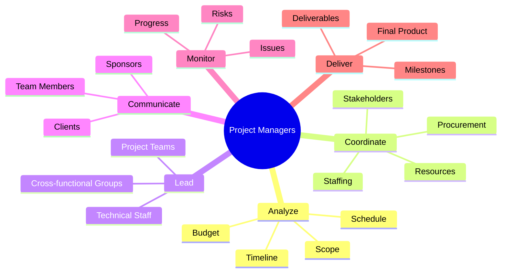
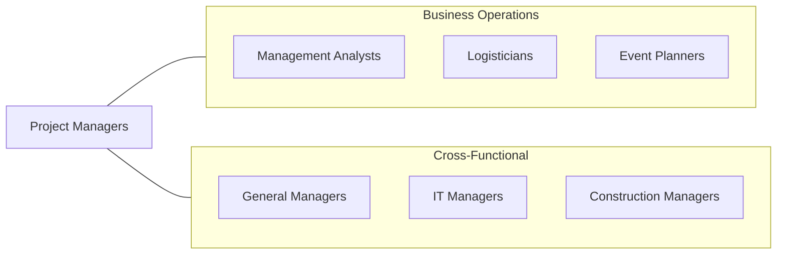
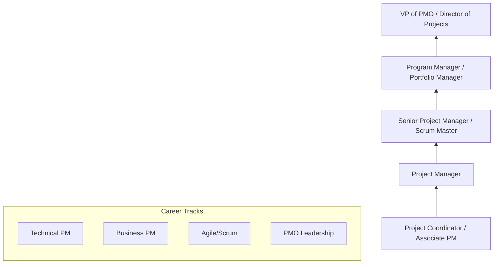

# Project Management Specialists

> Analyze and coordinate the schedule, timeline, procurement, staffing, and budget of a product or service on a per project basis. Lead and guide the work of technical staff. May serve as a point of contact for the client or customer.

## Overview

Project Management Specialists are the orchestrators who bring complex initiatives to successful completion. They coordinate schedules, resources, budgets, and stakeholders to deliver projects on time and within scope. This occupation spans all industries, from IT and construction to healthcare and marketing. The role requires balancing competing demands, managing risks, and adapting to change while keeping teams aligned and motivated. Modern project management has evolved to include both traditional waterfall and agile methodologies, with many practitioners now skilled in hybrid approaches.

## Classification Hierarchy

## Key Statistics

| Metric | Value |
|--------|-------|
| SOC Code | 13-1082.00 |
| Job Zone | 4 (Considerable Preparation) |
| Category | [Business and Financial Operations](/occupations/Business) |
| Subcategory | Business Operations Specialists |
| Core Tasks | 15+ |
| Source | O*NET |

## Core Tasks

### analyze.ProjectComponents

Analyze and coordinate the schedule, timeline, procurement, staffing, and budget of a project.

**Actions:**
- `analyze.Schedule.to.plan.ProjectTimeline` - Develop project schedules
- `analyze.Budget.to.allocate.Resources` - Plan financial resources
- `coordinate.Procurement.for.ProjectNeeds` - Manage vendor relationships
- `coordinate.Staffing.to.assign.TeamMembers` - Allocate human resources

### lead.TechnicalStaff

Lead and guide the work of technical staff and project team members.

**Actions:**
- `lead.TechnicalStaff.to.achieve.Objectives` - Direct team efforts
- `guide.WorkOfTeam.through.ProjectPhases` - Facilitate execution
- `assign.Tasks.to.TeamMembers` - Distribute work
- `remove.Obstacles.for.TeamProgress` - Clear blockers

### communicate.Stakeholders

Serve as a point of contact for the client or customer and manage stakeholder communications.

**Actions:**
- `communicate.Clients.regarding.ProjectStatus` - Update client on progress
- `communicate.Sponsors.on.KeyDecisions` - Escalate as needed
- `present.StatusReports.to.Stakeholders` - Deliver regular updates
- `manage.Expectations.with.Stakeholders` - Align on scope and timeline

### monitor.Progress

Track project progress against plan and manage risks and issues.

**Actions:**
- `monitor.Progress.against.Schedule` - Track timeline adherence
- `monitor.Budget.against.Actuals` - Control costs
- `identify.Risks.to.ProjectSuccess` - Proactively find risks
- `resolve.Issues.affecting.Project` - Address problems quickly

## Professional Certifications

| Certification | Full Name | Focus Area | Requirements |
|--------------|-----------|------------|--------------|
| **PMP** | Project Management Professional | Traditional PM | 35 hours education + experience + exam |
| **PMI-ACP** | Agile Certified Practitioner | Agile methodologies | 21 hours training + agile experience + exam |
| **PRINCE2** | Projects IN Controlled Environments | Structured methodology | Training + exam |
| **CSM** | Certified ScrumMaster | Scrum framework | 2-day course + exam |
| **CAPM** | Certified Associate in Project Management | Entry-level PM | 23 hours education + exam |
| **PgMP** | Program Management Professional | Program management | Experience + exam |

## Skills & Competencies

### Technical Skills
- **Project Planning** - Expert
- **Budget Management** - Expert
- **Risk Management** - Advanced
- **Schedule Management** - Expert
- **Resource Allocation** - Advanced
- **Project Management Software** - Expert
- **Agile/Scrum** - Advanced

### Soft Skills
- **Leadership** - Critical
- **Communication** - Critical
- **Problem Solving** - Essential
- **Stakeholder Management** - Essential
- **Negotiation** - Important
- **Conflict Resolution** - Important

## Related Occupations

## Industries

- [Technology](/industries/Technology) - High Employment
- [Construction](/industries/Construction) - High Employment
- [Healthcare](/industries/Healthcare) - Moderate Employment
- [Finance](/industries/Finance) - Moderate Employment
- [Manufacturing](/industries/Manufacturing) - Moderate Employment
- [Professional Services](/industries/ProfessionalServices) - High Employment

## Industry Variations

| Industry | Focus | Methodologies |
|----------|-------|---------------|
| **Technology** | Software delivery | Agile, Scrum, DevOps |
| **Construction** | Building projects | Critical Path, Earned Value |
| **Healthcare** | Clinical/IT projects | Waterfall, hybrid |
| **Finance** | Regulatory projects | Structured, compliance-focused |
| **Marketing** | Campaign delivery | Agile marketing, sprints |
| **Manufacturing** | Product launch | Stage-gate, lean |

## Career Progression

## Education & Training

| Requirement | Details |
|-------------|---------|
| Typical Education | Bachelor's degree (any field, business/technical preferred) |
| PMP Requirement | 36 months leading projects (degree) or 60 months (no degree) |
| On-the-Job Training | Moderate - methodology and tool-specific |
| Continuing Education | 60 PDUs per 3-year cycle (PMP) |

## Departments

This occupation typically works in:
- [Project Management Office (PMO)](/departments/PMO)
- [IT](/departments/IT)
- [Operations](/departments/Operations)
- [Engineering](/departments/Engineering)
- [Marketing](/departments/Marketing)

## Technology & Tools

| Category | Tools |
|----------|-------|
| **Project Management** | MS Project, Smartsheet, Primavera |
| **Agile Tools** | Jira, Azure DevOps, Monday.com |
| **Collaboration** | Asana, Trello, Basecamp |
| **Communication** | Slack, Teams, Zoom |
| **Documentation** | Confluence, SharePoint, Notion |
| **Time Tracking** | Harvest, Toggl, Clockify |

---

*Source: O*NET 13-1082.00 - ONETOccupation*
