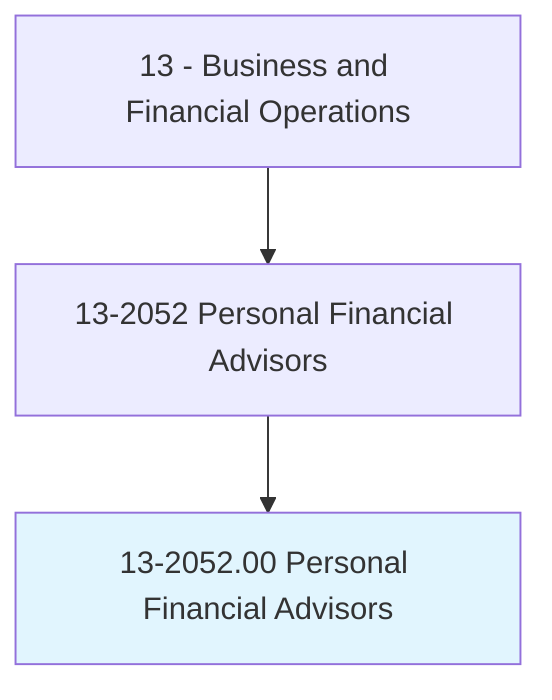
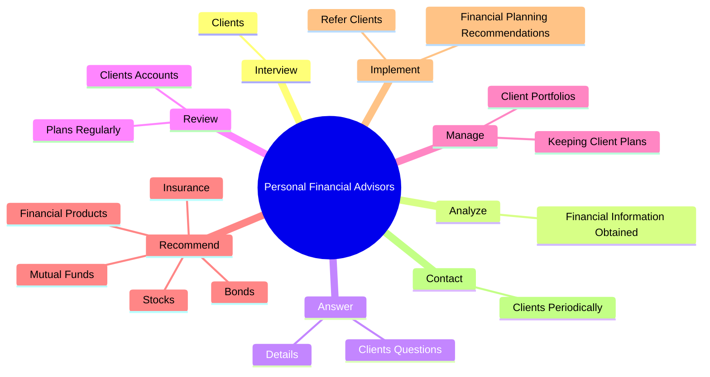

# Personal Financial Advisors

> Advise clients on financial plans using knowledge of tax and investment strategies, securities, insurance, pension plans, and real estate. Duties include assessing clients' assets, liabilities, cash flow, insurance coverage, tax status, and financial objectives. May also buy and sell financial assets for clients.

## Overview

Personal Financial Advisors is an occupation within the Business and Financial Operations category. Advise clients on financial plans using knowledge of tax and investment strategies, securities, insurance, pension plans, and real estate. Duties include assessing clients' assets, liabilities, cash flow, insurance coverage, tax status, and financial objectives.

## Classification Hierarchy

## Key Statistics

| Metric | Value |
|--------|-------|
| SOC Code | 13-2052.00 |
| Category | [Business and Financial Operations](/occupations/Business) |
| Task Count | 86 |
| Source | O*NET |

## Core Tasks

### interview.Clients

Personal Financial Advisors interview clients as part of their core responsibilities.

**Actions:**
- `interview.Clients.to.determine.CurrentIncome`
- `interview.Clients.to.Expenses`
- `interview.Clients.to.InsuranceCoverage`
- `interview.Clients.to.TaxStatus`

### analyze.FinancialInformationObtained

Personal Financial Advisors analyze financial information obtained as part of their core responsibilities.

**Actions:**
- `analyze.FinancialInformationObtained.from.Clients.to.determine.StrategiesForMeetingClientsFinancialObjectives`

### answer.ClientsQuestions

Personal Financial Advisors answer clients questions as part of their core responsibilities.

**Actions:**
- `answer.ClientsQuestions.about.Purposes.of.FinancialPlans`
- `answer.ClientsQuestions.about.Purposes.of.Strategies`
- `answer.Details.of.FinancialPlans`
- `answer.Details.of.Strategies`

## Skills & Competencies

### Technical Skills
- **Financial Analysis** - Advanced
- **Data Analysis** - Advanced
- **Regulatory Compliance** - Advanced

### Soft Skills
- **Communication** - Essential
- **Problem Solving** - Essential
- **Critical Thinking** - Important
- **Teamwork** - Important
- **Adaptability** - Important

## Related Occupations

## Industries

This occupation is found across multiple industries. See [Industries](/industries) for sector-specific employment data.

## Career Progression

---

*Source: O*NET 13-2052.00 - ONETOccupation*
