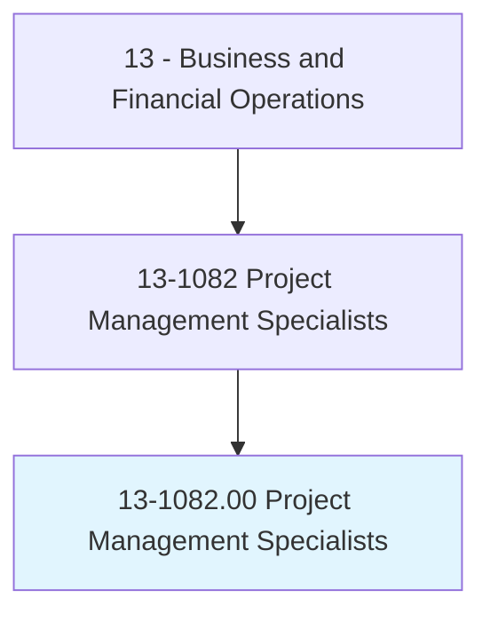
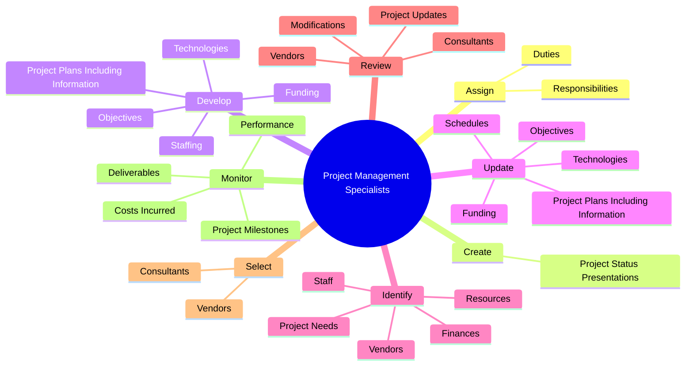

# Project Management Specialists

> Analyze and coordinate the schedule, timeline, procurement, staffing, and budget of a product or service on a per project basis. Lead and guide the work of technical staff. May serve as a point of contact for the client or customer.

## Overview

Project Management Specialists is an occupation within the Business and Financial Operations category. Analyze and coordinate the schedule, timeline, procurement, staffing, and budget of a product or service on a per project basis. Lead and guide the work of technical staff.

## Classification Hierarchy

## Key Statistics

| Metric | Value |
|--------|-------|
| SOC Code | 13-1082.00 |
| Category | [Business and Financial Operations](/occupations/Business) |
| Task Count | 54 |
| Source | O*NET |

## Core Tasks

### assign.Duties

Project Management Specialists assign duties as part of their core responsibilities.

**Actions:**
- `assign.Duties.to.project.Personnel`
- `assign.Responsibilities.to.project.Personnel`

### create.ProjectStatusPresentations

Project Management Specialists create project status presentations as part of their core responsibilities.

**Actions:**
- `create.ProjectStatusPresentations.for.Delivery.to.Customers`
- `create.ProjectStatusPresentations.for.ProjectPersonnel`

### develop.ProjectPlansIncludingInformation

Project Management Specialists develop project plans including information as part of their core responsibilities.

**Actions:**
- `develop.ProjectPlansIncludingInformation`
- `develop.Objectives`
- `develop.Technologies`
- `develop.Funding`

## Skills & Competencies

### Technical Skills
- **Financial Analysis** - Advanced
- **Data Analysis** - Advanced
- **Regulatory Compliance** - Advanced

### Soft Skills
- **Communication** - Essential
- **Problem Solving** - Essential
- **Critical Thinking** - Important
- **Teamwork** - Important
- **Adaptability** - Important

## Related Occupations

## Industries

This occupation is found across multiple industries. See [Industries](/industries) for sector-specific employment data.

## Career Progression

---

*Source: O*NET 13-1082.00 - ONETOccupation*
