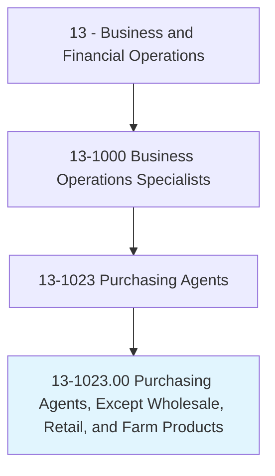
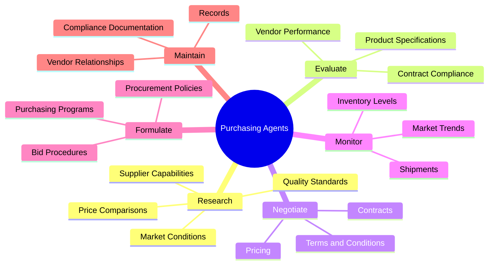
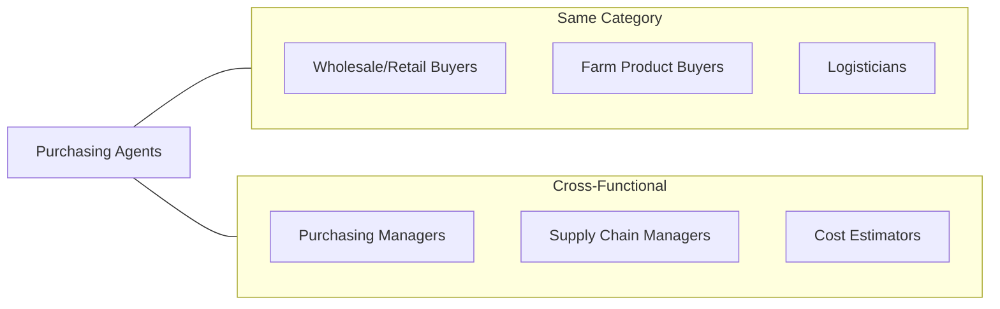
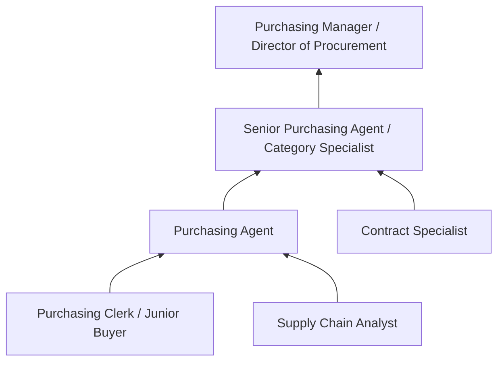

# Purchasing Agents, Except Wholesale, Retail, and Farm Products

> Purchase machinery, equipment, tools, parts, supplies, or services necessary for the operation of an establishment. Purchase raw or semifinished materials for manufacturing. May negotiate contracts.

## Overview

Purchasing Agents are strategic procurement professionals who acquire the goods and services essential for organizational operations. They research suppliers, negotiate contracts, ensure compliance with regulations, and maintain relationships that deliver value beyond mere cost savings. This role requires analytical rigor, negotiation expertise, and a deep understanding of supply chain dynamics to optimize procurement while managing risk.

## Classification Hierarchy

## Key Statistics

| Metric | Value |
|--------|-------|
| SOC Code | 13-1023.00 |
| Job Zone | 4 (Considerable Preparation) |
| Category | [Business and Financial Operations](/occupations/Business) |
| Core Tasks | 20+ |
| Source | O*NET |

## Core Tasks

### research.Suppliers

Purchasing Agents thoroughly investigate potential suppliers to ensure optimal sourcing decisions.

**Actions:**
- `research.Suppliers.on.Price` - Compare pricing structures
- `research.Suppliers.on.Quality` - Assess quality standards
- `research.Suppliers.on.Reliability` - Evaluate delivery performance
- `research.Suppliers.on.DistributionCapabilities` - Assess logistics capacity
- `research.Suppliers.on.SuppliersReputation` - Review market standing

### evaluate.Suppliers

Purchasing Agents assess vendor performance and capabilities.

**Actions:**
- `evaluate.Suppliers.on.Price` - Compare cost competitiveness
- `evaluate.Suppliers.on.Quality` - Verify quality standards
- `evaluate.Suppliers.on.Service` - Assess support capabilities
- `evaluate.ContractPerformance.to.ensure.ComplianceWithContractualObligationsDetermineNeedForChanges` - Monitor contract execution

### formulate.Policies

Purchasing Agents establish procurement procedures and policies.

**Actions:**
- `formulate.Policies.for.BidProposals.of.GoodsServices` - Create bidding guidelines
- `formulate.Policies.for.Procurement.of.GoodsServices` - Establish purchasing standards
- `formulate.Procedures.for.BidProposals.of.GoodsServices` - Define bid processes

### negotiate.Contracts

Purchasing Agents secure favorable terms through skilled negotiation.

**Actions:**
- `negotiate.RenegotiateAdministerContracts.with.SuppliersVendorsOtherRepresentatives` - Manage contract negotiations
- `purchase.HighestQualityMerchandise.at.LowestPossiblePriceCorrectAmounts` - Optimize value
- `analyze.PriceProposals.to.determine.ReasonablePrices` - Validate pricing

### maintain.Records

Purchasing Agents keep comprehensive documentation of all procurement activities.

**Actions:**
- `maintain.ComputerizedRecords.of.PurchasedItems` - Track purchases
- `maintain.ComputerizedRecords.of.Costs` - Monitor expenditures
- `maintain.ComputerizedRecords.of.Deliveries` - Track logistics
- `maintain.ComputerizedRecords.of.Inventories` - Manage stock levels

### monitor.Shipments

Purchasing Agents track deliveries and resolve supply issues.

**Actions:**
- `monitor.Shipments.to.ensure.GoodsComeInOnTime` - Track delivery schedules
- `monitor.Shipments.to.resolve.ProblemsRelatedToUndeliveredGoods` - Address logistics issues
- `monitor.ChangesAffectingSupply` - Track supply chain disruptions
- `monitor.PriceTrends` - Follow market pricing

## Skills & Competencies

### Technical Skills
- **Contract Management** - Expert
- **Supply Chain Management** - Advanced
- **Cost Analysis** - Advanced
- **Regulatory Compliance** - Proficient
- **ERP Systems** - Proficient

### Soft Skills
- **Negotiation** - Critical
- **Analytical Thinking** - Critical
- **Communication** - Essential
- **Problem Solving** - Essential
- **Relationship Management** - Important

## Related Occupations

## Industries

- [Manufacturing](/industries/Manufacturing) - High Employment
- [Government](/industries/Government) - High Employment
- [Healthcare](/industries/Healthcare) - Moderate Employment
- [Construction](/industries/Construction) - Moderate Employment
- [Professional Services](/industries/ProfessionalServices) - Moderate Employment

## Career Progression

## Education & Training

| Requirement | Details |
|-------------|---------|
| Typical Education | Bachelor's degree in Business, Supply Chain, or related field |
| Work Experience | 2-4 years in purchasing or supply chain |
| On-the-Job Training | Moderate - systems and procedures |
| Common Certifications | Certified Purchasing Professional (CPP), CPSM |

## Departments

This occupation typically works in:
- [Procurement](/departments/Procurement)
- [Supply Chain](/departments/SupplyChain)
- [Operations](/departments/Operations)

---

*Source: O*NET 13-1023.00 - ONETOccupation*
