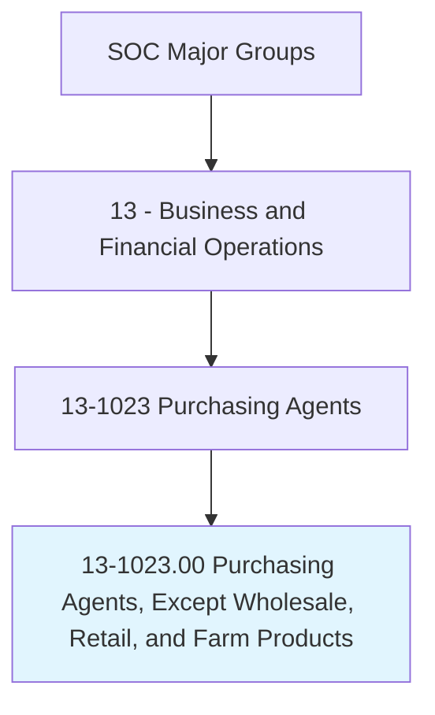
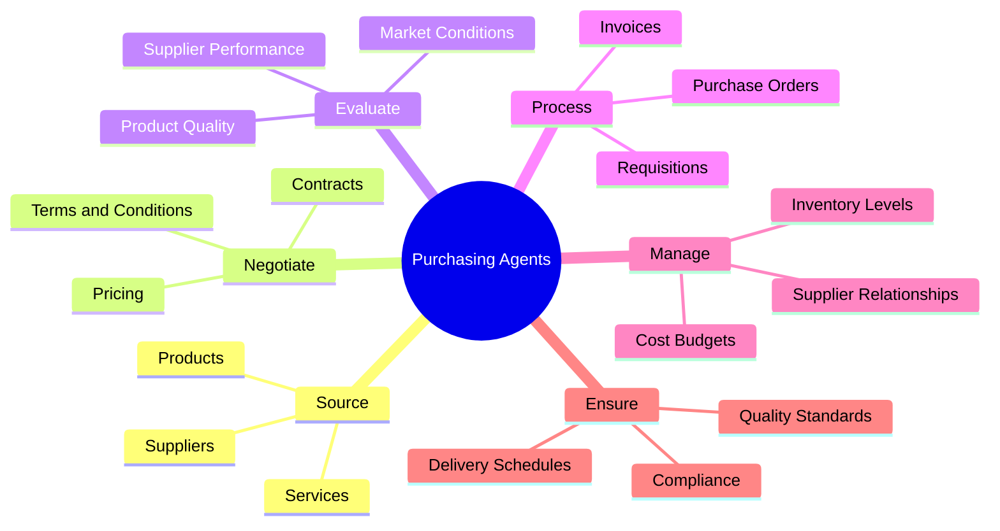
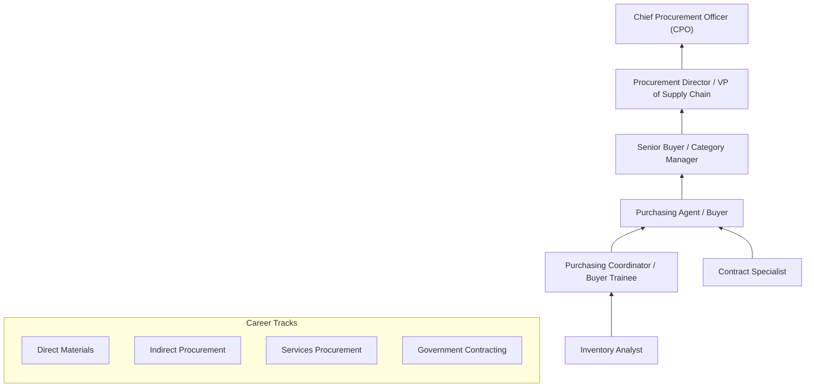
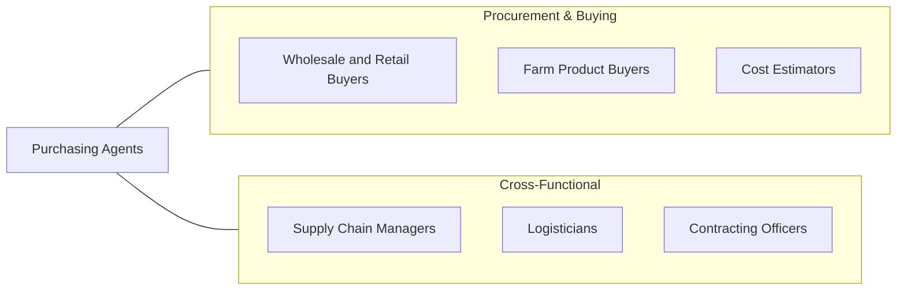

# Purchasing Agents, Except Wholesale, Retail, and Farm Products

> Purchase machinery, equipment, tools, parts, supplies, or services necessary for the operation of an establishment. Purchase raw or semi-finished materials for manufacturing. May purchase materials, services, and supplies for institution or government use.

## Overview

Purchasing Agents procure the goods, materials, equipment, and services that organizations need to operate. They evaluate suppliers, negotiate contracts, manage purchase orders, and ensure that their organizations receive quality products at competitive prices and on schedule. Operating across manufacturing, government, healthcare, education, and service industries, these professionals are critical to organizational cost management and operational continuity.

The role requires balancing cost optimization with quality assurance, delivery reliability, and risk management. Purchasing agents analyze market conditions, evaluate supplier capabilities, negotiate terms and conditions, and manage relationships with vendors across complex supply chains. They must understand specifications and technical requirements for the goods they purchase while maintaining compliance with organizational policies and applicable regulations.

The profession has evolved with strategic sourcing practices, e-procurement platforms, supplier relationship management systems, and sustainability mandates. Modern purchasing agents are expected to contribute to organizational strategy through total cost of ownership analysis, supplier diversity programs, risk mitigation, and sustainable procurement practices that align purchasing decisions with broader corporate objectives.

## Classification Hierarchy

## Key Statistics

| Metric | Value |
|--------|-------|
| SOC Code | 13-1023.00 |
| Job Zone | 4 (Considerable Preparation) |
| Category | [Business and Financial Operations](/occupations/Business/index) |
| Median Salary | $67,620 |
| Employment | ~266,000 |
| Projected Growth | -2% (Declining) |
| Task Count | 52 |
| Source | O*NET |

## Core Tasks

### source.Suppliers

Identify and qualify suppliers for required goods and services.

**Actions:**
- `source.Suppliers.to.identify.QualifiedVendors` - Find capable suppliers
- `evaluate.SupplierCapabilities.to.ensure.QualityAndReliability` - Assess vendor fitness
- `evaluate.MarketConditions.to.optimize.PurchaseTiming` - Time procurement
- `manage.SupplierDiversity.to.meet.OrganizationalGoals` - Support inclusion

### negotiate.Contracts

Negotiate pricing, terms, and conditions with suppliers.

**Actions:**
- `negotiate.Contracts.to.achieve.BestValue` - Secure favorable terms
- `negotiate.Pricing.based.on.VolumeAndRelationship` - Optimize costs
- `negotiate.DeliverySchedules.to.meet.ProductionNeeds` - Ensure timely supply
- `negotiate.WarrantyAndServiceTerms.for.RiskMitigation` - Protect organization

### manage.ProcurementProcess

Process purchase orders and manage the complete procurement lifecycle.

**Actions:**
- `process.PurchaseOrders.for.ApprovedRequisitions` - Execute procurement
- `manage.SupplierRelationships.for.LongTermValue` - Cultivate partnerships
- `monitor.DeliverySchedules.to.prevent.Disruptions` - Track fulfillment
- `ensure.Compliance.with.ProcurementPolicies` - Follow regulations

## Skills & Competencies

### Technical Skills
- **Strategic Sourcing** - Expert
- **Contract Negotiation** - Expert
- **Supplier Management** - Advanced
- **Cost Analysis / TCO** - Advanced
- **E-Procurement Systems** - Advanced
- **Quality Management** - Proficient
- **Inventory Management** - Proficient
- **Regulatory Compliance (FAR for government)** - Proficient

### Soft Skills
- **Negotiation** - Critical
- **Analytical Thinking** - Critical
- **Communication** - Essential
- **Relationship Building** - Essential
- **Decision Making** - Important
- **Attention to Detail** - Important

## Education & Certifications

| Requirement | Details |
|-------------|---------|
| Typical Education | Bachelor's degree in Supply Chain, Business, or related field |
| Key Certifications | CPSM (Certified Professional in Supply Management - ISM) |
| Additional Certs | CPM (Certified Purchasing Manager), CPPO (Certified Public Procurement Officer) |
| Government | CPCM (Certified Professional Contracts Manager - NCMA) |
| Work Experience | 2-5 years in purchasing or supply chain |
| Continuing Education | Required for most certifications |

## Career Progression

## Industry Variations

| Industry | Focus | Typical Tasks |
|----------|-------|---------------|
| **Manufacturing** | Raw materials & components | Supplier qualification, material specs, JIT delivery |
| **Government** | Regulated procurement | FAR compliance, competitive bidding, small business goals |
| **Healthcare** | Medical supplies & equipment | GPO management, clinical product evaluation, compliance |
| **Education** | Institutional supplies | Cooperative purchasing, budget management, vendor management |
| **Construction** | Building materials | Subcontractor management, bulk ordering, project-based procurement |
| **Technology** | IT hardware & services | Software licensing, SaaS procurement, cloud services |

## Technology & Tools

| Category | Tools |
|----------|-------|
| **E-Procurement** | SAP Ariba, Coupa, Jaggaer, Oracle Procurement Cloud |
| **ERP** | SAP, Oracle, Microsoft Dynamics |
| **Contract Management** | Icertis, Agiloft, ContractPodAi |
| **Spend Analytics** | SpendHQ, Ivalua, Sievo |
| **Supplier Management** | HICX, Avetta, SAP Ariba |
| **Communication** | Microsoft 365, Slack |
| **Market Intelligence** | Thomas, ThomasNet, industry databases |

## Related Occupations

## Departments

This occupation typically works in:
- [Procurement](/departments/Procurement)
- [Supply Chain Management](/departments/SupplyChain)
- Strategic Sourcing
- Contract Management
- [Operations](/departments/Operations)

---

*Source: O*NET 13-1023.00 - ONETOccupation*
