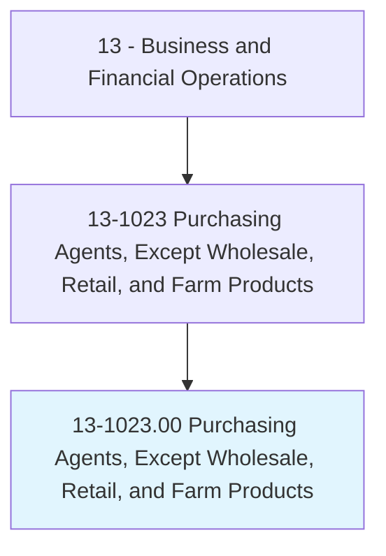
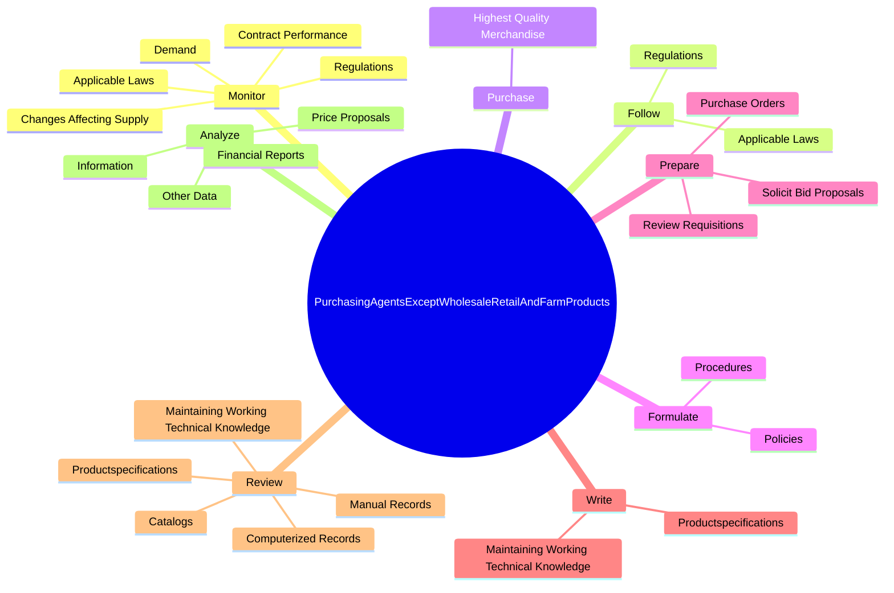
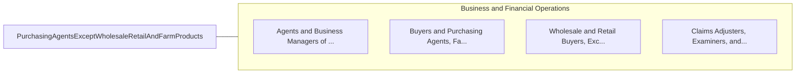

# Purchasing Agents, Except Wholesale, Retail, and Farm Products

> Purchase machinery, equipment, tools, parts, supplies, or services necessary for the operation of an establishment. Purchase raw or semifinished materials for manufacturing. May negotiate contracts.

## Overview

Purchasing Agents, Except Wholesale, Retail, and Farm Products is an occupation within the Business and Financial Operations category. Purchase machinery, equipment, tools, parts, supplies, or services necessary for the operation of an establishment. Purchase raw or semifinished materials for manufacturing.

## Classification Hierarchy

## Key Statistics

| Metric | Value |
|--------|-------|
| SOC Code | 13-1023.00 |
| Category | [Business and Financial Operations](/occupations/Business/index) |
| Task Count | 142 |
| Source | O*NET |

## Core Tasks

### monitor.ApplicableLaws

Purchasing Agents, Except Wholesale, Retail, and Farm Products monitor applicable laws as part of their core responsibilities.

**Actions:**
- `monitor.ApplicableLaws`
- `monitor.Regulations`
- `monitor.ContractPerformance.to.ensure.ComplianceWithContractualObligationsDetermineNeedForChanges`
- `monitor.ContractPerformance.to.ToDetermineNeedForChanges`

### follow.ApplicableLaws

Purchasing Agents, Except Wholesale, Retail, and Farm Products follow applicable laws as part of their core responsibilities.

**Actions:**
- `follow.ApplicableLaws`
- `follow.Regulations`

### purchase.HighestQualityMerchandise

Purchasing Agents, Except Wholesale, Retail, and Farm Products purchase highest quality merchandise as part of their core responsibilities.

**Actions:**
- `purchase.HighestQualityMerchandise.at.LowestPossiblePriceCorrectAmounts`
- `purchase.HighestQualityMerchandise.at.InCorrectAmounts`

## Skills & Competencies

### Technical Skills
- **Financial Analysis** - Advanced
- **Data Analysis** - Advanced
- **Regulatory Compliance** - Advanced

### Soft Skills
- **Communication** - Essential
- **Problem Solving** - Essential
- **Critical Thinking** - Important
- **Teamwork** - Important
- **Adaptability** - Important

## Related Occupations

## Industries

This occupation is found across multiple industries. See [Industries](/industries) for sector-specific employment data.

## Career Progression

---

*Source: O*NET 13-1023.00 - ONETOccupation*
