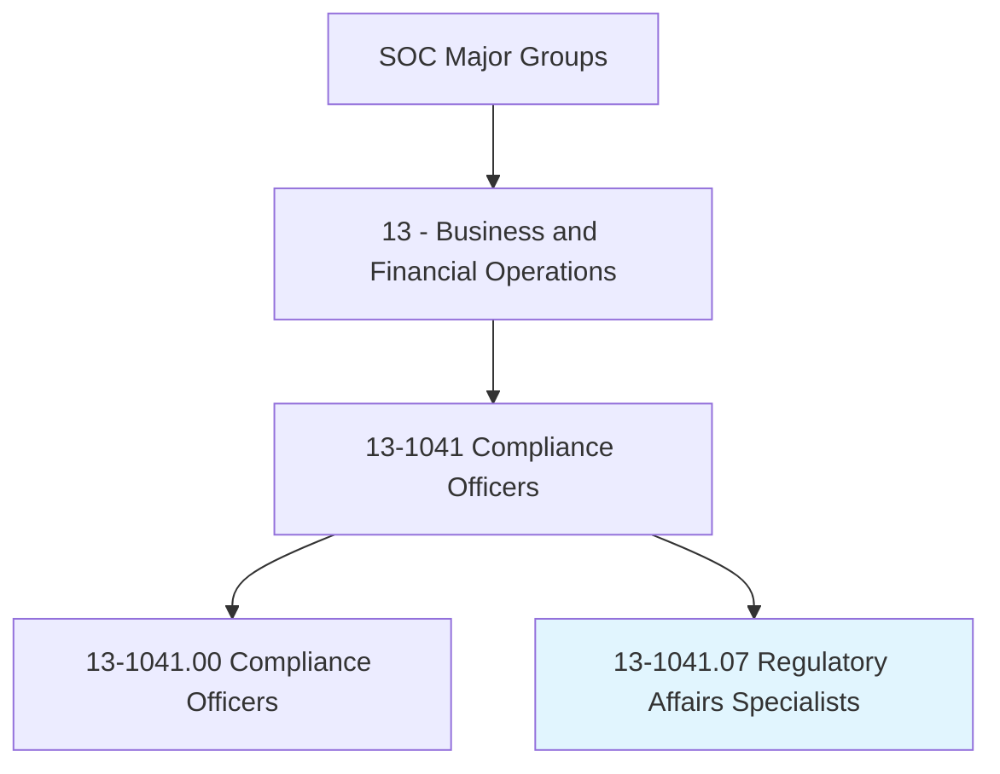
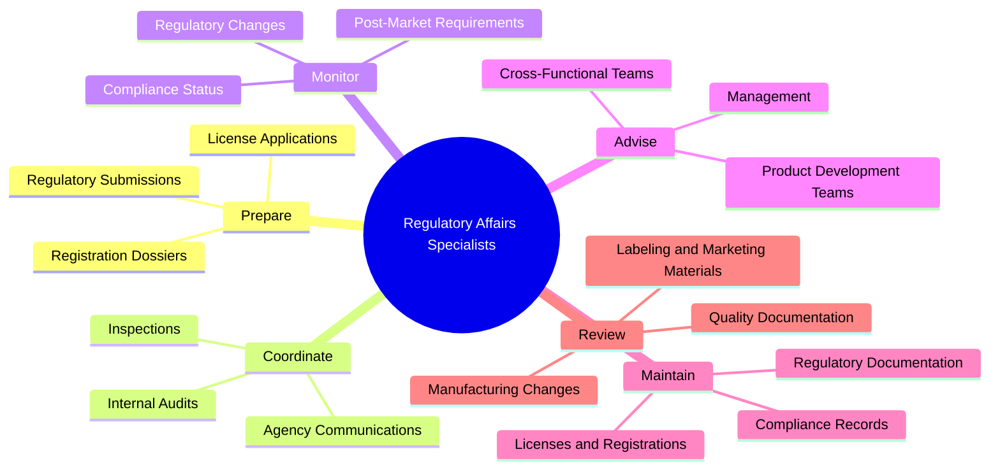
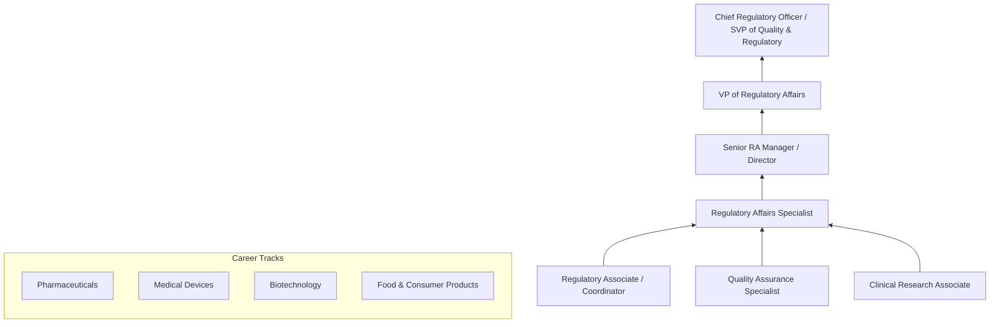
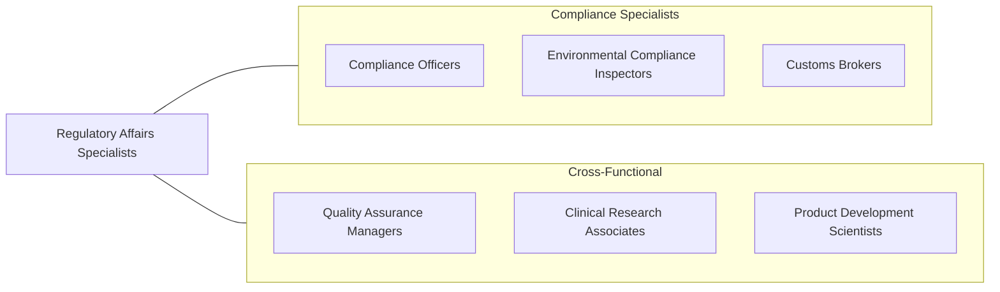

# Regulatory Affairs Specialists

> Coordinate and document internal regulatory processes, such as internal audits, inspections, license renewals, or registrations. May compile and prepare materials for submission to regulatory agencies.

## Overview

Regulatory Affairs Specialists ensure that organizations comply with government regulations governing the development, manufacturing, marketing, and distribution of products -- particularly in heavily regulated industries such as pharmaceuticals, medical devices, biotechnology, food and beverage, chemicals, and financial services. They prepare and manage regulatory submissions, coordinate with government agencies, maintain licenses and registrations, and advise organizations on regulatory strategy and compliance requirements.

In the life sciences sector, these professionals manage the regulatory pathway for new products from preclinical development through market approval, preparing Investigational New Drug (IND) applications, New Drug Applications (NDA), 510(k) submissions, and Premarket Approval (PMA) applications. They interpret regulatory guidance, monitor changes in regulatory requirements, and develop strategies to achieve timely approvals while maintaining compliance with post-market surveillance obligations.

The profession has grown in complexity as regulatory frameworks become more global, requiring coordination across FDA, EMA, PMDA, and other national regulatory bodies. Digital health technologies, combination products, gene therapies, and AI-based medical devices have introduced novel regulatory challenges that demand specialized expertise and adaptive regulatory strategies.

## Classification Hierarchy

## Key Statistics

| Metric | Value |
|--------|-------|
| SOC Code | 13-1041.07 |
| Job Zone | 4 (Considerable Preparation) |
| Category | [Business and Financial Operations](/occupations/Business/index) |
| Median Salary | $76,270 |
| Employment | ~35,000 |
| Projected Growth | 7% (Faster than average) |
| Task Count | 40 |
| Source | O*NET |

## Core Tasks

### prepare.RegulatorySubmissions

Prepare and manage submissions to regulatory agencies for product approval and compliance.

**Actions:**
- `prepare.RegulatorySubmissions.for.ProductApproval` - Compile dossiers
- `prepare.RegistrationDossiers.for.InternationalMarkets` - Support global registrations
- `prepare.LicenseApplications.for.ManufacturingSites` - Maintain site licenses
- `coordinate.AgencyCommunications.for.SubmissionReview` - Manage agency interactions

### monitor.RegulatoryCompliance

Monitor regulatory changes and ensure ongoing compliance with evolving requirements.

**Actions:**
- `monitor.RegulatoryChanges.to.assess.BusinessImpact` - Track regulatory evolution
- `monitor.ComplianceStatus.across.ProductPortfolio` - Verify adherence
- `monitor.PostMarketRequirements.for.ApprovedProducts` - Maintain market authorization
- `coordinate.InternalAudits.to.verify.ComplianceSystems` - Assess compliance programs

### advise.OnRegulatoryStrategy

Provide regulatory strategy guidance to product development and business teams.

**Actions:**
- `advise.ProductDevelopmentTeams.on.RegulatoryPathway` - Guide development strategy
- `advise.Management.on.RegulatoryRiskAndTimeline` - Inform business decisions
- `review.LabelingAndMarketingMaterials.for.RegulatoryCompliance` - Verify claims
- `review.ManufacturingChanges.for.RegulatoryImplications` - Assess change impact

## Skills & Competencies

### Technical Skills
- **Regulatory Science & Strategy** - Expert
- **Submission Preparation (eCTD, 510(k), NDA)** - Expert
- **FDA/EMA/Global Regulations** - Expert
- **Quality Management Systems (ISO, GMP)** - Advanced
- **Clinical Development Knowledge** - Advanced
- **Labeling & Advertising Compliance** - Advanced
- **Post-Market Surveillance** - Proficient

### Soft Skills
- **Attention to Detail** - Critical
- **Communication (Written/Verbal)** - Critical
- **Strategic Thinking** - Essential
- **Project Management** - Essential
- **Cross-Functional Collaboration** - Essential
- **Adaptability** - Important

## Education & Certifications

| Requirement | Details |
|-------------|---------|
| Typical Education | Bachelor's degree in Life Sciences, Pharmacy, Engineering, or related field |
| Advanced Degree | Master's in Regulatory Affairs, Regulatory Science, or related field preferred |
| Key Certifications | RAC (Regulatory Affairs Certification - RAPS) |
| Quality | CQA (Certified Quality Auditor - ASQ) |
| Professional Orgs | RAPS (Regulatory Affairs Professionals Society), DIA |
| Work Experience | 3-5 years in regulatory affairs, quality, or related field |

## Career Progression

## Industry Variations

| Industry | Focus | Typical Tasks |
|----------|-------|---------------|
| **Pharmaceuticals** | Drug approval | IND, NDA, ANDA submissions, labeling, post-market |
| **Medical Devices** | Device clearance/approval | 510(k), PMA, De Novo, UDI compliance |
| **Biotechnology** | Biologics/gene therapy | BLA submissions, biosimilar pathway, advanced therapies |
| **Food & Beverage** | Food safety | GRAS determinations, labeling, FSMA compliance |
| **Cosmetics** | Product safety | MoCRA compliance, ingredient review, claims substantiation |
| **Chemicals** | Environmental/safety | TSCA, REACH, GHS classification |

## Technology & Tools

| Category | Tools |
|----------|-------|
| **Submissions** | eCTD publishing tools, LORENZ docuBridge, GlobalSubmit |
| **Regulatory Intelligence** | Cortellis, IQVIA, FDA databases |
| **Document Management** | Veeva Vault, MasterControl, Documentum |
| **Quality Systems** | TrackWise, ETQ, Greenlight Guru |
| **Project Management** | Microsoft Project, Smartsheet, Planisware |
| **Communication** | Microsoft 365, regulatory agency portals |
| **Labeling** | Kallik, PRISYM, Loftware |

## Related Occupations

## Departments

This occupation typically works in:
- [Regulatory Affairs](/departments/RegulatoryAffairs)
- [Quality Assurance](/departments/QualityAssurance)
- [Product Development](/departments/ProductDevelopment)
- [Medical Affairs](/departments/MedicalAffairs)
- [Compliance](/departments/Compliance)

---

*Source: O*NET 13-1041.07 - ONETOccupation*
