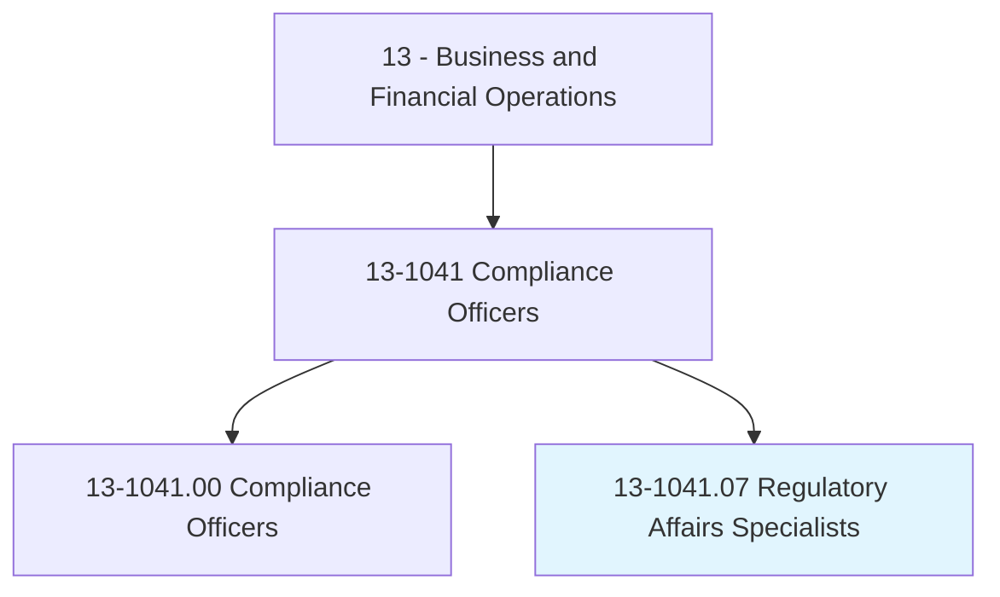
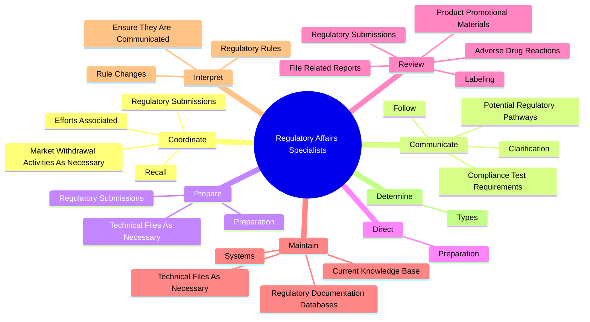
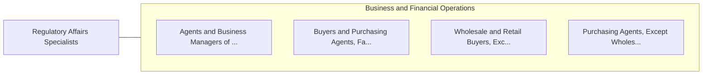

# Regulatory Affairs Specialists

> Coordinate and document internal regulatory processes, such as internal audits, inspections, license renewals, or registrations. May compile and prepare materials for submission to regulatory agencies.

## Overview

Regulatory Affairs Specialists is a specialized variant within the Business and Financial Operations category. Coordinate and document internal regulatory processes, such as internal audits, inspections, license renewals, or registrations. 

## Classification Hierarchy

## Key Statistics

| Metric | Value |
|--------|-------|
| SOC Code | 13-1041.07 |
| Category | [Business and Financial Operations](/occupations/Business) |
| Task Count | 112 |
| Source | O*NET |

## Core Tasks

### coordinate.EffortsAssociated

Regulatory Affairs Specialists coordinate efforts associated as part of their core responsibilities.

**Actions:**
- `coordinate.EffortsAssociated.with.Preparation.of.RegulatoryDocuments`
- `coordinate.EffortsAssociated.with.Submissions`
- `coordinate.RegulatorySubmissions.for.DomesticProjects`
- `coordinate.RegulatorySubmissions.for.InternationalProjects`

### communicate.PotentialRegulatoryPathways

Regulatory Affairs Specialists communicate potential regulatory pathways as part of their core responsibilities.

**Actions:**
- `communicate.PotentialRegulatoryPathways.of.SubmissionsUnderReview`
- `communicate.ComplianceTestRequirements.of.SubmissionsUnderReview`
- `communicate.Clarification.of.SubmissionsUnderReview`
- `communicate.Follow.up.OfSubmissionsUnderReview`

### prepare.Preparation

Regulatory Affairs Specialists prepare preparation as part of their core responsibilities.

**Actions:**
- `prepare.Preparation.of.AdditionalInformationAsRequested.by.RegulatoryAgencies`
- `prepare.Preparation.of.ResponsesAsRequested.by.RegulatoryAgencies`
- `prepare.RegulatorySubmissions.for.DomesticProjects`
- `prepare.RegulatorySubmissions.for.InternationalProjects`

## Skills & Competencies

### Technical Skills
- **Financial Analysis** - Advanced
- **Data Analysis** - Advanced
- **Regulatory Compliance** - Advanced

### Soft Skills
- **Communication** - Essential
- **Problem Solving** - Essential
- **Critical Thinking** - Important
- **Teamwork** - Important
- **Adaptability** - Important

## Related Occupations

## Industries

This occupation is found across multiple industries. See [Industries](/industries) for sector-specific employment data.

## Career Progression

---

*Source: O*NET 13-1041.07 - ONETOccupation*
