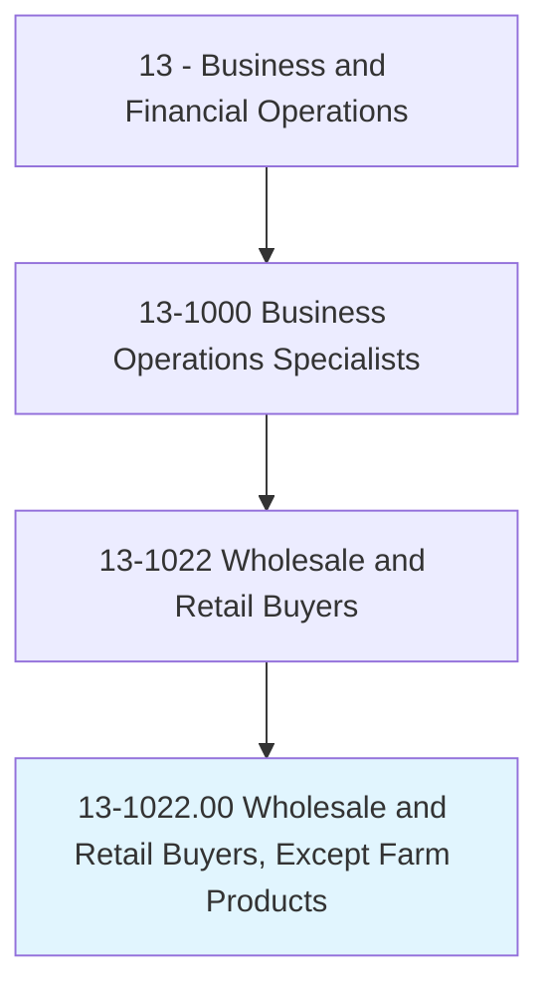
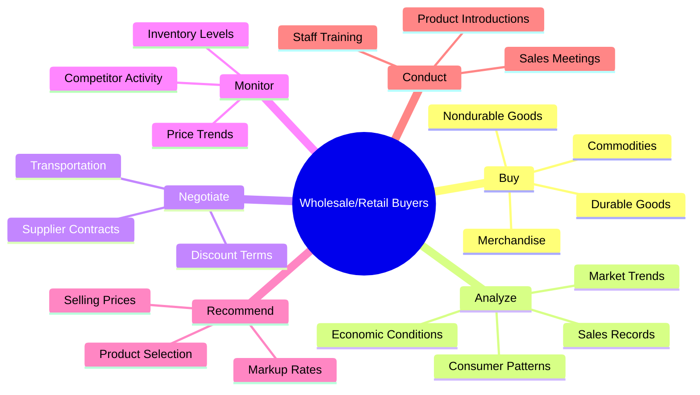
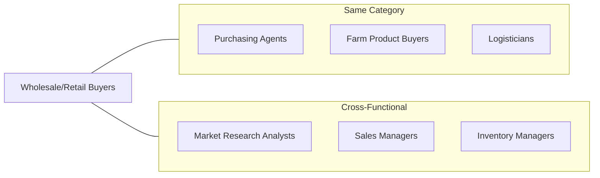
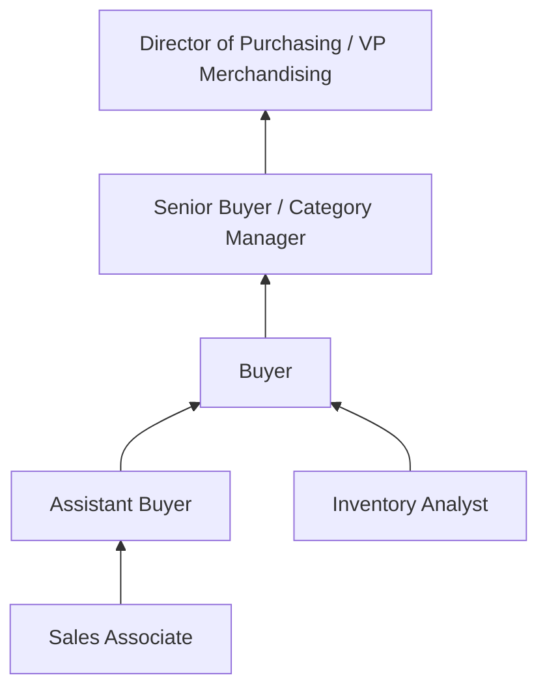

# Wholesale and Retail Buyers, Except Farm Products

> Buy merchandise or commodities, other than farm products, for resale to consumers at the wholesale or retail level, including both durable and nondurable goods. Analyze past buying trends, sales records, price, and quality of merchandise to determine value and yield. Select, order, and authorize payment for merchandise according to contractual agreements. May conduct meetings with sales personnel and introduce new products. May negotiate contracts.

## Overview

Wholesale and Retail Buyers are strategic purchasing professionals who determine what products their organizations will sell. They analyze market trends, evaluate suppliers, negotiate pricing, and manage inventory to maximize profitability while meeting customer demands. This role requires a blend of analytical skills, market intuition, and negotiation expertise to make purchasing decisions that drive business success.

## Classification Hierarchy

## Key Statistics

| Metric | Value |
|--------|-------|
| SOC Code | 13-1022.00 |
| Job Zone | 4 (Considerable Preparation) |
| Category | [Business and Financial Operations](/occupations/Business/index) |
| Core Tasks | 15+ |
| Source | O*NET |

## Core Tasks

### buy.Merchandise

Retail Buyers select and purchase products for resale to consumers.

**Actions:**
- `buy.Merchandise.for.ResaleToWholesaleConsumers` - Purchase for wholesale distribution
- `buy.Merchandise.for.RetailConsumers` - Purchase for direct retail sale
- `buy.Commodities.for.ResaleToWholesaleConsumers` - Acquire wholesale commodities
- `buy.Commodities.for.RetailConsumers` - Source retail commodities

### analyze.SalesRecords

Retail Buyers study data to anticipate market demands and optimize purchasing decisions.

**Actions:**
- `analyze.SalesRecords.to.anticipate.ConsumerBuyingPatterns` - Predict customer behavior
- `analyze.Trends.to.anticipate.ConsumerBuyingPatterns` - Identify market shifts
- `analyze.EconomicConditions.to.NeededInventory` - Adjust for economic factors
- `monitor.SalesRecords.to.CompanySales` - Track performance metrics

### negotiate.Terms

Retail Buyers secure favorable terms with suppliers to maximize margins.

**Actions:**
- `negotiate.DiscountTerms.with.Suppliers` - Obtain volume discounts
- `negotiate.TransportationArrangements.with.Suppliers` - Optimize logistics costs
- `authorize.Payment.of.Invoices.of.Merchandise` - Manage payment processes

### inspect.Merchandise

Retail Buyers evaluate product quality and value.

**Actions:**
- `inspect.Merchandise.to.determine.Quality` - Assess product standards
- `inspect.Merchandise.to.value` - Determine fair pricing
- `inspect.Products.to.Yield` - Evaluate return potential

### recommend.Prices

Retail Buyers establish pricing strategies for purchased merchandise.

**Actions:**
- `recommend.Mark.up.Rates` - Set profit margins
- `recommend.Mark.down.Rates` - Plan promotional pricing
- `recommend.MerchandiseSellingPrices` - Establish retail prices

### develop.Strategies

Retail Buyers create plans for marketing and merchandising products.

**Actions:**
- `develop.Strategies.to.advertise.GreenProducts` - Promote sustainable goods
- `develop.Strategies.to.merchandise.ToConsumers` - Plan product presentation
- `identify.Opportunities.to.buy.GreenCommodities` - Source eco-friendly products

## Skills & Competencies

### Technical Skills
- **Market Analysis** - Expert
- **Inventory Management** - Advanced
- **Financial Analysis** - Advanced
- **Supply Chain Management** - Proficient
- **Data Analytics** - Proficient

### Soft Skills
- **Negotiation** - Critical
- **Decision Making** - Critical
- **Analytical Thinking** - Essential
- **Communication** - Essential
- **Trend Awareness** - Important

## Related Occupations

## Industries

- [Retail Trade](/industries/Retail/index) - High Employment
- [Wholesale Trade](/industries/Wholesale/index) - High Employment
- [Manufacturing](/industries/Manufacturing/index) - Moderate Employment
- [E-commerce](/industries/Ecommerce) - Growing Employment

## Career Progression

## Education & Training

| Requirement | Details |
|-------------|---------|
| Typical Education | Bachelor's degree in Business, Marketing, or related field |
| Work Experience | 2-4 years in retail, sales, or purchasing |
| On-the-Job Training | Moderate - product knowledge and vendor relationships |
| Common Certifications | Certified Professional in Supply Management (CPSM) |

## Departments

This occupation typically works in:
- [Merchandising](/departments/Merchandising)
- [Procurement](/departments/Procurement)
- [Category Management](/departments/CategoryManagement)

---

*Source: O*NET 13-1022.00 - ONETOccupation*
