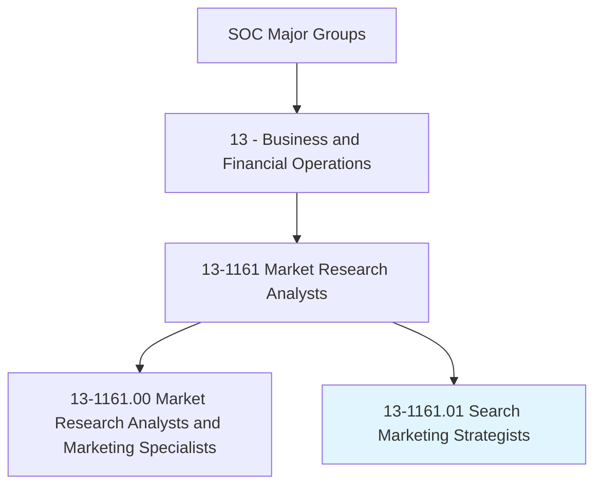
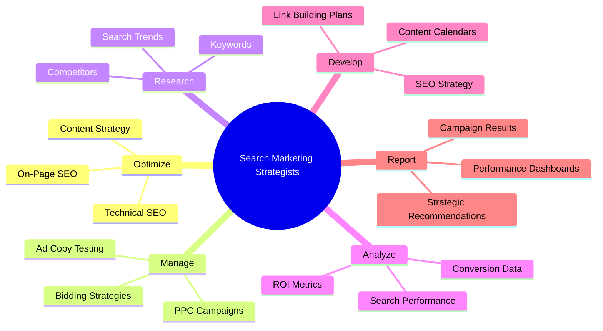
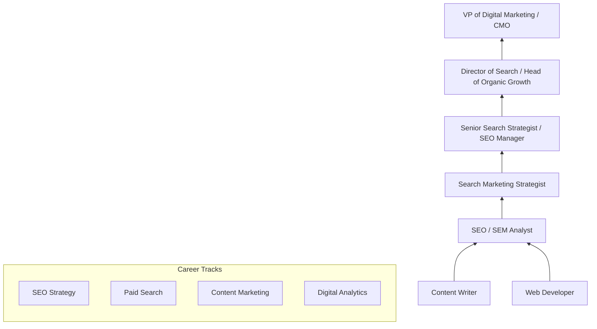
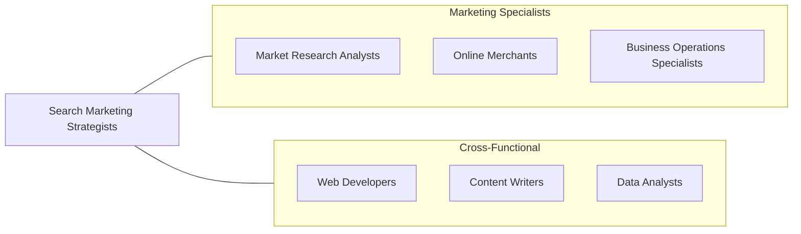

# Search Marketing Strategists

> Employ search marketing tactics to increase visibility and engagement with content, products, or services in Internet-enabled devices or interfaces. Examine search query behaviors on general or specialized search engines or other Internet-based content. Analyze research data to provide strategy recommendations on search engine optimization (SEO) and marketing (SEM).

## Overview

Search Marketing Strategists develop and execute strategies to increase an organization's online visibility and drive targeted traffic through search engines and digital platforms. They optimize website content for organic search rankings (SEO), manage paid search advertising campaigns (SEM/PPC), and analyze search data to inform broader digital marketing strategies. In an era where the majority of purchasing decisions begin with an online search, these professionals directly impact business revenue and growth.

The role requires a blend of technical, analytical, and creative skills. Search marketing strategists must understand search engine algorithms, keyword research, content optimization, link building, technical website architecture, and paid advertising platforms. They analyze search query data, competitive landscapes, and user behavior to develop strategies that align content with user intent and business objectives.

The profession is evolving rapidly as search becomes more complex, encompassing voice search, visual search, AI-generated results, social search, and multi-platform discovery. The rise of AI-powered search assistants, zero-click searches, and the integration of generative AI into search results pages is fundamentally changing how search marketing strategists approach visibility and traffic acquisition.

## Classification Hierarchy

## Key Statistics

| Metric | Value |
|--------|-------|
| SOC Code | 13-1161.01 |
| Job Zone | 4 (Considerable Preparation) |
| Category | [Business and Financial Operations](/occupations/Business/index) |
| Median Salary | $73,150 |
| Employment | ~55,000 |
| Projected Growth | 13% (Much faster than average) |
| Task Count | 35 |
| Source | O*NET |

## Core Tasks

### optimize.SearchVisibility

Optimize website content and technical infrastructure for search engine visibility.

**Actions:**
- `optimize.OnPageSEO.to.improve.SearchRankings` - Enhance content relevance
- `optimize.TechnicalSEO.to.ensure.Crawlability` - Fix technical barriers
- `develop.ContentStrategy.aligned.with.SearchIntent` - Create targeted content
- `build.BacklinkProfile.to.increase.DomainAuthority` - Earn quality links

### manage.PaidSearchCampaigns

Create and manage paid search advertising campaigns across search platforms.

**Actions:**
- `manage.PPCCampaigns.to.drive.TargetedTraffic` - Run paid search ads
- `manage.BiddingStrategies.to.optimize.CostPerAcquisition` - Control ad spend
- `test.AdCopy.to.improve.ClickThroughRates` - A/B test messaging
- `manage.ShoppingCampaigns.for.EcommerceRevenue` - Drive product sales

### analyze.SearchPerformance

Analyze search data to measure performance and inform strategy.

**Actions:**
- `analyze.SearchPerformance.to.track.Rankings` - Monitor SERP positions
- `analyze.ConversionData.to.measure.ROI` - Calculate marketing return
- `research.Keywords.to.identify.Opportunities` - Find traffic potential
- `report.CampaignResults.to.Stakeholders` - Communicate performance

## Skills & Competencies

### Technical Skills
- **SEO (On-Page, Off-Page, Technical)** - Expert
- **PPC / SEM (Google Ads, Bing Ads)** - Expert
- **Keyword Research & Analysis** - Expert
- **Web Analytics (GA4, Search Console)** - Advanced
- **Content Marketing** - Advanced
- **HTML / CSS Basics** - Proficient
- **A/B Testing & CRO** - Proficient
- **Schema Markup & Structured Data** - Proficient

### Soft Skills
- **Analytical Thinking** - Critical
- **Adaptability** - Critical
- **Communication** - Essential
- **Creativity** - Essential
- **Strategic Thinking** - Essential
- **Attention to Detail** - Important

## Education & Certifications

| Requirement | Details |
|-------------|---------|
| Typical Education | Bachelor's degree in Marketing, Communications, Business, or related field |
| Key Certifications | Google Ads (Search, Display, Shopping, Video), Google Analytics |
| Additional Certs | Bing Ads, SEMrush, HubSpot Inbound Marketing |
| Professional Development | Moz, Ahrefs, Search Engine Land conferences |
| Work Experience | 2-5 years in SEO, SEM, or digital marketing |
| Portfolio | Track record of ranking improvements and campaign results |

## Career Progression

## Industry Variations

| Industry | Focus | Typical Tasks |
|----------|-------|---------------|
| **E-commerce** | Product search | Shopping ads, product schema, category optimization |
| **SaaS / Technology** | Lead generation | B2B content, technical SEO, conversion optimization |
| **Local Business** | Local SEO | Google Business Profile, local citations, reviews |
| **Publishing / Media** | Traffic & ad revenue | Content SEO, news optimization, audience growth |
| **Healthcare** | YMYL content | E-E-A-T compliance, medical content, local SEO |
| **Agency** | Multi-client | Client management, scalable processes, reporting |

## Technology & Tools

| Category | Tools |
|----------|-------|
| **SEO** | Ahrefs, SEMrush, Moz, Screaming Frog |
| **PPC** | Google Ads, Microsoft Ads, SA360 |
| **Analytics** | Google Analytics 4, Google Search Console |
| **Content** | Clearscope, Surfer SEO, MarketMuse |
| **Technical** | Chrome DevTools, PageSpeed Insights, GTmetrix |
| **Reporting** | Looker Studio, Tableau, custom dashboards |
| **AI Tools** | ChatGPT, Jasper, programmatic SEO tools |

## Related Occupations

## Departments

This occupation typically works in:
- Digital Marketing
- SEO / Organic Growth
- Performance Marketing
- Content Marketing
- Marketing Analytics

---

*Source: O*NET 13-1161.01 - ONETOccupation*
