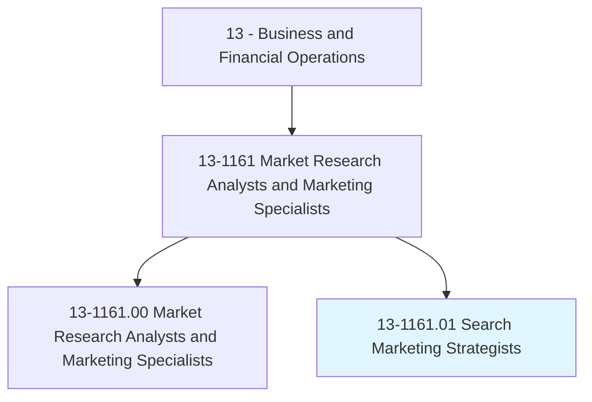
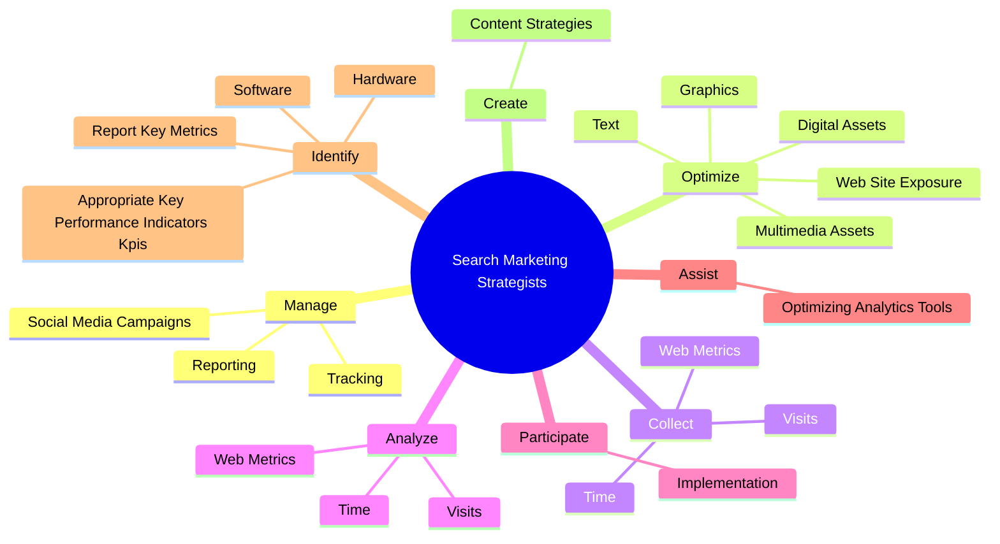

# Search Marketing Strategists

> Employ search marketing tactics to increase visibility and engagement with content, products, or services in Internet-enabled devices or interfaces. Examine search query behaviors on general or specialty search engines or other Internet-based content. Analyze research, data, or technology to understand user intent and measure outcomes for ongoing optimization.

## Overview

Search Marketing Strategists is a specialized variant within the Business and Financial Operations category. Employ search marketing tactics to increase visibility and engagement with content, products, or services in Internet-enabled devices or interfaces. Examine search query behaviors on general or specialty search engines or other Internet-based content.

## Classification Hierarchy

## Key Statistics

| Metric | Value |
|--------|-------|
| SOC Code | 13-1161.01 |
| Category | [Business and Financial Operations](/occupations/Business) |
| Task Count | 196 |
| Source | O*NET |

## Core Tasks

### manage.Tracking

Search Marketing Strategists manage tracking as part of their core responsibilities.

**Actions:**
- `manage.Tracking.of.SearchRelatedActivities`
- `manage.Tracking.of.ProvideAnalysesToMarketingExecutives`
- `manage.Reporting.of.SearchRelatedActivities`
- `manage.Reporting.of.ProvideAnalysesToMarketingExecutives`

### optimize.DigitalAssets

Search Marketing Strategists optimize digital assets as part of their core responsibilities.

**Actions:**
- `optimize.DigitalAssets.for.SearchEngineOptimizationSeo`
- `optimize.DigitalAssets.for.ForDisplayUsabilityOnInternetConnectedDevices`
- `optimize.Text.for.SearchEngineOptimizationSeo`
- `optimize.Text.for.ForDisplayUsabilityOnInternetConnectedDevices`

### collect.WebMetrics

Search Marketing Strategists collect web metrics as part of their core responsibilities.

**Actions:**
- `collect.WebMetrics.on.Site`
- `collect.WebMetrics.on.PageViewsPerVisit`
- `collect.WebMetrics.on.TransactionVolume`
- `collect.WebMetrics.on.Revenue`

## Skills & Competencies

### Technical Skills
- **Financial Analysis** - Advanced
- **Data Analysis** - Advanced
- **Regulatory Compliance** - Advanced

### Soft Skills
- **Communication** - Essential
- **Problem Solving** - Essential
- **Critical Thinking** - Important
- **Teamwork** - Important
- **Adaptability** - Important

## Related Occupations

## Industries

This occupation is found across multiple industries. See [Industries](/industries) for sector-specific employment data.

## Career Progression

---

*Source: O*NET 13-1161.01 - ONETOccupation*
