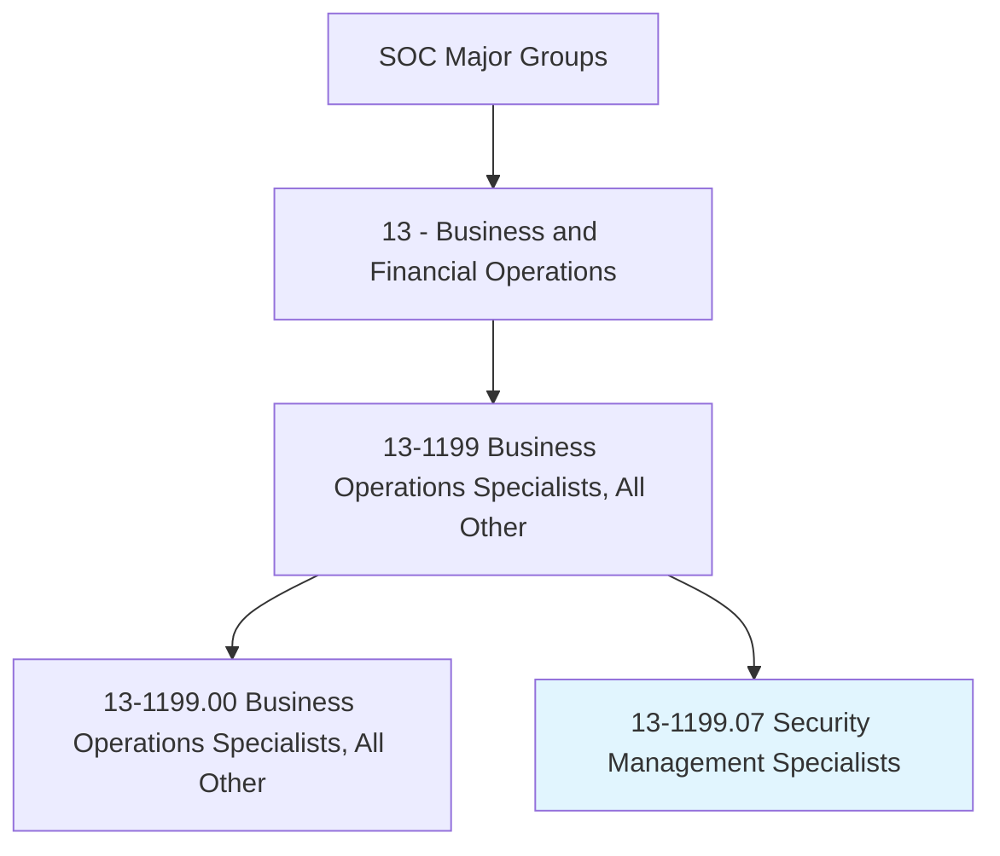
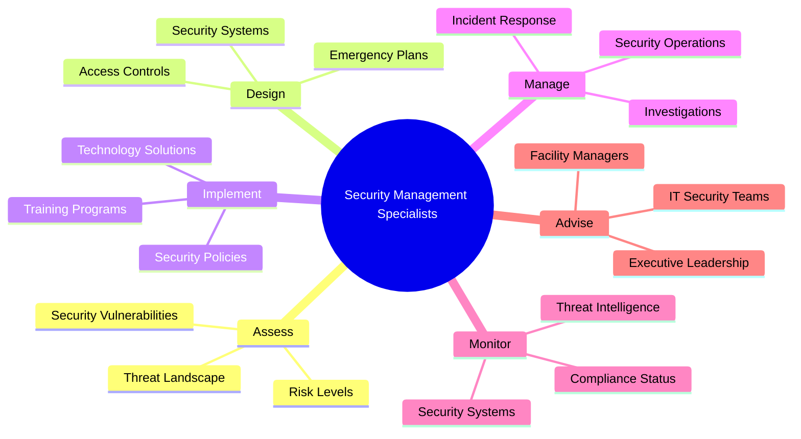
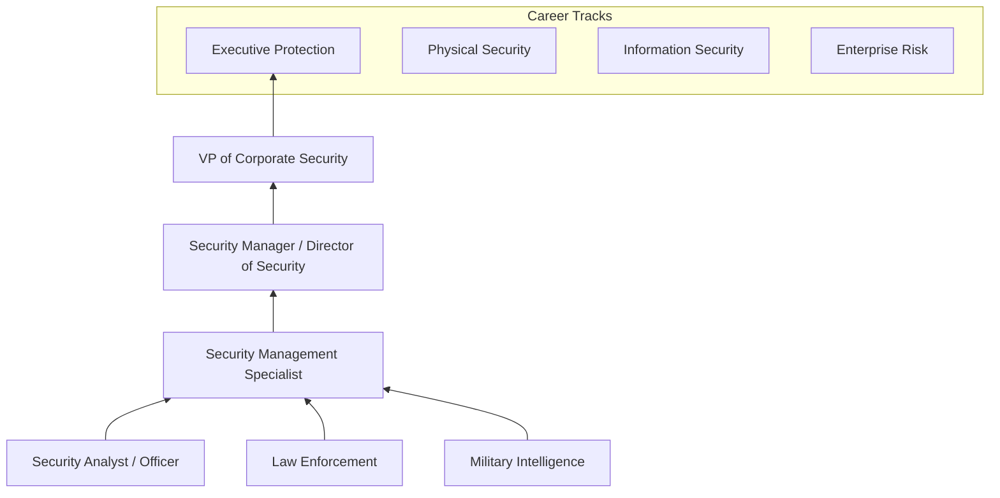
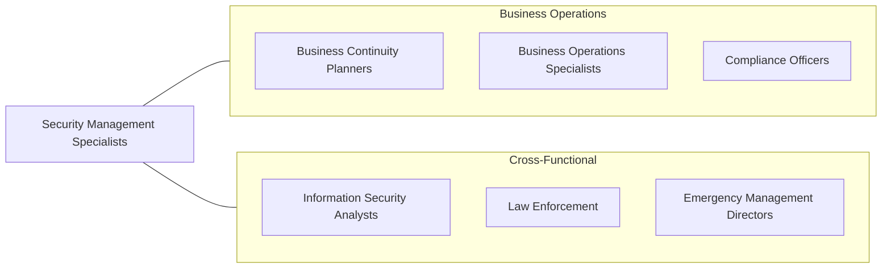

# Security Management Specialists

> Conduct security assessments for organizations, and design security systems and processes. May specialize in areas such as physical security or the security of information systems.

## Overview

Security Management Specialists design, implement, and manage comprehensive security programs that protect organizations from physical threats, cyber attacks, insider risks, and business disruptions. They conduct security assessments, develop security policies, design access control systems, manage incident response, and ensure compliance with security regulations. The role spans physical security, information security, personnel security, and enterprise risk management.

These professionals assess organizational vulnerabilities through security surveys, threat analyses, and risk assessments, then design layered security solutions that address identified risks within budgetary constraints. They may oversee security operations centers, manage security technology deployments, develop security awareness training programs, and serve as liaison with law enforcement and intelligence agencies. The role requires balancing security effectiveness with operational efficiency and employee experience.

The convergence of physical and cyber security threats has expanded the profession significantly. Modern security management specialists must understand both traditional physical security measures (access control, surveillance, executive protection) and cybersecurity fundamentals, as attacks increasingly blend physical and digital vectors. The rise of workplace violence prevention, pandemic preparedness, supply chain security, and geopolitical risk management has further broadened the scope of enterprise security management.

## Classification Hierarchy

## Key Statistics

| Metric | Value |
|--------|-------|
| SOC Code | 13-1199.07 |
| Job Zone | 4 (Considerable Preparation) |
| Category | [Business and Financial Operations](/occupations/Business/index) |
| Median Salary | $84,200 |
| Employment | ~32,000 |
| Projected Growth | 6% (As fast as average) |
| Task Count | 42 |
| Source | O*NET |

## Core Tasks

### assess.SecurityRisks

Conduct security assessments to identify vulnerabilities and prioritize risk mitigation.

**Actions:**
- `assess.SecurityVulnerabilities.to.identify.Weaknesses` - Survey security posture
- `assess.ThreatLandscape.to.evaluate.ExternalRisks` - Monitor threats
- `assess.RiskLevels.to.prioritize.SecurityInvestments` - Rank risks
- `conduct.SecuritySurveys.of.FacilitiesAndOperations` - Inspect physical security

### design.SecuritySystems

Design comprehensive security systems and processes for organizational protection.

**Actions:**
- `design.SecuritySystems.to.protect.AssetsAndPeople` - Engineer security solutions
- `design.AccessControlSystems.for.FacilitySecurity` - Manage physical access
- `design.EmergencyPlans.for.CrisisResponse` - Prepare response procedures
- `implement.SecurityPolicies.across.Organization` - Deploy security standards

### manage.SecurityOperations

Manage day-to-day security operations, incident response, and investigations.

**Actions:**
- `manage.SecurityOperations.to.maintain.ProtectionLevels` - Run security programs
- `manage.IncidentResponse.to.contain.SecurityBreaches` - Handle security events
- `manage.Investigations.to.resolve.SecurityIncidents` - Investigate threats
- `monitor.ThreatIntelligence.to.anticipate.EmergingRisks` - Track threat evolution

## Skills & Competencies

### Technical Skills
- **Security Risk Assessment** - Expert
- **Physical Security Systems (CCTV, Access Control)** - Expert
- **Security Program Management** - Advanced
- **Cybersecurity Fundamentals** - Advanced
- **Emergency & Crisis Management** - Advanced
- **Investigation Techniques** - Proficient
- **Regulatory Compliance (NERC CIP, CFATS, MTSA)** - Proficient

### Soft Skills
- **Analytical Thinking** - Critical
- **Communication** - Critical
- **Leadership** - Essential
- **Problem Solving** - Essential
- **Judgment & Decision Making** - Essential
- **Discretion** - Important

## Education & Certifications

| Requirement | Details |
|-------------|---------|
| Typical Education | Bachelor's degree in Security Management, Criminal Justice, or related field |
| Key Certifications | CPP (Certified Protection Professional - ASIS), PSP (Physical Security Professional) |
| Additional Certs | PCI (Professional Certified Investigator), CISSP (for IT security focus) |
| Professional Orgs | ASIS International, ISMA |
| Security Clearance | Often required for government and critical infrastructure |
| Work Experience | 5-10 years in security, law enforcement, or military |

## Career Progression

## Industry Variations

| Industry | Focus | Typical Tasks |
|----------|-------|---------------|
| **Corporate** | Enterprise security | Executive protection, workplace violence prevention |
| **Critical Infrastructure** | Facility protection | NERC CIP, CFATS, physical security design |
| **Financial Services** | Fraud & physical security | Branch security, cyber-physical convergence |
| **Healthcare** | Patient & staff safety | Behavioral threat management, active shooter preparedness |
| **Technology** | Data center & campus security | Access control, visitor management, IP protection |
| **Government Contracting** | Classified operations | NISPOM compliance, SCIF management, insider threat |

## Technology & Tools

| Category | Tools |
|----------|-------|
| **Physical Security** | Genetec, Lenel, Milestone, Axis cameras |
| **Access Control** | HID, Allegion, dormakaba |
| **Threat Intelligence** | Flashpoint, Dataminr, NC4 |
| **Incident Management** | Resolver, D3 Security, Omnigo |
| **GSOC Platforms** | Everbridge, SiLQ, TrackTik |
| **Investigation** | Case management systems, video analytics |
| **Communication** | Mass notification systems, two-way radios |

## Related Occupations

## Departments

This occupation typically works in:
- [Corporate Security](/departments/CorporateSecurity)
- [Physical Security](/departments/PhysicalSecurity)
- [Risk Management](/departments/RiskManagement)
- [Emergency Management](/departments/EmergencyManagement)
- [Information Security](/departments/InfoSec)

---

*Source: O*NET 13-1199.07 - ONETOccupation*
