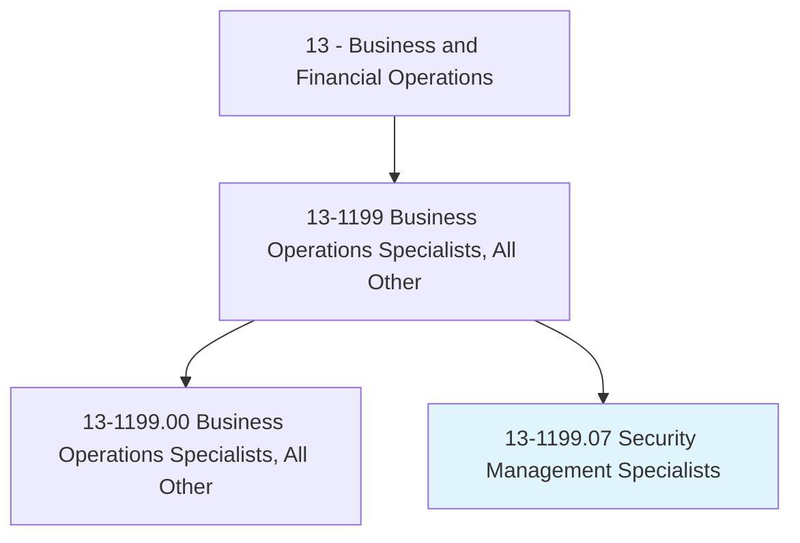
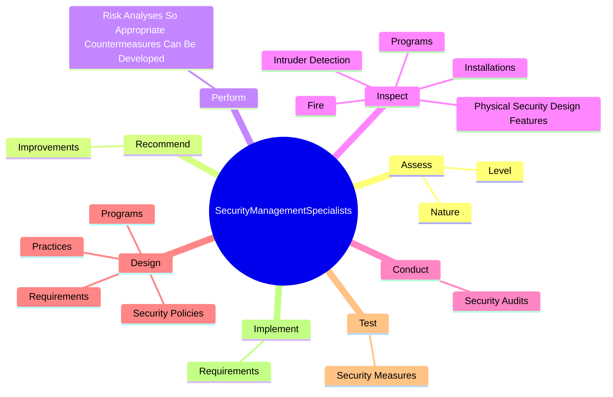

# Security Management Specialists

> Conduct security assessments for organizations, and design security systems and processes. May specialize in areas such as physical security or the safety of employees and facilities.

## Overview

Security Management Specialists is a specialized variant within the Business and Financial Operations category. Conduct security assessments for organizations, and design security systems and processes. 

## Classification Hierarchy

## Key Statistics

| Metric | Value |
|--------|-------|
| SOC Code | 13-1199.07 |
| Category | [Business and Financial Operations](/occupations/Business/index) |
| Task Count | 98 |
| Source | O*NET |

## Core Tasks

### assess.Nature

Security Management Specialists assess nature as part of their core responsibilities.

**Actions:**
- `assess.Nature.of.PhysicalSecurityThreatsSoScope.of.ProblemCanBeDetermined`
- `assess.Level.of.PhysicalSecurityThreatsSoScope.of.ProblemCanBeDetermined`

### recommend.Improvements

Security Management Specialists recommend improvements as part of their core responsibilities.

**Actions:**
- `recommend.Improvements.in.SecuritySystems`
- `recommend.Improvements.in.Procedures`

### perform.RiskAnalysesSoAppropriateCountermeasuresCanBeDeveloped

Security Management Specialists perform risk analyses so appropriate countermeasures can be developed as part of their core responsibilities.

**Actions:**
- `perform.RiskAnalysesSoAppropriateCountermeasuresCanBeDeveloped`

## Skills & Competencies

### Technical Skills
- **Financial Analysis** - Advanced
- **Data Analysis** - Advanced
- **Regulatory Compliance** - Advanced

### Soft Skills
- **Communication** - Essential
- **Problem Solving** - Essential
- **Critical Thinking** - Important
- **Teamwork** - Important
- **Adaptability** - Important

## Related Occupations

## Industries

This occupation is found across multiple industries. See [Industries](/industries) for sector-specific employment data.

## Career Progression

---

*Source: O*NET 13-1199.07 - ONETOccupation*
