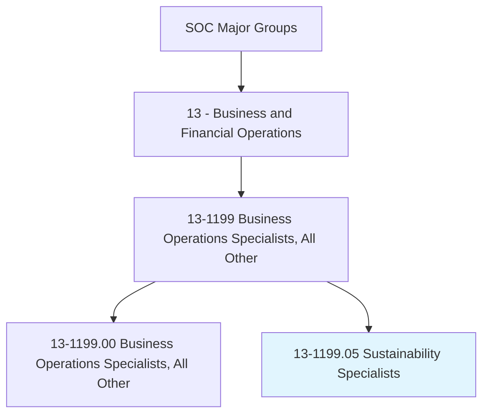
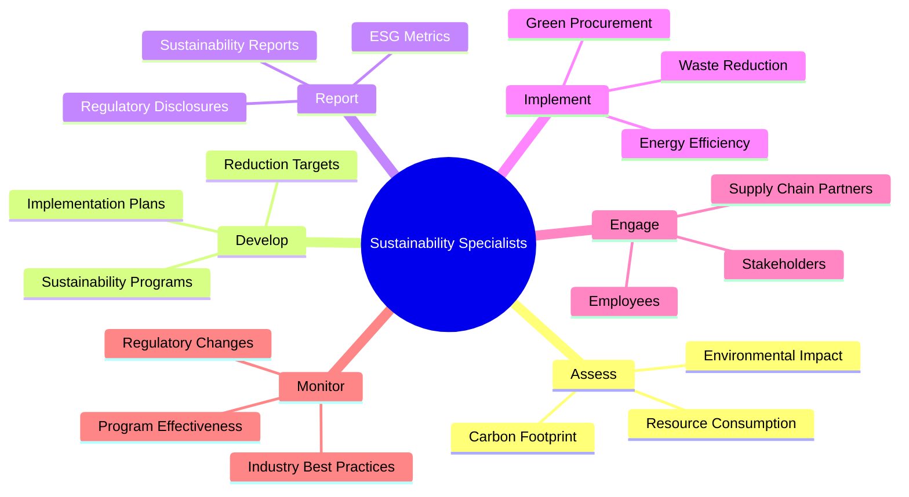
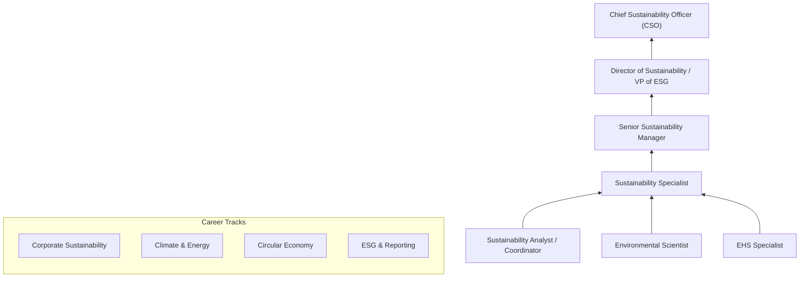
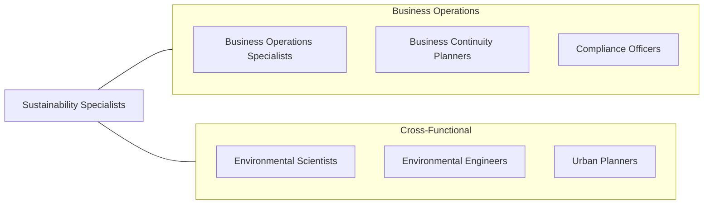

# Sustainability Specialists

> Address organizational sustainability issues, such as waste stream management, green building practices, and green procurement plans. Implement organizational sustainability programs, assess and report on their effectiveness, and advise management on sustainable practices.

## Overview

Sustainability Specialists develop and implement programs that reduce organizational environmental impact while supporting business objectives. They address waste management, energy efficiency, greenhouse gas emissions, sustainable procurement, water conservation, and circular economy practices. Their work translates environmental science and sustainability principles into actionable business strategies that create both ecological and economic value.

These professionals conduct environmental assessments, develop sustainability metrics and reporting frameworks, manage certification processes (LEED, B Corp, ISO 14001), and engage stakeholders across the organization to embed sustainability into operational decision-making. They must balance environmental idealism with business pragmatism, making the case for sustainability initiatives through cost-benefit analysis, risk reduction, regulatory compliance, and brand value enhancement.

The profession has grown dramatically as climate change, ESG investing, regulatory requirements (EU Taxonomy, SEC climate disclosure rules), and consumer expectations have elevated sustainability from a peripheral concern to a strategic business imperative. Modern sustainability specialists must navigate carbon accounting, science-based targets, supply chain decarbonization, circular economy design, biodiversity impact, and increasingly sophisticated sustainability reporting standards (GRI, SASB, TCFD, CSRD).

## Classification Hierarchy

## Key Statistics

| Metric | Value |
|--------|-------|
| SOC Code | 13-1199.05 |
| Job Zone | 4 (Considerable Preparation) |
| Category | [Business and Financial Operations](/occupations/Business/index) |
| Median Salary | $76,530 |
| Employment | ~42,000 |
| Projected Growth | 15% (Much faster than average) |
| Task Count | 48 |
| Source | O*NET |

## Core Tasks

### assess.EnvironmentalImpact

Assess organizational environmental footprint and identify improvement opportunities.

**Actions:**
- `assess.CarbonFootprint.to.establish.EmissionsBaseline` - Calculate GHG emissions
- `assess.ResourceConsumption.to.identify.WasteStreams` - Map material flows
- `assess.SupplyChainImpact.to.evaluate.Scope3Emissions` - Measure indirect impact
- `assess.RegulatoryRequirements.to.ensure.Compliance` - Verify environmental obligations

### develop.SustainabilityPrograms

Design and implement sustainability programs with measurable targets and timelines.

**Actions:**
- `develop.SustainabilityPrograms.to.reduce.EnvironmentalImpact` - Create action plans
- `develop.ReductionTargets.aligned.with.ScienceBasedTargets` - Set ambitious goals
- `develop.GreenProcurementPlans.for.SustainableSourcing` - Greening supply chain
- `implement.CircularEconomyPractices.to.minimize.Waste` - Design out waste

### report.ESGPerformance

Prepare sustainability reports and ESG disclosures for stakeholders.

**Actions:**
- `report.ESGMetrics.to.InvestorsAndStakeholders` - Communicate performance
- `report.SustainabilityProgress.in.AnnualReports` - Document achievements
- `report.RegulatoryDisclosures.for.ComplianceRequirements` - Meet reporting obligations
- `monitor.ProgramEffectiveness.to.drive.ContinuousImprovement` - Track progress

## Skills & Competencies

### Technical Skills
- **Carbon Accounting & GHG Protocol** - Expert
- **Sustainability Reporting (GRI, SASB, TCFD)** - Expert
- **Environmental Management Systems (ISO 14001)** - Advanced
- **Life Cycle Assessment** - Advanced
- **Energy Management & Efficiency** - Advanced
- **Waste Management & Circular Economy** - Advanced
- **ESG Frameworks & Rating Systems** - Advanced
- **Data Analysis** - Proficient

### Soft Skills
- **Strategic Thinking** - Critical
- **Communication & Stakeholder Engagement** - Critical
- **Project Management** - Essential
- **Cross-Functional Collaboration** - Essential
- **Influence & Persuasion** - Important
- **Adaptability** - Important

## Education & Certifications

| Requirement | Details |
|-------------|---------|
| Typical Education | Bachelor's degree in Environmental Science, Sustainability, Engineering, or Business |
| Advanced Degree | Master's in Sustainability, Environmental Management, or MBA with sustainability focus |
| Key Certifications | ISSP-SA (Sustainability Associate), LEED AP (Green Building) |
| Additional Certs | TRUE (Zero Waste), GRI Certified Sustainability Professional |
| Standards Knowledge | GHG Protocol, SBTi, CDP, TCFD, CSRD |
| Work Experience | 2-5 years in sustainability, environmental management, or related field |

## Career Progression

## Industry Variations

| Industry | Focus | Typical Tasks |
|----------|-------|---------------|
| **Manufacturing** | Operations & supply chain | Energy efficiency, waste reduction, supplier sustainability |
| **Financial Services** | ESG investing | ESG integration, climate risk, sustainability reporting |
| **Technology** | Carbon neutrality | Data center efficiency, renewable energy procurement |
| **Retail / Consumer** | Sustainable products | Packaging reduction, ethical sourcing, circular design |
| **Energy** | Transition planning | Renewable development, carbon capture, just transition |
| **Real Estate** | Green building | LEED certification, energy retrofits, tenant engagement |

## Technology & Tools

| Category | Tools |
|----------|-------|
| **Carbon Accounting** | Watershed, Persefoni, Sphera, GHG Protocol tools |
| **ESG Reporting** | Workiva, Enablon, Measurabl |
| **Energy Management** | EnergyCAP, Schneider Electric, GridPoint |
| **LCA** | SimaPro, GaBi, openLCA |
| **Data Collection** | Utility tracking systems, IoT sensors |
| **Visualization** | Tableau, Power BI, custom dashboards |
| **Communication** | Microsoft 365, sustainability management platforms |

## Related Occupations

## Departments

This occupation typically works in:
- Sustainability
- Environmental, Health & Safety
- Corporate Social Responsibility
- [Facilities Management](/departments/Operations)
- [Supply Chain](/departments/SupplyChain)

---

*Source: O*NET 13-1199.05 - ONETOccupation*
