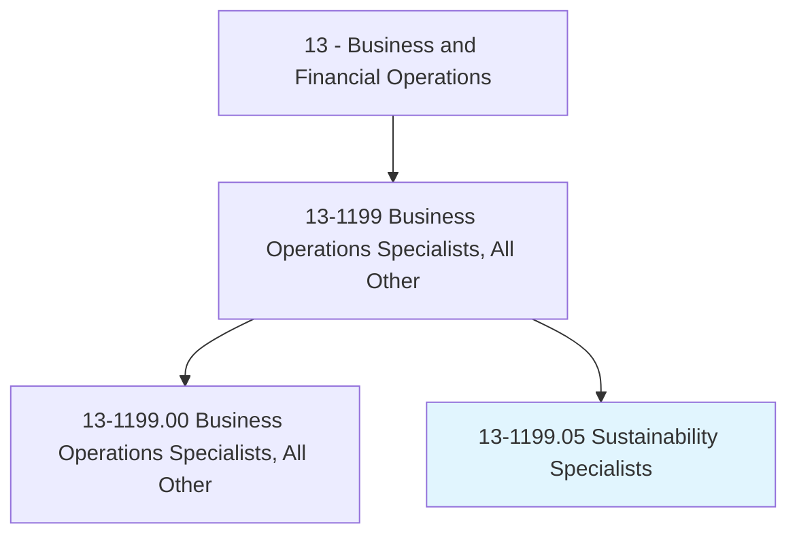
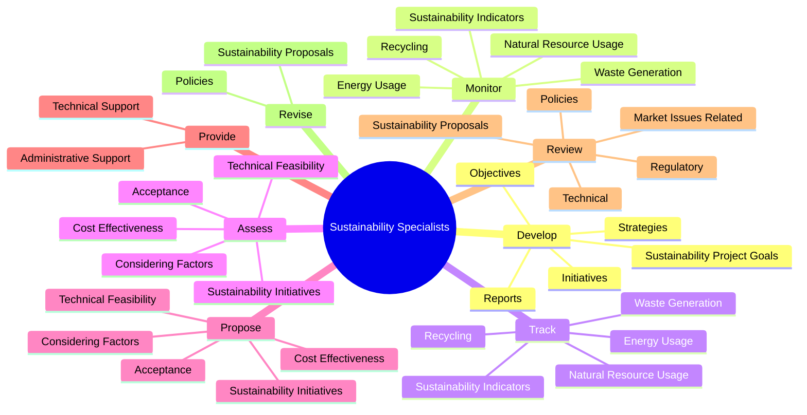
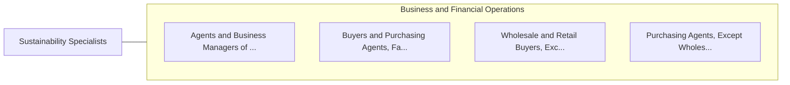

# Sustainability Specialists

> Address organizational sustainability issues, such as waste stream management, green building practices, and green procurement plans.

## Overview

Sustainability Specialists is classified under Business and Financial Operations (SOC 13). Address organizational sustainability issues, such as waste stream management, green building practices, and green procurement plans.

## Classification Hierarchy

## Key Statistics

| Metric | Value |
|--------|-------|
| SOC Code | 13-1199.05 |
| Category | [Business and Financial Operations](/occupations/Business) |
| Task Count | 75 |
| Source | O*NET |

## Core Tasks

### develop.SustainabilityProjectGoals

Sustainability Specialists develop sustainability project goals as part of their core responsibilities.

**Actions:**
- `develop.SustainabilityProjectGoals.in.Collaboration.with.OtherSustainabilityProfessionals`
- `develop.Objectives.in.Collaboration.with.OtherSustainabilityProfessionals`
- `develop.Initiatives.in.Collaboration.with.OtherSustainabilityProfessionals`
- `develop.Strategies.in.Collaboration.with.OtherSustainabilityProfessionals`

### monitor.SustainabilityIndicators

Sustainability Specialists monitor sustainability indicators as part of their core responsibilities.

**Actions:**
- `monitor.SustainabilityIndicators`
- `monitor.EnergyUsage`
- `monitor.NaturalResourceUsage`
- `monitor.WasteGeneration`

### track.SustainabilityIndicators

Sustainability Specialists track sustainability indicators as part of their core responsibilities.

**Actions:**
- `track.SustainabilityIndicators`
- `track.EnergyUsage`
- `track.NaturalResourceUsage`
- `track.WasteGeneration`

## Skills & Competencies

### Technical Skills
- **Financial Analysis** - Advanced
- **Data Analysis** - Advanced
- **Regulatory Compliance** - Advanced

### Soft Skills
- **Communication** - Essential
- **Problem Solving** - Essential
- **Critical Thinking** - Important
- **Teamwork** - Important
- **Adaptability** - Important

## Related Occupations

## Industries

This occupation is found across multiple industries. See [Industries](/industries) for sector-specific employment data.

## Career Progression

---

*Source: O*NET 13-1199.05 - ONETOccupation*
