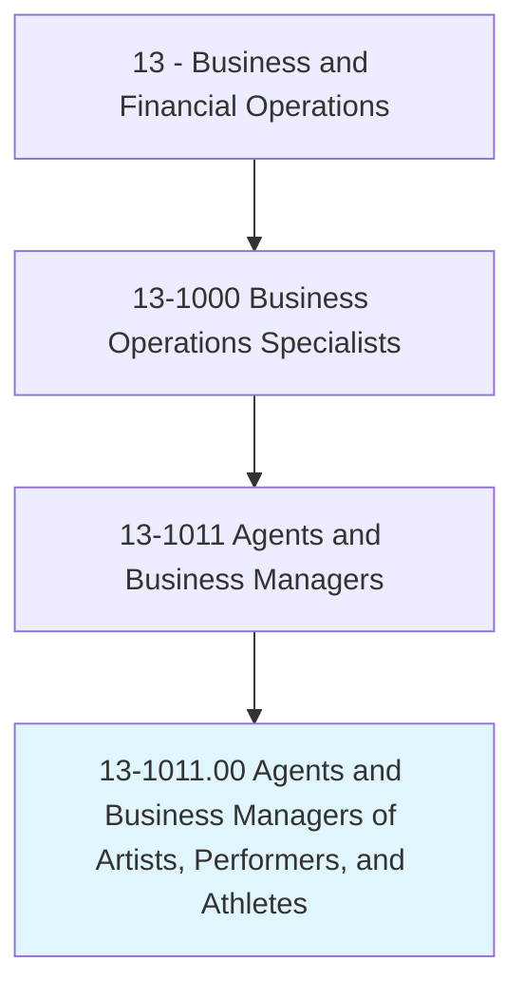
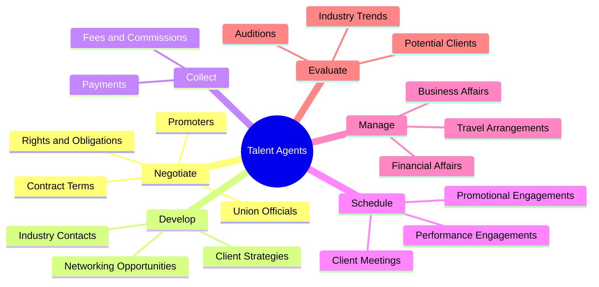
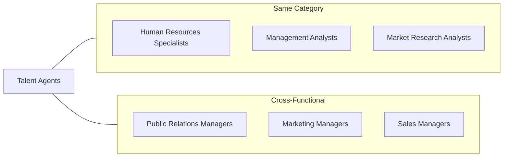
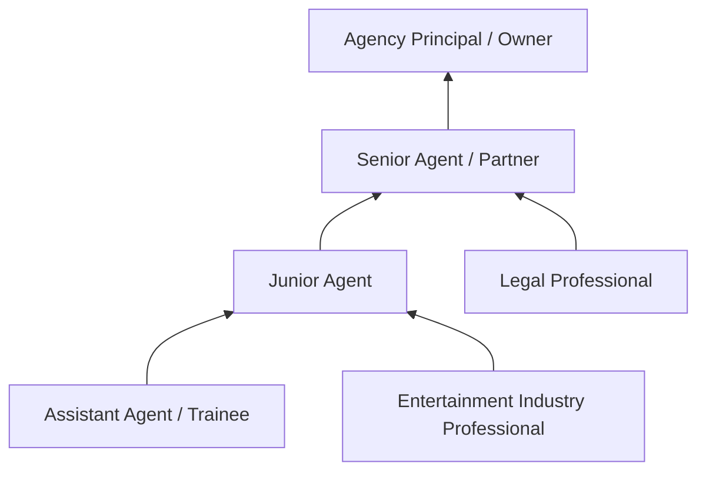

# Agents and Business Managers of Artists, Performers, and Athletes

> Represent and promote artists, performers, and athletes in dealings with current or prospective employers. May handle contract negotiation and other business matters for clients.

## Overview

Talent Agents and Business Managers serve as the critical link between creative professionals and the commercial opportunities that sustain their careers. They identify promising talent, negotiate contracts, manage business affairs, and strategically position their clients in competitive entertainment and sports markets. This role requires a unique combination of business acumen, industry knowledge, and interpersonal skills to build lasting relationships and maximize client success.

## Classification Hierarchy

## Key Statistics

| Metric | Value |
|--------|-------|
| SOC Code | 13-1011.00 |
| Job Zone | 4 (Considerable Preparation) |
| Category | [Business and Financial Operations](/occupations/Business/index) |
| Core Tasks | 12+ |
| Source | O*NET |

## Core Tasks

### negotiate.Contracts

Talent Agents negotiate with employers, promoters, and union officials to secure favorable terms for their clients.

**Actions:**
- `negotiate.Promoters` - Negotiate terms with event promoters and venues
- `negotiate.UnionOfficials` - Work with unions on contractual rights
- `negotiate.OtherPersons.regarding.ClientsContractualRights` - Advocate for client interests in all dealings
- `negotiate.Obligations` - Establish clear contractual obligations

### collect.Fees

Talent Agents ensure proper compensation is collected according to contractual agreements.

**Actions:**
- `collect.Fees.to.contract.Terms` - Collect fees per contract specifications
- `collect.Commissions.to.contract.Terms` - Process commission payments
- `collect.OtherPayments.to.contract.Terms` - Handle additional compensation

### develop.Contacts

Talent Agents build and maintain networks to create opportunities for their clients.

**Actions:**
- `develop.Contacts.with.Individuals` - Build relationships with industry professionals
- `develop.Contacts.with.Organizations` - Establish partnerships with companies and agencies
- `develop.Contacts.with.Techniques.to.ensure.ClientsSuccess` - Apply effective networking strategies

### schedule.Engagements

Talent Agents coordinate promotional and performance activities for clients.

**Actions:**
- `schedule.PromotionalEngagements.for.Clients` - Arrange publicity appearances
- `schedule.PerformanceEngagements.for.Clients` - Book performance dates
- `arrange.Meetings.concerning.IssuesInvolvingClients` - Set up business meetings

### manage.BusinessAffairs

Talent Agents handle the day-to-day business operations for their clients.

**Actions:**
- `manage.BusinessAffairs.for.Clients` - Oversee general business matters
- `manage.BusinessAffairs.for.ArrangingTravel` - Coordinate travel logistics
- `manage.BusinessAffairs.for.DirectingMarketing` - Guide marketing efforts
- `manage.FinancialAffairs.for.Clients` - Handle financial planning

## Skills & Competencies

### Technical Skills
- **Contract Negotiation** - Expert
- **Entertainment Law** - Advanced
- **Financial Management** - Advanced
- **Marketing and Promotion** - Advanced
- **Industry Analysis** - Proficient

### Soft Skills
- **Persuasion** - Critical
- **Networking** - Critical
- **Communication** - Critical
- **Relationship Building** - Essential
- **Strategic Thinking** - Essential

## Related Occupations

## Industries

- [Arts, Entertainment, and Recreation](/industries/ArtsEntertainment) - High Employment
- [Professional Sports](/industries/ProfessionalSports) - High Employment
- [Motion Picture and Video](/industries/MotionPicture) - Moderate Employment
- [Performing Arts Companies](/industries/PerformingArts) - Moderate Employment
- [Sound Recording](/industries/SoundRecording) - Moderate Employment

## Career Progression

## Education & Training

| Requirement | Details |
|-------------|---------|
| Typical Education | Bachelor's degree in Business, Communications, or related field |
| Work Experience | 2-5 years in entertainment industry or related field |
| On-the-Job Training | Extensive mentorship and industry networking |
| Common Certifications | State licensing may be required |

## Departments

This occupation typically works in:
- [Talent Management](/departments/TalentManagement)
- [Artist Relations](/departments/ArtistRelations)
- [Contract Administration](/departments/ContractAdmin)

---

*Source: O*NET 13-1011.00 - ONETOccupation*
