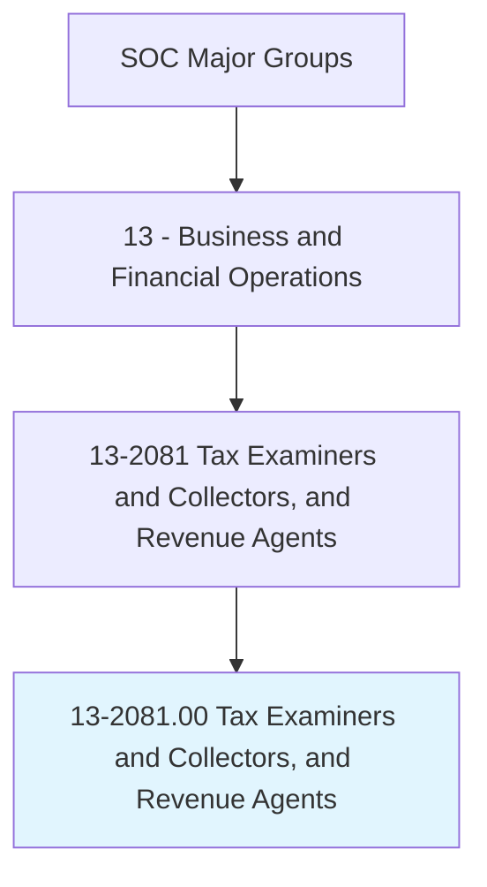
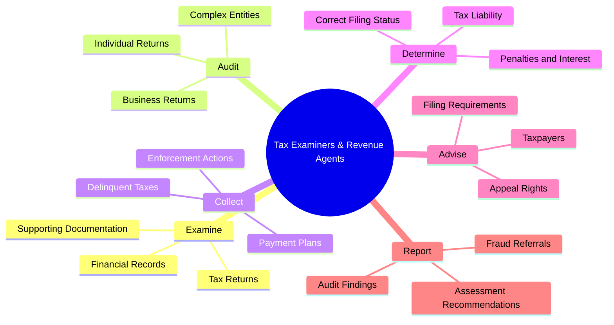
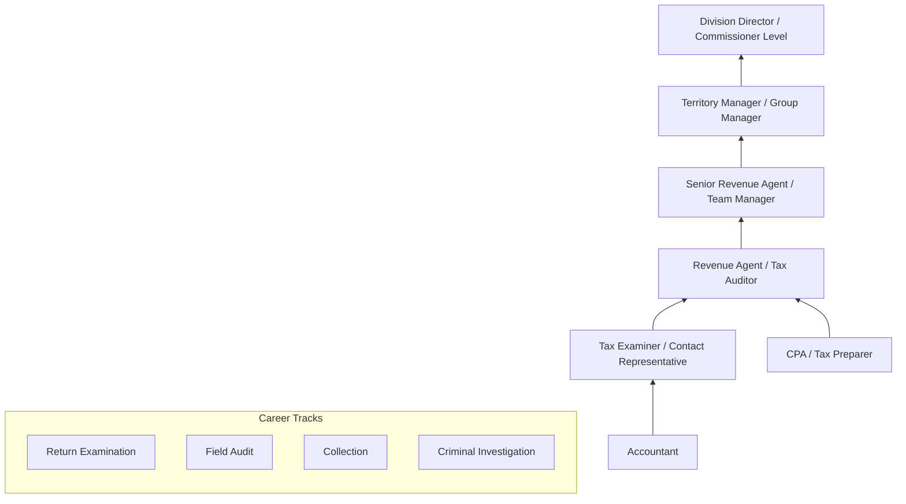
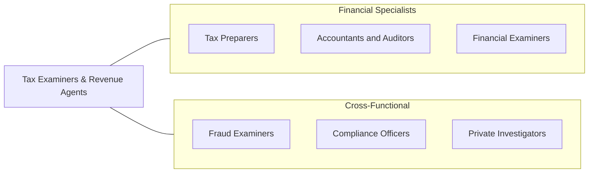

# Tax Examiners and Collectors, and Revenue Agents

> Determine tax liability or collect taxes from individuals or business firms according to prescribed laws and regulations. May conduct field audits to verify information on tax returns.

## Overview

Tax Examiners, Collectors, and Revenue Agents work for federal, state, and local governments to ensure compliance with tax laws and collect taxes owed. Tax examiners review filed tax returns for accuracy and completeness, identifying errors, omissions, and potential fraud. Revenue agents conduct more complex audits of individuals and businesses, examining financial records and applying tax law to determine the correct tax liability. Tax collectors pursue delinquent accounts, arrange payment plans, and take enforcement actions when necessary.

These professionals serve as the enforcement arm of the tax system, which is the financial foundation of government operations. They must apply complex and frequently changing tax codes to diverse situations, requiring strong analytical skills, attention to detail, and the ability to communicate technical findings to taxpayers who may be confused, frustrated, or resistant. The role demands both technical tax expertise and interpersonal skills for taxpayer interactions.

The profession is evolving with electronic filing systems, data analytics for audit selection, AI-powered return processing, and digital collection tools. However, the complexity of tax law, international tax compliance, cryptocurrency taxation, and the growing sophistication of tax avoidance schemes ensure that skilled human examiners and agents remain essential to effective tax administration.

## Classification Hierarchy

## Key Statistics

| Metric | Value |
|--------|-------|
| SOC Code | 13-2081.00 |
| Job Zone | 4 (Considerable Preparation) |
| Category | [Business and Financial Operations](/occupations/Business/index) |
| Median Salary | $56,780 |
| Employment | ~58,000 |
| Projected Growth | 2% (Slower than average) |
| Task Count | 28 |
| Source | O*NET |

## Core Tasks

### examine.TaxReturns

Review filed tax returns for accuracy, completeness, and compliance.

**Actions:**
- `examine.TaxReturns.to.verify.Accuracy` - Check mathematical and reporting accuracy
- `examine.FinancialRecords.to.validate.ReportedIncome` - Verify income sources
- `examine.SupportingDocumentation.to.substantiate.Deductions` - Validate claims
- `identify.Errors.to.calculate.CorrectTaxLiability` - Determine proper assessment

### audit.TaxpayerAccounts

Conduct audits of individual and business tax accounts.

**Actions:**
- `audit.IndividualReturns.to.verify.Compliance` - Examine personal tax
- `audit.BusinessReturns.to.assess.CorporateTaxLiability` - Review business tax
- `audit.ComplexEntities.to.evaluate.PartnershipAndTrustTax` - Handle sophisticated structures
- `determine.TaxLiability.based.on.AuditFindings` - Calculate correct tax

### collect.DelinquentTaxes

Pursue collection of unpaid taxes through various enforcement mechanisms.

**Actions:**
- `collect.DelinquentTaxes.through.PaymentArrangements` - Negotiate installments
- `collect.DelinquentTaxes.through.Levies` - Seize assets
- `collect.DelinquentTaxes.through.Liens` - Secure government interest
- `advise.Taxpayers.on.AppealRights` - Inform of due process

## Skills & Competencies

### Technical Skills
- **Federal/State Tax Law** - Expert
- **Tax Return Analysis** - Expert
- **Auditing Techniques** - Advanced
- **Accounting & Financial Analysis** - Advanced
- **Collection Law & Procedures** - Advanced
- **IRS/State Tax Systems** - Advanced
- **Data Analysis** - Proficient

### Soft Skills
- **Attention to Detail** - Critical
- **Analytical Thinking** - Critical
- **Communication** - Essential
- **Interpersonal Skills** - Essential
- **Integrity & Ethics** - Essential
- **Problem Solving** - Important

## Education & Certifications

| Requirement | Details |
|-------------|---------|
| Typical Education | Bachelor's degree in Accounting, Finance, or related field |
| Key Certifications | EA (Enrolled Agent - IRS), CPA (Certified Public Accountant) |
| State-Specific | CTEC (California Tax Education Council) and equivalents |
| Federal Training | IRS continuing professional education |
| Work Experience | 1-3 years in tax, accounting, or related field |
| Background | Government security background check required |

## Career Progression

## Industry Variations

| Industry | Focus | Typical Tasks |
|----------|-------|---------------|
| **IRS (Federal)** | Federal tax administration | Income tax, employment tax, excise tax examination |
| **State Tax Agencies** | State tax enforcement | Sales tax, income tax, property tax audit |
| **Local Government** | Property/sales tax | Assessment review, license compliance |
| **Tax-Exempt Orgs** | Exempt organization audit | 990 examination, unrelated business income |
| **International** | Cross-border tax | Transfer pricing, FATCA, treaty compliance |
| **Criminal Investigation** | Tax fraud | Financial forensics, money laundering, prosecution support |

## Technology & Tools

| Category | Tools |
|----------|-------|
| **Tax Systems** | IRS IRM systems, state tax processing systems |
| **Audit** | CaseWare IDEA, ACL, Excel |
| **Research** | Internal Revenue Code, CCH, RIA |
| **Collection** | ACS (Automated Collection System), IDRS |
| **Data Analytics** | SAS, Python, data mining tools |
| **Communication** | Case management systems, taxpayer portals |
| **Document Management** | Electronic case files, imaging systems |

## Related Occupations

## Departments

This occupation typically works in:
- Tax Examination
- Revenue Collection
- Audit Division
- Criminal Investigation
- Taxpayer Services

---

*Source: O*NET 13-2081.00 - ONETOccupation*
