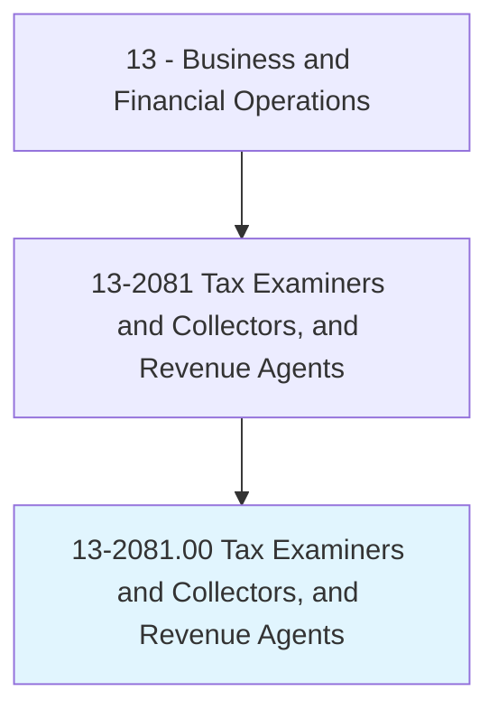
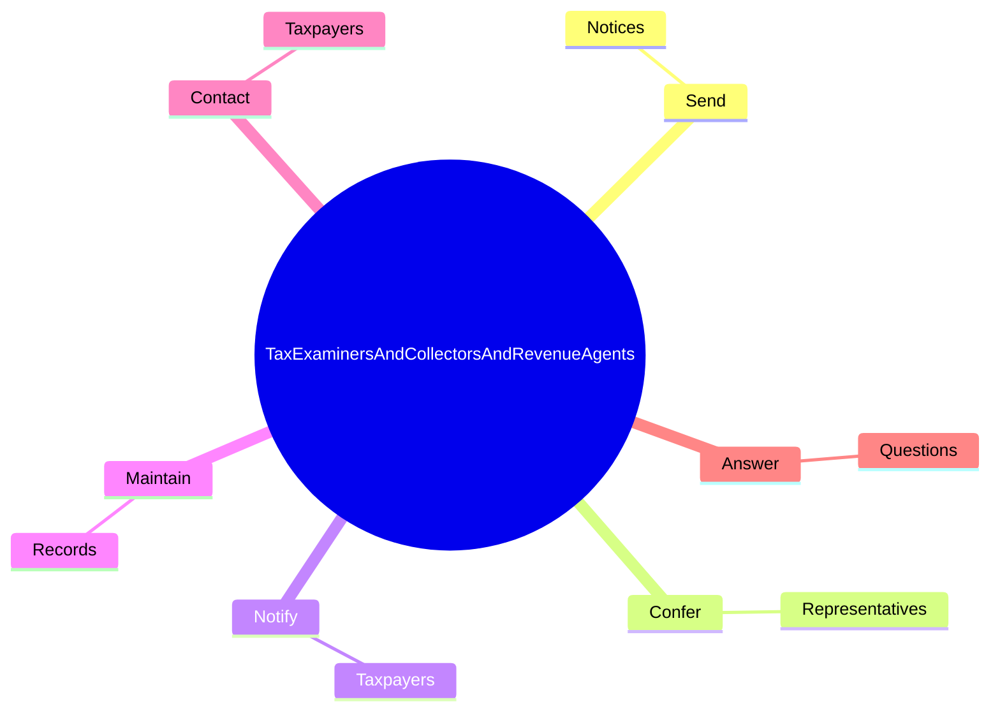
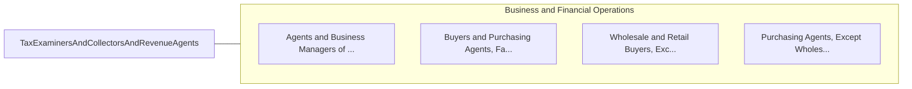

# Tax Examiners and Collectors, and Revenue Agents

> Determine tax liability or collect taxes from individuals or business firms according to prescribed laws and regulations.

## Overview

Tax Examiners and Collectors, and Revenue Agents is classified under Business and Financial Operations (SOC 13). Determine tax liability or collect taxes from individuals or business firms according to prescribed laws and regulations.

## Classification Hierarchy

## Key Statistics

| Metric | Value |
|--------|-------|
| SOC Code | 13-2081.00 |
| Category | [Business and Financial Operations](/occupations/Business/index) |
| Task Count | 62 |
| Source | O*NET |

## Core Tasks

### send.Notices

Tax Examiners and Collectors, and Revenue Agents send notices as part of their core responsibilities.

**Actions:**
- `send.Notices.to.TaxpayersWhenAccountsAreDelinquent`

### confer.Representatives

Tax Examiners and Collectors, and Revenue Agents confer representatives as part of their core responsibilities.

**Actions:**
- `confer.Representatives.to.discuss.Issues`
- `confer.Representatives.to.Laws`
- `confer.Representatives.to.RegulationsInvolvedInReturns`
- `confer.Representatives.to.ToResolveProblemsWithReturns`

### notify.Taxpayers

Tax Examiners and Collectors, and Revenue Agents notify taxpayers as part of their core responsibilities.

**Actions:**
- `notify.Taxpayers.of.Overpayment`
- `notify.Taxpayers.of.Underpayment`
- `notify.Taxpayers.of.EitherIssueRefund`
- `notify.Taxpayers.of.RequestFurtherPayment`

## Skills & Competencies

### Technical Skills
- **Financial Analysis** - Advanced
- **Data Analysis** - Advanced
- **Regulatory Compliance** - Advanced

### Soft Skills
- **Communication** - Essential
- **Problem Solving** - Essential
- **Critical Thinking** - Important
- **Teamwork** - Important
- **Adaptability** - Important

## Related Occupations

## Industries

This occupation is found across multiple industries. See [Industries](/industries) for sector-specific employment data.

## Career Progression

---

*Source: O*NET 13-2081.00 - ONETOccupation*
