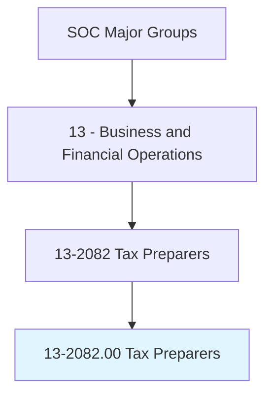
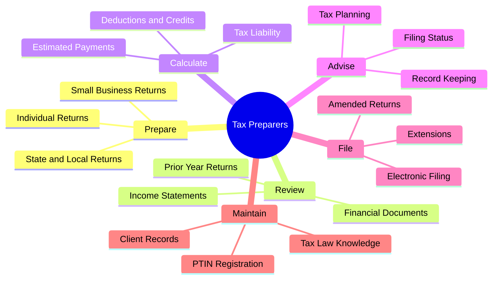
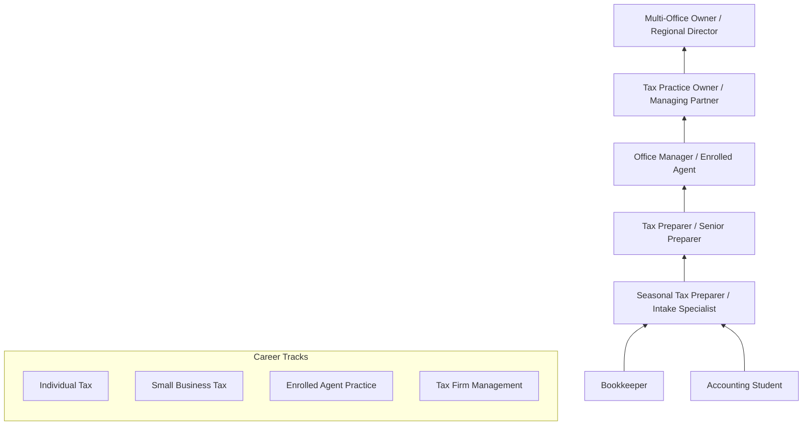
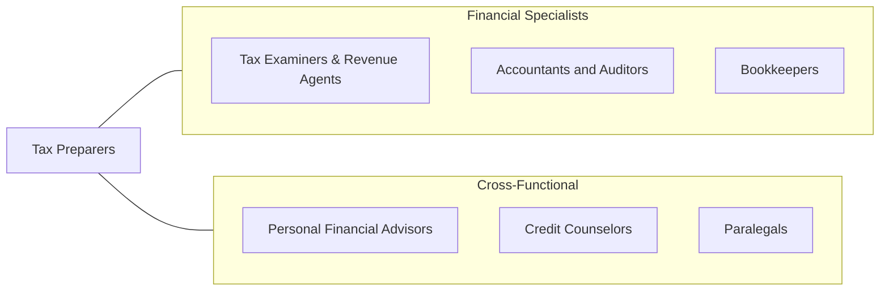

# Tax Preparers

> Prepare tax returns for individuals or small businesses. May also help plan financial futures.

## Overview

Tax Preparers assist individuals and small businesses in completing and filing federal, state, and local tax returns. They gather financial information from clients, identify applicable deductions and credits, calculate tax liabilities, and ensure returns are filed accurately and on time. While the scope ranges from straightforward individual returns to complex small business filings, all tax preparers must maintain current knowledge of tax law changes and filing requirements.

These professionals serve a vital role in the tax system, helping millions of taxpayers navigate an increasingly complex tax code. They work for tax preparation firms, accounting offices, financial service companies, or as independent practitioners. During tax season (January through April), the workload is intense and demanding, requiring efficiency, accuracy, and strong client communication skills. Many tax preparers also provide year-round tax planning advice and bookkeeping services.

The profession faces ongoing transformation from tax preparation software, AI-assisted return preparation, and IRS modernization efforts. However, the complexity of the tax code, the value of personalized advice, and the potential consequences of errors ensure continued demand for knowledgeable human preparers, particularly for self-employed individuals, small business owners, and taxpayers with complex financial situations.

## Classification Hierarchy

## Key Statistics

| Metric | Value |
|--------|-------|
| SOC Code | 13-2082.00 |
| Job Zone | 3 (Medium Preparation) |
| Category | [Business and Financial Operations](/occupations/Business/index) |
| Median Salary | $46,290 |
| Employment | ~62,000 |
| Projected Growth | -2% (Declining) |
| Task Count | 24 |
| Source | O*NET |

## Core Tasks

### prepare.TaxReturns

Prepare federal, state, and local tax returns for individuals and small businesses.

**Actions:**
- `prepare.IndividualReturns.to.ensure.AccurateFilings` - Complete personal tax
- `prepare.SmallBusinessReturns.to.optimize.TaxPosition` - Handle business tax
- `review.FinancialDocuments.to.identify.AllIncomeAndDeductions` - Gather complete data
- `calculate.TaxLiability.to.determine.AmountOwedOrRefund` - Compute tax

### advise.Clients

Provide tax planning advice and guidance on financial record-keeping.

**Actions:**
- `advise.Clients.on.TaxPlanningStrategies` - Recommend tax savings
- `advise.Clients.on.FilingStatus.and.Deductions` - Optimize elections
- `advise.Clients.on.EstimatedTaxPayments` - Prevent underpayment penalties
- `advise.SmallBusinessOwners.on.RecordKeeping` - Improve documentation

### file.ElectronicallyAndMaintainRecords

File returns electronically and maintain accurate client records.

**Actions:**
- `file.Returns.electronically.through.IRSeSystems` - Submit returns
- `file.Extensions.when.AdditionalTimeNeeded` - Request filing extensions
- `maintain.ClientRecords.for.FutureReference` - Archive tax documents
- `maintain.PTINRegistration.for.ProfessionalCompliance` - Uphold IRS requirements

## Skills & Competencies

### Technical Skills
- **Federal & State Tax Law** - Advanced
- **Tax Preparation Software** - Expert
- **Individual Income Tax** - Expert
- **Small Business Tax** - Advanced
- **Tax Planning** - Proficient
- **Bookkeeping Basics** - Proficient
- **E-Filing Systems** - Advanced

### Soft Skills
- **Attention to Detail** - Critical
- **Communication** - Critical
- **Client Service** - Essential
- **Time Management** - Essential
- **Integrity & Confidentiality** - Essential
- **Patience** - Important

## Education & Certifications

| Requirement | Details |
|-------------|---------|
| Typical Education | High school diploma minimum; associate's or bachelor's preferred |
| Federal Requirements | PTIN (Preparer Tax Identification Number) required |
| Key Certifications | EA (Enrolled Agent), AFSP (Annual Filing Season Program) |
| State Requirements | Vary - some states require registration, testing, or CE |
| Advanced | CPA license for accounting and audit services |
| Continuing Education | Required annually for EA and AFSP participants |

## Career Progression

## Industry Variations

| Industry | Focus | Typical Tasks |
|----------|-------|---------------|
| **National Tax Firms** | High-volume individual | Standardized processes, quality review, upselling services |
| **CPA Firms** | Full-service accounting | Tax and accounting integration, business advisory |
| **Independent Practice** | Personalized service | Year-round relationships, niche specialization |
| **Financial Services** | Tax and wealth | Coordination with investment, insurance, estate planning |
| **Nonprofit** | Free tax preparation | VITA/TCE programs, low-income and elderly returns |
| **Virtual / Online** | Remote preparation | Digital document collection, video consultations |

## Technology & Tools

| Category | Tools |
|----------|-------|
| **Tax Software** | Intuit ProConnect, Drake, Lacerte, UltraTax |
| **Consumer** | TurboTax, H&R Block, TaxAct (for reference) |
| **E-Filing** | IRS MeF, state e-file systems |
| **Client Portals** | SmartVault, Canopy, TaxDome |
| **Research** | TheTaxBook, CCH AnswerConnect, RIA |
| **Document Management** | Adobe Scan, Gruntworx, SurePrep |
| **Communication** | Phone systems, Zoom, secure messaging |

## Related Occupations

## Departments

This occupation typically works in:
- Tax Preparation Services
- Tax Department
- Accounting Services
- Client Services
- Financial Advisory

---

*Source: O*NET 13-2082.00 - ONETOccupation*
