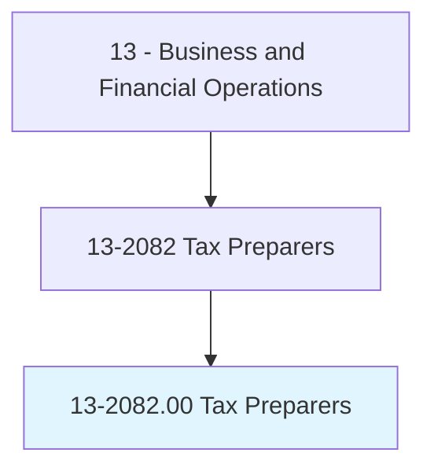
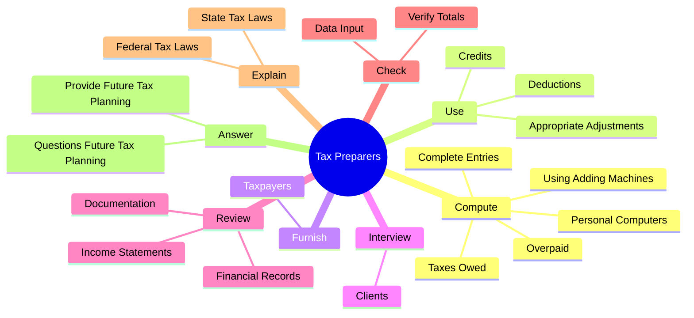
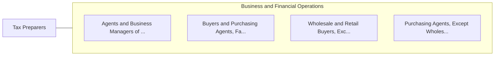

# Tax Preparers

> Prepare tax returns for individuals or small businesses.

## Overview

Tax Preparers is classified under Business and Financial Operations (SOC 13). Prepare tax returns for individuals or small businesses.

## Classification Hierarchy

## Key Statistics

| Metric | Value |
|--------|-------|
| SOC Code | 13-2082.00 |
| Category | [Business and Financial Operations](/occupations/Business) |
| Task Count | 42 |
| Source | O*NET |

## Core Tasks

### compute.TaxesOwed

Tax Preparers compute taxes owed as part of their core responsibilities.

**Actions:**
- `compute.TaxesOwed.on.Forms`
- `compute.TaxesOwed.on.FollowingTaxFormInstructions`
- `compute.TaxesOwed.on.TaxTables`
- `compute.Overpaid.on.Forms`

### use.AppropriateAdjustments

Tax Preparers use appropriate adjustments as part of their core responsibilities.

**Actions:**
- `use.AppropriateAdjustments.to.keep.ClientsTaxesToMinimum`
- `use.Deductions.to.keep.ClientsTaxesToMinimum`
- `use.Credits.to.keep.ClientsTaxesToMinimum`

### furnish.Taxpayers

Tax Preparers furnish taxpayers as part of their core responsibilities.

**Actions:**
- `furnish.Taxpayers.with.SufficientInformation.to.ensure.CorrectTaxFormCompletion`
- `furnish.Taxpayers.with.Advice.to.ensure.CorrectTaxFormCompletion`

## Skills & Competencies

### Technical Skills
- **Financial Analysis** - Advanced
- **Data Analysis** - Advanced
- **Regulatory Compliance** - Advanced

### Soft Skills
- **Communication** - Essential
- **Problem Solving** - Essential
- **Critical Thinking** - Important
- **Teamwork** - Important
- **Adaptability** - Important

## Related Occupations

## Industries

This occupation is found across multiple industries. See [Industries](/industries) for sector-specific employment data.

## Career Progression

---

*Source: O*NET 13-2082.00 - ONETOccupation*
